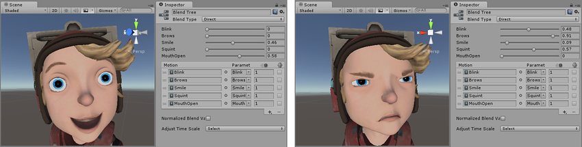

直接混合
===========

使用直接混合树可将 Animator 参数映射到 BlendTree 子项的权重。如果您想要精确控制所混合的各种动画而不是使用一个或两个参数来间接混合它们（1D 和 2D 混合树便是这种情况），这将非常有用。

设置直接混合树时，检视面板允许您将动作添加到动作列表。然后，应为每个动作分配一个相应参数以直接控制其在树中的混合权重。[在此处阅读有关创建 Animator 参数的更多信息](AnimationParameters.html)。

实际上，此直接模式只是绕过交叉渐变或各种 2D 混合算法（Freeform Directional、Freeform Cartesian 等），允许您实现所喜欢的任何代码来控制混合动画的混合。

在混合面部表情的混合形状动画时，或者在将附加动画混合在一起时，这可能特别有用。

