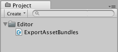
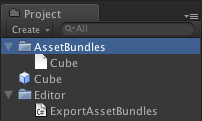

#在 Unity 4 中创建 Asset Bundle

*在早于 Unity 5 的 Unity 版本中，必须单独使用编辑器脚本选择资源并将其添加到 Bundle。（在 Unity 5 中，我们在编辑器中提供了工具，以方便将资源分配给特定的 Bundle）。本页面的信息适用于在 Unity 4 中处理旧版项目的用户，并假设使用的是 Unity 4。*

要创建 Asset Bundle，必须使用 BuildPipeline 编辑器类。使用编辑器类的所有脚本必须放在名为 Editor 的文件夹中（可位于 Assets 文件夹内的任何位置）。以下是此类脚本的 C# 示例：

````
// 旧版 Unity 4 示例。不可用于 Unity 5 和更高版本
using UnityEngine;
using UnityEditor;

public class ExportAssetBundles {
    [MenuItem("Assets/Build AssetBundle")]
    static void ExportResource () {
        string path = "Assets/myAssetBundle.unity3d";
        Object[] selection = Selection.GetFiltered(typeof(Object), SelectionMode.DeepAssets);
        BuildPipeline.BuildAssetBundle(Selection.activeObject, selection, path, 
                                       BuildAssetBundleOptions.CollectDependencies 
                                     | BuildAssetBundleOptions.CompleteAssets);
    }
}
````

编辑器脚本不需要应用于游戏对象，而是由编辑器使用。前面的示例将在编辑器的“Assets”菜单中创建一个名为“Build AssetBundle”的新菜单项。

要使用此示例，请执行以下操作：

* 在 Project 视图中名为 Editor 的文件夹内创建一个名为 ExportAssetBundles.cs 的 C# 脚本文件。
* 在项目文件夹中选择要包含在 AssetBundle 中的一个或多个资源。
* 从 Assets 菜单中选择 Build AssetBundle。单击“Save”以创建 AssetBundle。
* ExportResource 函数的第一行将设置 AssetBundle 的路径。
* 下一行将需要包含在 AssetBundle 中的选定资源设置为在 Project 窗口中选择的对象。


BuildAssetBundle 函数行将创建 AssetBundle 并将其保存到指定位置。第一个参数指定 mainAsset，这是一种从 AssetBundle 加载资源时可直接使用 mainAsset 属性获取的特殊资源。设置主资源 (main Asset) 不是必须的，如果不使用这种资源，可对该参数使用 null 值。第二个参数是构成 AssetBundle 的对象数组。第三个参数指定磁盘上用于保存 AssetBundle 的位置。最后一个参数是构建 AssetBundle 时使用的构建标志或选项。这些 [BuildAssetBundleOptions](../ScriptReference/BuildAssetBundleOptions.html) 可使用按位 OR 运算符加以组合。

构建 AssetBundle 应该是发布前执行的步骤，只需一次函数调用（例如使用一个构建所有 AssetBundle 的菜单项）进行一次即可。在开发应用程序时，应编写辅助脚本；通过脚本，只需单击一次或在批处理模式下无需用户干预，即可为目标平台构建所有 AssetBundle。

您可以使用三种类方法来构建 AssetBundle：


* [BuildPipeline.BuildAssetBundle](../ScriptReference/BuildPipeline.BuildAssetBundle.html) 允许您构建任何资源类型的 AssetBundle。


* 当您仅希望包含进行流传输和加载的场景作为数据时，使用 [BuildPipeline.BuildStreamedSceneAssetBundle](../ScriptReference/BuildPipeline.BuildStreamedSceneAssetBundle.html)。


* [BuildPipeline.BuildAssetBundleExplicitAssetNames](../ScriptReference/BuildPipeline.BuildAssetBundleExplicitAssetNames.html) 与 BuildPipeline.BuildAssetBundle 相同，但有一个额外的参数可为每个对象指定自定义字符串标识符（名称）。


如何构建 AssetBundle 的示例
-----------------------------------------


构建 Asset Bundle 是通过编辑器脚本完成的。[BuildPipeline.BuildAssetBundle](../ScriptReference/BuildPipeline.BuildAssetBundle.html) 的脚本文档中提供了此过程的一个基本示例。

为了此示例的需要，请将以上链接中的脚本复制并粘贴到一个名为 ExportAssetBundles 的新 C# 脚本中。此脚本应放在名为 Editor 的文件夹中，以便它能在 Unity Editor 中运行。


 

现在，在 __Assets__ 菜单中，应该会看到两个新的菜单选项。


 

1.__Build AssetBundle From Selection - Track dependencies__。此选项可将当前对象构建到 Asset Bundle 中并包含其所有依赖项。例如，如果您有一个由多个层级结构层组成的预制件，则将以递归方式将所有子对象和组件添加到 Asset Bundle 中。


1.__Build AssetBundle From Selection - No dependency tracking__。此方法与前一种方法相反，仅会包含您选择的单个资源。

在此示例中，应创建一个新的预制件。首先通过 __GameObject &gt; 3D Object &gt; Cube__ 创建新立方体（此操作将在 Hierarchy 视图中创建新的立方体）。然后，将立方体从 Hierarchy 视图拖动到 Project 视图中，此过程将创建该对象的预制件。

然后，应右键单击 Project 窗口中的立方体 (Cube) 预制件，并选择 __Build AssetBundle From Selection - Track dependencies__。
此时，您将看到一个窗口，用于保存“捆绑的”资源。如果您创建了一个名为“AssetBundles”的新文件夹并将立方体保存为 __Cube.unity3d__，Project 窗口现在将如下所示。


 

此时，您可以将 AssetBundle __Cube.unity3d__ 移动到本地存储设备上的其他位置，或将其上传到您选择的服务器。


构建 Asset Bundle 时如何更改资源属性的示例
--------------------------------------------------------------------------------------


您可以使用 [AssetDatabase.ImportAsset](../ScriptReference/AssetDatabase.ImportAsset.html) 强制在调用 [BuildPipeline.BuildAssetBundle](../ScriptReference/BuildPipeline.BuildAssetBundle.html) 之前重新导入资源，然后使用 [AssetPostprocessor.OnPreprocessTexture](../ScriptReference/AssetPostprocessor.OnPreprocessTexture.html) 设置所需的属性。以下示例将向您展示如何在构建 Asset Bundle 时设置不同的纹理压缩。

````
// 旧版 Unity 4 示例。不可用于 Unity 5 和更高版本。
// 从 Project 视图中的选定对象构建 Asset Bundle，
// 并使用 AssetPostprocessor 更改纹理格式。

using UnityEngine;
using UnityEditor;

public class ExportAssetBundles {
    
	// 存储 TextureProcessor 的当前纹理格式。
	public static TextureImporterFormat textureFormat;
	
	[MenuItem("Assets/Build AssetBundle From Selection - PVRTC_RGB2")]
	static void ExportResourceRGB2 () {
		textureFormat = TextureImporterFormat.PVRTC_RGB2;
		ExportResource();		
	}	
    
	[MenuItem("Assets/Build AssetBundle From Selection - PVRTC_RGB4")]
	static void ExportResourceRGB4 () {
		textureFormat = TextureImporterFormat.PVRTC_RGB4;
		ExportResource();
	}
	
	static void ExportResource () {
		// 显示保存面板。
		string path = EditorUtility.SaveFilePanel ("Save Resource", "", "New Resource", "unity3d");
		
		if (path.Length != 0) {
			// 从当前所选项构建资源文件。
			Object[] selection = Selection.GetFiltered(typeof(Object), SelectionMode.DeepAssets);
			
			foreach (object asset in selection) {
				string assetPath = AssetDatabase.GetAssetPath((UnityEngine.Object) asset);
				if (asset is Texture2D) {
					//强制通过 TextureProcessor 重新导入。
					AssetDatabase.ImportAsset(assetPath);
				}
			}
            
			BuildPipeline.BuildAssetBundle(Selection.activeObject, selection, path, BuildAssetBundleOptions.CollectDependencies | BuildAssetBundleOptions.CompleteAssets);
			Selection.objects = selection;
		}
	}
}
````

````
// 旧版 Unity 4 示例。不可用于 Unity 5 和更高版本。
// 构建 Asset Bundle 时更改纹理格式。

using UnityEngine;
using UnityEditor;

public class TextureProcessor : AssetPostprocessor
{ 
	void OnPreprocessTexture() {
		TextureImporter importer = assetImporter as TextureImporter;
		importer.textureFormat = ExportAssetBundles.textureFormat;
	}
}


````

此外还可使用 [AssetDatabase.ImportAssetOptions](../ScriptReference/ImportAssetOptions.html) 控制资源的导入方式。

在测试环境中，有时需要测试更改，而此更改需要重新构建 AssetBundle。在此类情况下，建议在构建 AssetBundle 时使用 [BuildAssetBundleOptions.UncompressedAssetBundle](../ScriptReference/BuildAssetBundleOptions.UncompressedAssetBundle.html) 选项。此选项可加快构建和加载 AssetBundle 的速度，但也会导致它们更大，因此下载时间更长。

在生产环境中构建 AssetBundle
------------------------------------------------


首次使用 AssetBundle 时，似乎按照以上示例所示手动构建它们就足够了。但随着项目规模增大和资源数量增加，手动执行此过程的效率不高。更好的方法是编写一个为项目构建所有 AssetBundle 的函数。例如，您可以使用一个文本文件将资源文件映射到 AssetBundle 文件。

