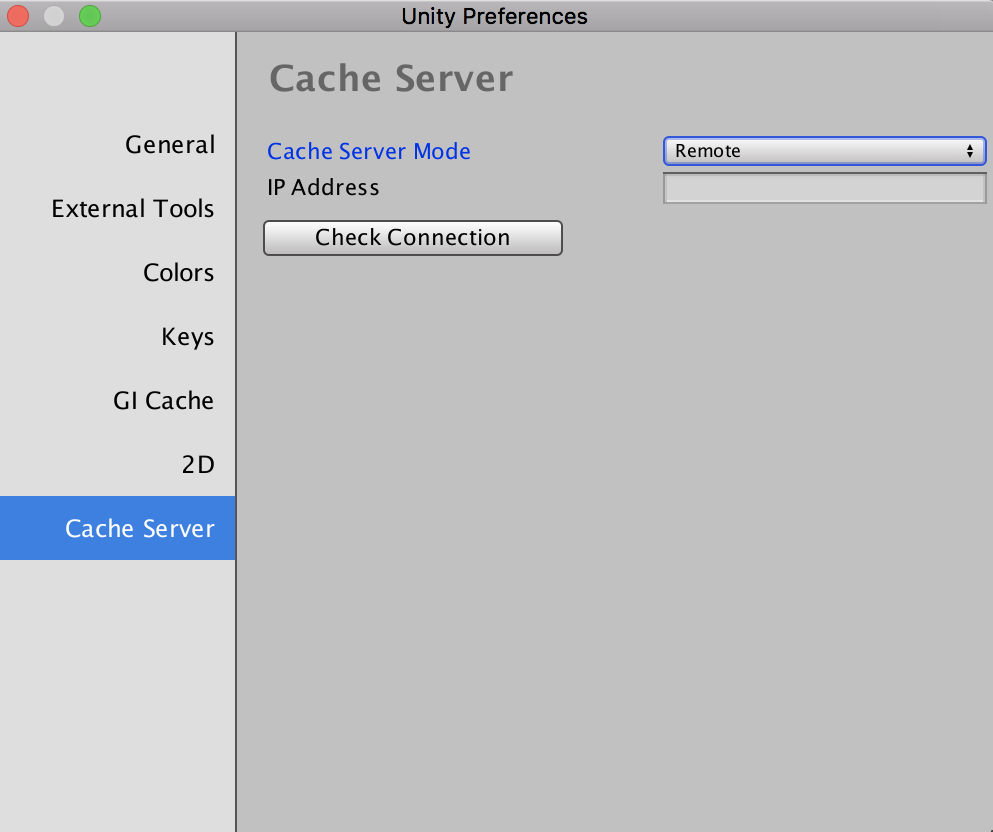
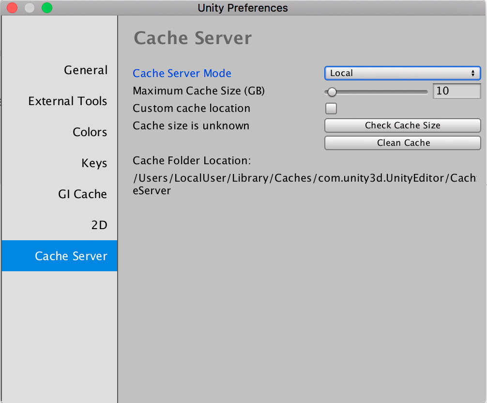
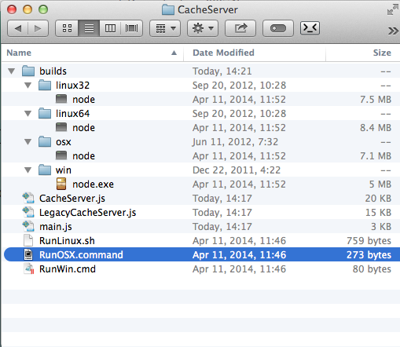
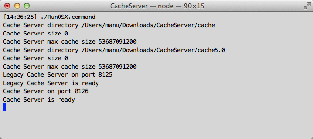

#缓存服务器

Unity 有一个完全自动的资源管线。每当修改 .psd 或 .fbx 文件等源资源时，Unity 都会检测到更改并自动将其重新导入。随后，Unity 以内部格式存储从文件导入的数据。

这种安排旨在使工作流程对于个人用户而言尽可能高效和灵活。但是，在团队中工作时，可能会发现其他用户可能会继续对资源进行更改，所有这些更改都必须导入。此外，在桌面和移动构建目标平台之间切换时，必须重新导入资源。因此，该切换对于大型项目而言可能需要很长时间。

在__缓存服务器__上缓存导入的资源数据可以大大减少导入资源所需的时间。

每次资源导入都基于以下内容进行缓存：

* 资源文件本身
* 导入设置
* 资源导入器版本
* 当前平台

如果以上任何内容更改，都要重新导入资源。否则，从缓存服务器下载资源。

启用缓存服务器（请参阅下面的_如何以用户身份设置缓存服务器_）时，甚至可以跨多个项目共享资源导入（即，在一台计算机上完成导入工作，结果将与其他计算机共享）。

请注意，一旦设置了缓存服务器，此过程就是完全自动的，因此没有其他工作流程要求。它只会减少导入项目所需的时间，而不会妨碍您。

##如何以用户身份设置缓存服务器

设置缓存服务器非常简单。只需在偏好设置中选中 Use Cache Server，并将__缓存服务器__所在位置告诉本地计算机的 __Unity Editor__。

在 Mac OS X 上，可以在 __Unity__ > __Preferences__ 中找到缓存服务器设置，在 Windows 和 Linux 上，可以在 __Edit__ > __Preferences__ 中找到。

 

要在本地计算机而不是远程计算机上托管缓存服务器，请将 __Cache Server Mode__ 设置为 __Local__。

 

此设置允许您在本地计算机上轻松配置缓存服务器。由于硬盘驱动器大小限制，建议在单独的计算机上托管缓存服务器。

|**属性：** |**功能：** |
|:---|:---|
|__Cache Server Mode__|选择要使用的缓存服务器模式 (Cache Server Mode)。此设置允许禁用缓存服务器，指定远程服务器，或在本地计算机上设置缓存服务器。|
|    _Disabled_（默认设置）| 不使用缓存服务器。|
|    _Remote_|使用远程计算机上托管的缓存服务器。|
|    _Local_|使用此计算机上的本地缓存服务器。|
|__IP Address__ （仅适用于 Remote 模式）| 指定托管缓存服务器的远程计算机的 IP 地址。|
|__Check Connection__ （仅适用于 Remote 模式）| 使用此按钮尝试连接到远程缓存服务器。|
|__Maximum Cache Size (GB)__ （仅适用于 Local 模式）| 指定缓存服务器在此计算机存储上的最大大小（以 GB 为单位）。最小大小为 1GB。最大缓存大小为 200GB。默认值为 10GB。|
|__Custom cache location__|指定磁盘上用作缓存的位置。|
|__Check Cache Size__ （仅适用于 Local 模式）|单击此按钮可查看本地缓存服务器使用的存储量。如果项目很大，此操作可能需要一些时间才能完成。运行完毕后，“Cache size is unknown”消息将替换为具体缓存大小。|
|__Clean Cache__|删除缓存的内容。|

如果本地缓存服务器具有自定义位置，但该位置变为不可用，Unity 将显示以下警告：

> _Local cache directory does not exist - please check that you can access the cache folder and are able to write to it_

##如何以管理员身份设置__缓存服务器__

管理员需要设置托管缓存资源的__缓存服务器__计算机。

需要执行以下操作：

* 下载缓存服务器。访问[下载存档 (Download Archive)](https://unity3d.com/get-unity/download/archive) 页面。找到自己使用的 Unity 版本，然后单击目标服务器操作系统的 Downloads 按钮。单击缓存服务器 (Cache Server) 链接开始下载。
* 解压缩文件，然后应该会看到如下内容：

 

* 根据操作系统，运行相应的命令脚本。
* 随后将看到一个终端窗口，指示缓存服务器正在后台运行

 

缓存服务器需要位于具有大型存储的可靠计算机上（远大于项目本身的大小，因为会存储多个版本的导入资源）。如果硬盘已满，缓存服务器可能会运行缓慢。

##将缓存服务器安装为服务

必须将提供的 `.sh` 和 `.cmd` 脚本设置为服务器上的服务。
缓存服务器可以随时安全地终止和重新启动，因为它使用原子文件操作。

##新版和旧版缓存服务器

默认情况下启动两个缓存服务器进程。旧版缓存服务器适用于 5.0 之前的 Unity 版本。新版缓存服务器适用于 5.0 和之后的 Unity 版本。有关配置、启用和禁用两个不同缓存服务器的详细信息，请参阅下面的缓存服务器配置。

##缓存服务器配置

如果通过执行脚本直接启动，将在端口 8125 上启动旧版缓存服务器，而在端口 8126 上启动新版缓存服务器。此外还会在与脚本相同的目录中创建“cache”和“cache5.0”目录，并在其中保存数据。默认情况下，缓存目录最多可增长到 50 GB。可以使用命令行选项配置数据的大小和位置，如下所示：

`./RunOSX.command --path ~/mycachePath --size 2000000000`

或者

`./RunOSX.command --path ~/mycachePath --port 8199 --nolegacy`

可以使用以下命令行选项配置缓存服务器：

* 使用 `--port` 指定服务器端口。这仅适用于新版缓存服务器。默认值为 `8126`。
* 使用 `--path` 指定缓存位置的路径。这仅适用于新版缓存服务器。默认值为 `./cache5.0`。
* 使用 `--legacypath` 指定缓存位置的路径。这仅适用于旧版缓存服务器。默认值为 `./cache`。
* 使用 `--size` 指定两个缓存服务器的最大缓存大小（以字节为单位）。超过此缓存大小时，将自动丢弃最近未使用的文件。
* 使用 `--nolegacy` 禁止启动旧版缓存服务器。否则，旧版缓存服务器会在端口 `8125` 上启动。

##托管缓存服务器的计算机的要求

为获得最佳性能，必须有足够的 RAM 来容纳整个导入的项目文件夹。此外，计算机最好配备快速硬盘驱动器和快速以太网连接。硬盘驱动器还应该有足够的可用空间。另一方面，缓存服务器的 CPU 使用率非常低。

缓存服务器和版本控制系统之间的主要区别之一是其缓存的数据始终可以在本地重建。它只是一种提高性能的工具。因此，在互联网上使用缓存服务器是没有意义的。如果是分布式团队，应在每个位置放置单独的缓存服务器。

缓存服务器在 Linux 或 Mac OS X 计算机上的运行效果最好。Windows 文件系统没有针对缓存服务器的数据存储方式进行很好的特别优化，并且 Windows 上的文件锁定问题可能会导致一些在 Linux 或 Mac OS X 上不会出现的问题。

##关于缓存服务器的常见问题解答

###随着导入和存储的资源越来越多，缓存服务器数据库的大小会无限增长吗？
缓存服务器会自动删除一段时间未使用的资源（当然，如果再次需要这些资源，则会在下次使用时重新创建这些资源）。

###缓存服务器是否仅适用于资源服务器 (Asset Server)？

根据设计，缓存服务器对源代码/版本控制系统而言是透明的，因此不局限于使用 Unity 的资源服务器。

###哪些更改会导致重新生成导入的文件？

当 Unity 即将导入资源时，它会生成所有源数据的 MD5 哈希值。

对于纹理，这包括：

* 源资源：“myTexture.psd”文件
* 元文件：“myTexture.psd.meta”（存储所有导入器设置）
* 纹理导入器的内部版本号
* 所有 [AssetPostprocessor](../ScriptReference/AssetPostprocessor.html) 的版本号哈希值

如果该哈希值与缓存服务器上存储的哈希值不同，则重新导入资源。否则，将下载缓存版本。客户端 Unity Editor 仅在需要时从服务器中拉取资源 - 资源在更改时不会被推送到每个项目。

###如何使用资源依赖项？

缓存服务器不处理依赖项。Unity 的资源管线不处理依赖项的概念。根据设计，它会避免资源之间的依赖关系。[AssetPostprocessor](../ScriptReference/AssetPostprocessor.html) 类是一种用于自定义资源导入器来满足需求的常用技术。例如，有时可能希望将网格碰撞体添加到 .fbx 文件中的某些游戏对象（基于名称或标签）。

使用 `AssetPostprocessor` 来引入依赖项也很容易。例如，可以使用资源旁边的文本文件中的数据向导入的游戏对象添加其他组件。缓存服务器不支持此功能。如果要使用缓存服务器，必须去除对项目文件夹中其他资源的依赖。由于缓存服务器对后处理器中的依赖项一无所知，因此它不知道是否任何内容已发生更改，因此会使用资源的旧缓存版本。

在实践中，可以通过多种方式进行资源后期处理，以便与缓存服务器配合使用。可以使用：

* 已导入资源的路径
* 资源的任何导入设置
* 源资源本身或在其基础上生成的任何数据（在资源后处理器中传递给您）。

###使用材质时是否有任何问题？
修改已存在的材质可能会导致问题。使用缓存服务器时，Unity 会验证是否维持了对材质的引用，但由于不会调用后期处理调用，因此在通过缓存服务器导入模型时无法更改材质的内容。因此，使用和不使用缓存服务器进行导入可能会得到不同的结果。最好不要修改磁盘上已经存在的材质。

###是否有任何资源类型不会被服务器缓存？

有几种类型的资源数据不会被服务器缓存。对脚本文件进行缓存实际上不会带来任何好处，因此服务器会忽略它们。此外，3D 建模软件（Maya、3D Max 等）使用的原生文件将由应用程序本身转换为 FBX。资源服务器不会缓存原生文件，也不会缓存导入过程中生成的中间 FBX 文件。但是，通过从建模软件导出文件作为 FBX，然后将这些文件添加到 Unity 项目，也许可从该服务器受益。
