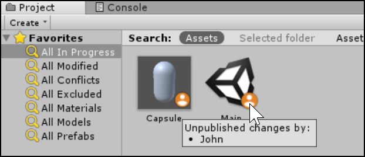
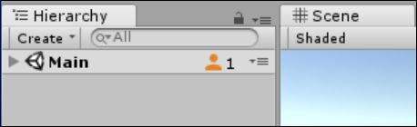
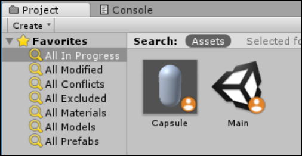
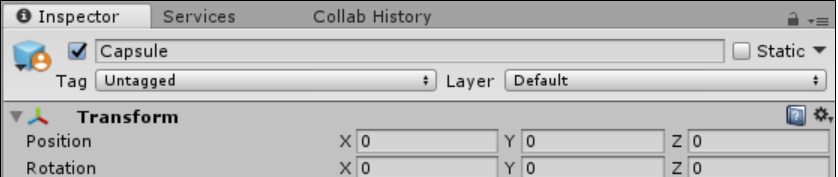

# 进行中 (In-Progress) 编辑通知

Unity Collaborate 持续监控团队成员对项目所做的更改。团队成员在本地计算机上保存对场景或预制件的更改时，Collaborate 会通过在资源上显示“进行中”(In-Progress) 标示来通知您该资源已更改。

要查看谁正在处理该场景或预制件，请将鼠标悬停在标示上。

 

## 场景的进行中标示

对于场景，进行中标示显示在 Unity Editor 中的两个位置：

* **Project** 浏览器中的文件图标上。

     

* **Hierarchy** 窗口中。

     

## 预制件的进行中标示

对于预制件，进行中标示也显示在 Unity Editor 中的两个位置：

* Project 浏览器中的文件图标上。

     

* **Inspector** 窗口中。

     

团队成员发布其更改后，Unity 会删除该图标和计数器。

----
* Unity [2017.1](../Manual/30_search.html?q=newin20171) 中的新功能 NewIn20171
