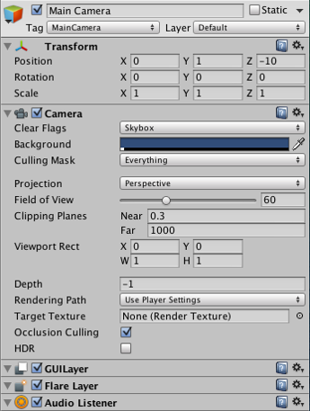

#组件简介

一个__游戏对象__包含多个__组件__。（请参阅关于[游戏对象](GameObjects.html)的文档以了解更多信息。）

下面使用最常见的__组件__（即__变换组件__）来举例说明__游戏对象__和__组件__之间的关系。

可以通过在 __Inspector__ 中查看新的__游戏对象__来查看__变换组件__：

* 在 Unity Editor 中的任何项目中打开任何场景。（请参阅[入门](GettingStarted.html)文档以了解与此相关的更多指导信息。）
* 创建新的__游戏对象__（菜单：__GameObject__ > __Create Empty__）。
* 新的__游戏对象__处于预先选中状态，并在 __Inspector__ 中显示其__变换组件__，如下图中所示。（如果未预先选中，可单击游戏对象来查看其 __Inspector__。）

请注意，新的空__游戏对象__包含一个名称 ("GameObject")、一个 [Tag](Tags.html) ("Untagged") 和一个 [Layer](Layers.html) ("Default")。它还包含一个__变换组件__。

变换组件
-----------------------

在 Editor 中无法创建不含__变换组件__的__游戏对象__。此组件定义__游戏对象__在游戏世界和 __Scene 视图__中的位置、旋转和缩放。

__变换组件__还支持名为“父子化”的概念，这一概念对于使用__游戏对象__很重要。要详细了解__变换组件__和父子化，请参阅[变换组件参考页面](class-Transform.html)。

其他组件
----------------

__变换组件__对于所有__游戏对象__都至关重要，因此每个__游戏对象__都有一个变换组件，但__游戏对象__还可以包含其他__组件__。

默认情况下，每个场景都有一个__主摄像机 (Main Camera)__ __游戏对象__。主摄像机具有若干__组件__。（要查看此信息，请在打开的__场景__中选择主摄像机来查看其 __Inspector__。）

通过查看__主摄像机 (Main Camera)__ __游戏对象__的 __Inspector__，可以看到其包含额外__组件__。具体来说，包括 [Camera 组件](class-Camera.html)、[GUILayer](class-GUILayer.html)、[Flare Layer](class-FlareLayer.html) 和 [Audio Listener](class-AudioListener.html)。所有这些__组件__都为此__游戏对象__提供功能。

还可以向__游戏对象__中添加 [Rigidbody](RigidbodiesOverview.html)、[Collider](CollidersOverview.html)、[Particle System](PartSysWhatIs.html) 和 [Audio](AudioOverview.html) 等各种不同的__组件__。
