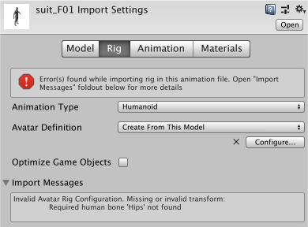
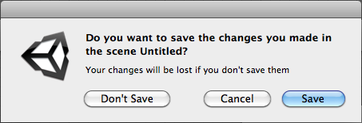
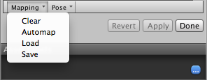
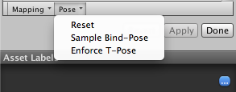
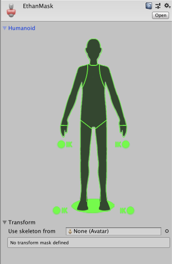

# 导入人形动画

当 Unity 导入包含__人形__骨架和动画的模型文件时，需要将模型的骨骼结构与其动画进行协调。为了实现这一点，系统会将文件中的每个骨骼映射到人形 Avatar，这样才能正确播放动画。因此，在将模型文件导入 Unity 之前，仔细准备该文件非常重要。

1.[定义骨架类型并创建 Avatar](#AvatarSetup)。
2.[纠正或验证 Avatar 的映射](#AvatarConfig)。
3.完成骨骼映射后，可选择单击 __Muscles &amp; Settings__ 选项卡来[调整 Avatar 的肌肉配置](MuscleDefinitions.html)。
4.可以选择[将骨架骨骼到 Avatar 的映射](class-Avatar.html#HumanTemplate)保存为人体模板 (.ht) 文件。
5.可以选择通过[定义 Avatar 遮罩](#AvatarMask)来限制在某些骨骼上导入的动画。
6.从 __Animation__ 选项卡中，启用 __Import Animation__ 选项，然后设置其他特定于资源的属性。
7.如果文件包含多个动画或动作，可[将特定动作范围定义为动画剪辑](Splittinganimations.html)。
8.对于文件中定义的每个动画剪辑，可以：
    * [更改姿势和根变换](class-AnimationClip.html#ClipProperties)
    * [优化循环](LoopingAnimationClips.html)
	* 对人形骨架两侧的动画进行__镜像 (Mirror)__。
    * [向剪辑添加曲线](AnimationCurvesOnImportedClips.html)以便动画化其他项的时序
    * [向剪辑添加事件](AnimationEventsOnImportedClips.html)以便在动画期间触发某些动作
    * [丢弃动画的一部分](AnimationMaskOnImportedClips.html)（类似于使用运行时 [Avatar 遮罩](class-AvatarMask.html)，但却是在导入时执行的）
    * [选择其他根运动节点](AnimationRootMotionNodeOnImportedClips.html)来驱动动作
    * [阅读 Unity 提供的有关导入剪辑的任何消息](class-AnimationClip.html#ImportMessages)
    * [观看动画剪辑的预览](class-AnimationClip.html#AnimationPreview)
9.要保存更改，请单击 __Import Settings__ 窗口底部的 __Apply__ 按钮，也可单击 __Revert__ 放弃所做的更改。

 
## 设置 Avatar

从 [Inspector 窗口的 Rig 选项卡](FBXImporter-Rig.html)中，将 __Animation Type__ 设置为 __Humanoid__。默认情况下，__Avatar Definition__ 属性设置为 __Create From This Model__。如果保持该选项，Unity 会尝试将文件中定义的一组骨骼映射到人形 Avatar。

**注意：**在某些情况下，可将此选项更改为 __Copy From Other Avatar__，从而使用事先为其他模型文件定义的 Avatar。例如，如果在 3D 建模应用程序中使用多个不同的动画来创建一个网格（皮肤），则可以将网格导出到一个 FBX 文件，并将每个动画导出到各自的 FBX 文件。将这些文件导入 Unity 时，只需为导入的第一个文件（通常是网格）创建一个 Avatar 即可。只要所有文件都使用相同的骨骼结构，便可以将该 Avatar 用于其余文件（例如，所有动画）。

如果启用此选项，必须通过设置 __Source__ 属性来指定要使用的 Avatar。

单击 __Apply__ 按钮。Unity 会尝试将现有骨骼结构与 Avatar 骨骼结构相匹配。在许多情况下，它可以通过分析骨架中骨骼之间的连接情况来自动执行此操作。

如果匹配成功，__Configure__ 菜单旁会出现一个复选标记。Unity 还会将 Avatar 子资源添加到模型资源（可以在项目视图中找到该资源）。

成功匹配只是意味着 Unity 能够匹配所有必需的骨骼。但是，为了获得更好的结果，还需要匹配可选骨骼，并将模型设置为正确的 __T 形姿势 (T-pose)__。

如果 Unity 无法创建 Avatar，__Configure__ 按钮旁将显示一个叉号，且项目视图中不显示任何 Avatar 子资源。

由于 Avatar 是动画系统极其重要的一个方面，因此为__模型__正确配置 Avatar 非常重要。

出于这一原因，无论自动创建 Avatar 是否成功，都务必要[检查 Avatar](#AvatarConfig) 是否有效并正确进行设置。

 
## 配置 Avatar

如果 Unity 无法为模型创建 Avatar，必须单击 __Rig__ 选项卡上的 __Configure ...__ 按钮以打开 [Avatar 窗口](class-Avatar.html)并修复 Avatar。

如果匹配成功，可以单击 __Rig__ 选项卡上的 __Configure ...__ 按钮，或从项目视图中打开窗口：

1.单击__项目__视图中的 Avatar 子资源。__Inspector__ 将显示 Avatar 名称和 __Configure Avatar__ 按钮。
2.单击 __Configure Avatar__ 按钮。

如果尚未保存 Avatar，则会显示一条消息，要求保存场景：

 

出现这种情况的原因是，在 __Configure__ 模式下，Scene 视图用于单独显示所选模型的骨骼、肌肉和动画信息，而不显示场景的其余部分。

保存场景后，__Inspector__ 内将显示 __Avatar__ 窗口，其中显示所有骨骼映射。

确保骨骼映射正确，并映射了 Unity 未分配的任何可选骨骼。

骨架必须至少具备所需的骨骼才能让 Unity 产生有效的匹配。为了提高与 Avatar 相匹配的机会，请确保骨骼的命名方式反映了其所代表的身体部位。例如，“LeftArm”和“RightForearm”明确显示了这些骨骼的控制对象。

### 映射策略

如果模型*未*产生有效匹配，可以使用与 Unity 内部过程类似的过程：

1.从 __Avatar__ 窗口底部的 __Mapping__ 菜单中选择 __Clear__ 来重置 Unity 尝试进行的映射。 
2.从 __Avatar__ 窗口底部的 __Pose__ 菜单中选择 __Sample Bind-pose__ 来估算模型的初始建模姿势。 
3.选择 __Mapping__ &gt; __Automap__ 从初始姿势创建骨骼映射。
4.选择 __Pose__ &gt; __Enforce T-Pose__ 将模型设置回所需的 T 形姿势。

如果自动映射彻底失败或部分失败，可以通过从 __Scene__ 视图或 __Hierarchy__ 视图中拖动骨骼来手动分配骨骼。如果 Unity 认为骨骼适合，该骨骼会在 __Avatar Mapping__ 选项卡中显示为绿色；否则显示为红色。

### 重置姿势

__T 形姿势__是 Unity 动画所需的默认姿势，也是在 3D 建模应用程序中建模的推荐姿势。但是，如果没有使用 T 形姿势对角色进行建模并且动画无法按预期工作，则可以选择：

如果骨骼分配正确，但角色未处于正确的_姿势_，将看到消息“Character not in T-Pose”。此时可从 __Pose__ 菜单中选择 __Enforce T-Pose__ 来修复该问题。如果姿势仍然不正确，可以手动将剩余的骨骼旋转为 T 形姿势。

 
## 创建 Avatar 遮罩

通过遮罩功能可以丢弃剪辑中的一些动画数据，从而让剪辑仅动画化对象或角色的某些部分而不是整体。例如，可能有一个标准的行走动画，其中包括手臂和腿部运动，但如果一个角色用双手抱着大型物体，那么不会希望其手臂在行走时向侧面摆动。但是，仍然可以在角色抱着物体时使用标准行走动画，但需要使用遮罩在行走动画的上层仅播放抱着物体动画的上半身部分。

可以在导入时或运行时将遮罩应用于动画剪辑。最好是在导入时应用遮罩，因为这样做允许从构建中忽略丢弃的动画数据，从而使文件更小，进而使用更少的内存。此外还可以提高处理速度，因为在运行时需要混合的动画数据更少。在某些情况下，导入遮罩可能对您不适用。这种情况下，可在运行时应用遮罩，为此需要创建 __Avatar 遮罩 (Avatar Mask)__ 资源，并在 __Animator Controller__ 的[层设置中使用该资源](AnimationLayers.html)。

要创建空的 Avatar 遮罩资源，可以：

* 从 __Assets__ 菜单中选择 __Create__ &gt; __Avatar Mask__。
* 在__项目__视图中单击要定义遮罩的模型对象，然后单击右键并选择 __Create__ &gt; __Avatar Mask__。

新资源将显示在__项目__视图中：

现在可以[将人体部位添加到遮罩](class-AvatarMask.html)，然后将遮罩添加到[动画层](AnimationLayers.html)或添加对遮罩的引用（在 [Animation 选项卡](class-AnimationClip.html)的 [Mask](AnimationMaskOnImportedClips.html) 部分）。

---

*  2018-04-25  Page amended with limited [editorial review](DocumentationEditorialReview.html)

