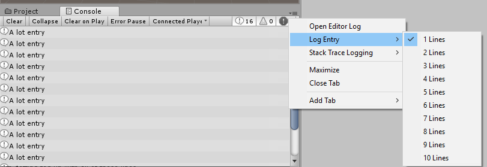
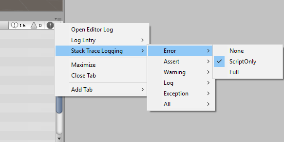

#Console 窗口

__Console__ 窗口（菜单：__Window &gt; Console__）显示 Unity 生成的错误、警告和其他消息。为了方便调试，还可以使用 [Debug.Log](../ScriptReference/Debug.Log.html)、[Debug.LogWarning](../ScriptReference/Debug.LogWarning.html) 和 [Debug.LogError](../ScriptReference/Debug.LogError.html) 函数，在控制台中显示自定义的消息。

 

Console 窗口的工具栏有许多选项可影响消息显示方式。

_Clear_ 按钮可移除从代码中生成的所有消息，但会保留编译器错误。可通过启用 _Clear On Play_ 选项来设置在运行游戏时自动清除控制台。

还可以更改控制台中消息的显示和更新方式。_Collapse_ 选项仅显示重复出现的错误消息的第一个实例。有时在每次帧更新时会重复生成的运行时错误（例如 null 引用），此选项在这种情况下非常有用。使用 _Error Pause_ 选项时，只要从脚本调用 Debug.LogError，就会使回放暂停（但是，请注意 Debug.Log 不会这样暂停）。需要在执行中冻结特定点的回放并检查场景时，这会很方便。

最后，有两个选项可用于查看有关错误的其他信息。控制台选项卡菜单上的 _Open Player Log_ 和 _Open Editor Log_ 菜单项可访问 Unity 的日志文件，这些文件将记录可能未在控制台上显示的详细信息。请参阅关于[日志文件](LogFiles.html)的页面以了解更多信息。


##过时 API 警告和自动更新

除了其他消息，Unity 还显示有关在代码中使用过时 API 调用的警告。例如，Unity 曾在 MonoBehaviour 和其他类中使用“快捷方式”来访问常见组件类型。因此，比如说，可使用如下代码来访问对象上的[刚体](class-Rigidbody.html)：

````
	//“rigidbody”变量是类的一部分，未在用户脚本中声明。
		Vector3 v = rigidbody.velocity;
````

这些快捷方式已被弃用，因此现在应该使用如下代码：

````
	// 使用 GetComponent 来访问组件。
		Rigidbody rb = GetComponent<Rigidbody>();
		Vector3 v = rb.velocity;
````

检测到过时 API 调用时，Unity 将显示相关的警告消息。双击此消息时，Unity 将自动尝试将已弃用的用法升级到建议的等效用法。

## 调整行计数

要调整日志条目在列表中显示的行数，请单击惊叹号按钮，选择 __Log Entry__，然后选择行数。

 

通过此设置，可根据上下文量与窗口中能够容纳的条目数来确定窗口所需的粒度。

##堆栈跟踪日志记录

可以指定在将日志消息输出到控制台或日志文件时应如何准确捕获堆栈跟踪。



错误消息不是很明确时，这通常很有帮助。通过查看堆栈跟踪，可以推导错误来自哪个引擎区域。
堆栈跟踪日志记录有三个选项：

* **None** - 不会输出堆栈跟踪
* **ScriptOnly** - 只输出托管堆栈跟踪
* **Full** - 同时输出本机和托管堆栈跟踪，注意：解析完整堆栈跟踪是一项高成本的操作，应仅用于调试目的

还可以通过脚本 API 来控制堆栈跟踪日志记录。请参阅关于 [Application.stackTraceLogType](../ScriptReference/Application-stackTraceLogType.html) 的 API 参考文档以了解更多详细信息。

---

* <span class="page-edit">2017-09-18  Page amended with limited [editorial review](DocumentationEditorialReview.html)
</span>

* <span class="page-history">在 [2017.3](https://docs.unity3d.com/2017.3/Documentation/Manual/30_search.html?q=newin20173) 版中添加了日志条目行计数 <span class="search-words">NewIn20173</span></span>
