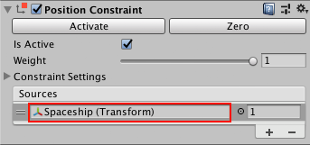
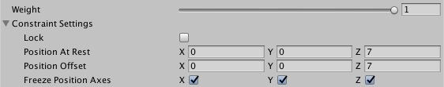
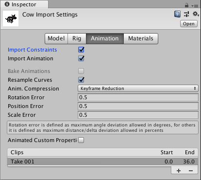

# 约束

约束组件将游戏对象的位置、旋转或缩放与另一个游戏对象关联。受约束的游戏对象像关联到的游戏对象一样移动、旋转或缩放。

Unity 支持以下类型的约束组件：

* [Aim](class-AimConstraint.html)：旋转受约束的游戏对象以朝向关联的游戏对象。

* [Parent](class-ParentConstraint.html)：使受约束的游戏对象跟随关联的游戏对象移动和旋转。

* [Position](class-PositionConstraint.html)：像关联的游戏对象一样移动受约束的游戏对象。

* [Rotation](class-RotationConstraint.html)：像关联的游戏对象一样旋转受约束的游戏对象。

* [Scale](class-ScaleConstraint.html)：像关联的游戏对象一样缩放受约束的游戏对象。

## 关联到游戏对象

使用约束组件中的 __Sources__ 列表可指定要关联到的游戏对象。

例如，要让十字准线跟随 2D 射击游戏中玩家的宇宙飞船，请在十字准线上添加一个 __Position Constraint__ 组件。要将十字准线关联到宇宙飞船，请导航到 __Position Constraint__ 组件，然后将宇宙飞船游戏对象添加到 __Sources__ 列表中。当玩家移动宇宙飞船时，十字准线随之移动。

一个约束可以关联到多个源游戏对象。在这种情况下，约束使用其源游戏对象的平均位置、旋转或缩放。例如，要将光源指向一组游戏对象，请将 __Aim Constraint__ 组件添加到光源游戏对象。然后，在 __Sources__ 列表中添加要接受光照的游戏对象。__Aim Constraint__ 将光源定向至其光源的平均位置。

Unity 按照源游戏对象在 __Sources__ 列表中出现的顺序来对源游戏对象求值。该顺序对 __Position Constraint__ 和 __Scale Constraint__ 组件没有影响。但是，顺序会对 __Parent Constraint__、__Rotation Constraint__ 和 __Aim Constraint__ 组件产生影响。要获得所需的结果，请通过拖放各项来重新排序 __Sources__ 列表。

可以约束一系列游戏对象。例如，假如想让小鸭子排成一排跟随它们的妈妈。应将 __Position Constraint__ 组件添加到游戏对象 _Duckling1_。在 __Sources__ 列表中，关联到 _MotherDuck_。然后，将 __Position Constraint__ 添加到 _Duckling2_，而后者再关联到 _Duckling1_。当 _MotherDuck_ 游戏对象在场景中移动时，_Duckling1_ 跟随 _MotherDuck_，_Duckling2_ 跟随 _Duckling1_。

请避免创建循环约束，因为这会在游戏过程中导致不可预测的更新。

## 设置约束属性

使用 [Inspector 窗口](UsingTheInspector.html)可更改约束中的常用属性。

使用 __Weight__ 属性可以改变约束的影响。权重 1 会使约束更新游戏对象的速度与其源游戏对象的速度相同。权重为 0 会完全消除约束的影响。每个源游戏对象也有一个单独的权重。

在 __Constraint Settings__ 中，使用 __At Rest__ 属性可以指定当 __Weight__ 为 0 或未选中 __Freeze Axes__ 中相应属性时要使用的 X、Y 和 Z 值。

使用 __Constraint Settings__ 中的 __Offset__ 属性可以指定约束游戏对象时要使用的 X、Y 和 Z 值。

使用 __Freeze Axes__ 设置可以切换约束可以实际修改的轴。

## 激活和锁定约束

可以在两个方面使用约束：激活和锁定。

通过激活约束可以对受约束的游戏对象的位置、旋转或缩放进行求值。Unity 不会对非活动约束进行求值。

通过锁定约束可以移动、旋转或缩放游戏对象。锁定的约束会控制游戏对象的[变换组件](Transforms.html)的相关部分。无法使用锁定的约束手动移动、旋转或缩放游戏对象。也无法编辑 __Constraint Settings__。

要手动编辑游戏对象的位置、旋转或缩放，请解锁其约束。如果约束处于活动状态的同时未锁定，则在您移动、旋转或缩放受约束的游戏对象或其源游戏对象时，约束会更新 __Constraint Settings__。

向游戏对象添加约束组件时，约束在默认情况下处于非活动状态并且未锁定。因此，允许在激活和锁定约束之前微调受约束游戏对象和源游戏对象的位置、旋转和缩放。

为方便起见，__Activate__ 和 __Zero__ 按钮可以更新 __Constraint Settings__：

* __Activate__：保存相对于源游戏对象的当前偏移量，然后激活并锁定受约束的游戏对象__。__

* __Zero__：重置位置、旋转或缩放以匹配源游戏对象，然后激活并锁定受约束的游戏对象。

## 动画化和组合约束

使用动画剪辑可以修改受约束的游戏对象关联到的源游戏对象。当动画修改源游戏对象时，约束会修改受约束的游戏对象。

还可以在约束组件中动画化属性。例如，使用 Parent Constraint 将角色的剑从他们的手中移到他们的背后。首先，将一个 Parent Constraint 添加到剑游戏对象。在 __Sources__ 列表中，将约束关联到角色的手和角色的脊椎。要动画化剑，请为每个源的权重添加关键帧。要动画化剑从背部移动到手中的动作，请添加关键帧来将手的权重从 0 更改为 1，并添加关键帧来将脊椎权重从 1 更改为 0。

可以向同一个游戏对象添加多种类型的约束组件。更新游戏对象时，Unity 会按照约束组件在 [Inspector 窗口](UsingTheInspector.html)中的先后出现顺序来对这些组件求值。一个游戏对象只能包含同一类型的一个约束组件。例如，不能添加多个 Position Constraint。

## 导入约束

从 Autodesk Maya® 和 MotionBuilder® 将 FBX 文件导入 Unity Editor 时，可以包含约束。单击 Import Settings 窗口的 [Animation 选项卡](class-AnimationClip.html)，然后选中 __Import Constraints__：

对于 FBX 文件中的每个约束，Unity 会自动添加相应的约束组件并将其关联到正确的游戏对象。

## 添加和编辑约束

要添加约束组件，请执行以下操作：

1.选择要约束的游戏对象。

2.在 Inspector 窗口中，单击 __Add Component__ 查找要添加的约束类型，然后单击该约束进行添加。

3.要将源游戏对象添加到新约束，请将该游戏对象从 Hierarchy 视图（或从 Scene 视图）拖到 __Sources__ 列表中。

4.移动、旋转或缩放受约束的游戏对象及其源游戏对象。

5.要激活约束，请单击 __Activate__ 或 __Zero__，或者选中 __Is Active__ 和 __Lock__。

要编辑约束组件，请执行以下操作：

1.在 Editor 中选择受约束的游戏对象。

2.要调整 __At Rest__ 或 __Offset__ 字段，请使用 Inspector 窗口展开 __Constraint Settings__，取消选中 __Lock__，然后编辑值。

3.要指定约束更新的轴，请展开 __Constraint Settings__，然后选中 __Freeze Axes__ 中的属性。

4.要将源游戏对象添加到约束，请执行以下操作：

    * 如果 Sources 列表中没有空字段，请单击列表底部的 +。

    * 将要用作约束源的游戏对象从场景中拖动到 __Sources__ 列表中。

5.要删除某个源游戏对象，请在 __Sources__ 列表中选择它，然后单击列表底部的减号 (__-__)。

6.要在 __Sources__ 列表中重新排序源游戏对象，请单击要移动的每个游戏对象左侧的双横线图标，然后向上或向下拖动。

    __注意：__在 __Sources__ 列表中，顺序对 Position、Rotation 和 Scale 约束
    没有影响。但是，顺序确实会影响 Parent Constraint 和 Aim Constraint 移动或旋转
    游戏对象的方式。

7.选中 __Is Active__ 和 __Lock__。

---

*  2018-04-11  Page published with [editorial review](DocumentationEditorialReview.html)

* 在 [2018.1](https://docs.unity3d.com/2018.1/Documentation/Manual/30_search.html?q=newin20181) 中添加了约束 NewIn20181
