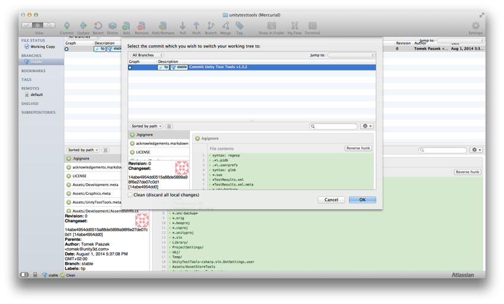
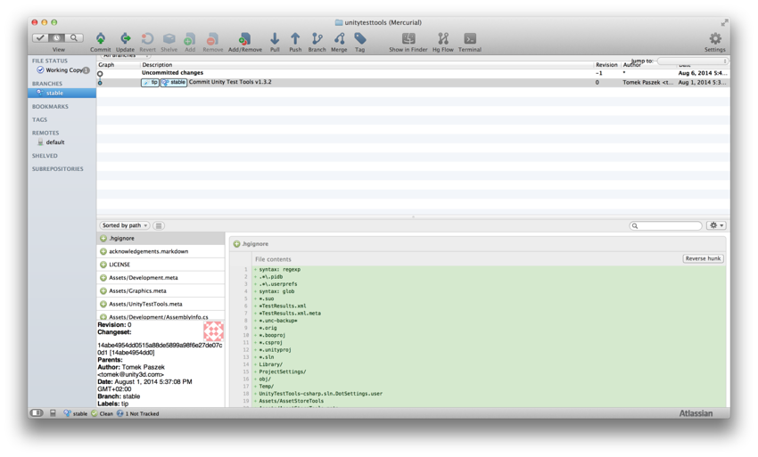
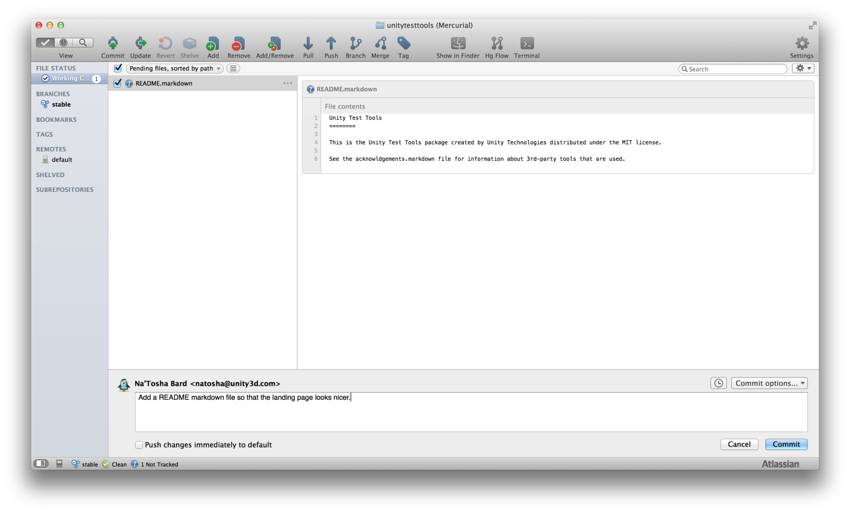
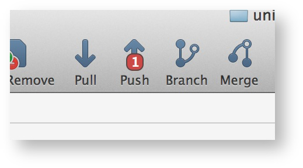
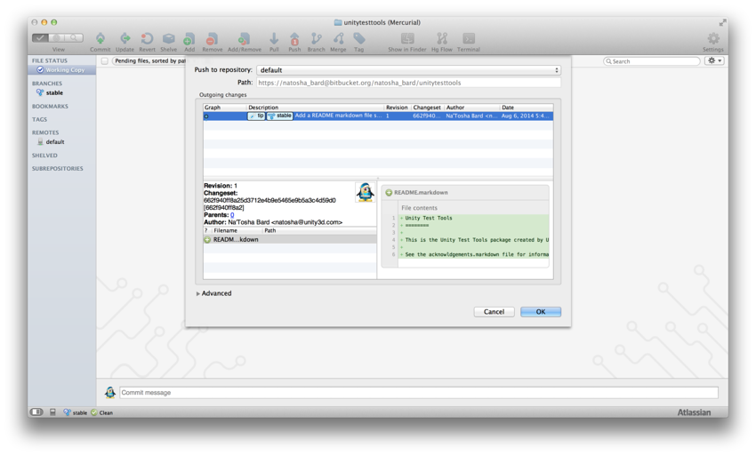

步骤 4：对分叉应用修改
============

您现在应该有了一个本地克隆体。要进行更改，您需要做的第一件事是通过导航到 Mercurial/Git 客户端中的正确分支来访问正确版本的源代码。然后，即可进行修改。

在我们的示例中，Unity Test Tools 代码仓库是新的，并且只在稳定分支上有一个提交。以下是显式更新到该版本的示例：

 

获得正确版本的源代码后，可根据需要进行修改。当您返回到 Mercurial/Git 客户端时，它将检测到您已修改文件：

 

您可以在 __Working Copy__ 视图中看到它们。单击 __Commit__ 提交这些更改：

 

接下来，推送更改。您的客户端将显示等待推送的变更集数量：

 

单击 __Push__ 推送更改：

 
