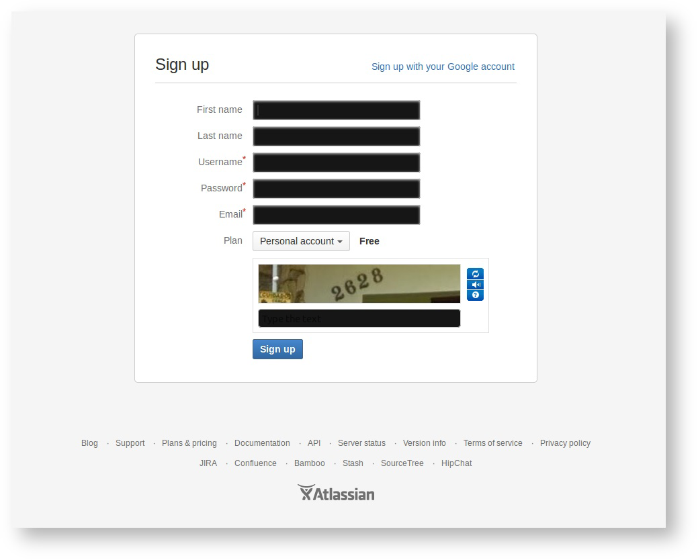
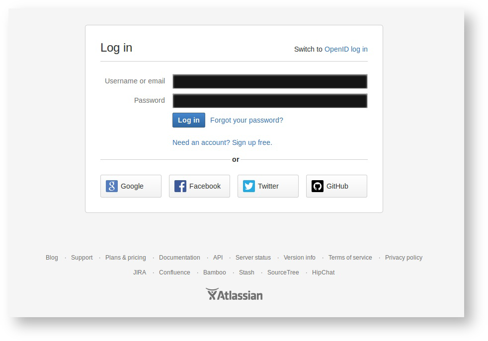

步骤 1：获取 Bitbucket 帐户
============

我们的开源组件托管在 [Bitbucket](http://bitbucket.org/) 上的 [Unity-Technologies 团队](https://bitbucket.org/Unity-Technologies)名下。您无需登录即可访问代码仓库并克隆源代码，但需要有一个帐户才能参与更改。

首先，访问 [Bitbucket 的帐户注册页面](https://bitbucket.org/account/signup/)。

 

如果您不想创建新帐户，Bitbucket 支持 [OpenID](http://openid.net/get-an-openid/what-is-openid/)，因此允许使用 Google、Facebook、Twitter 或 GitHub 帐户登录。

 
