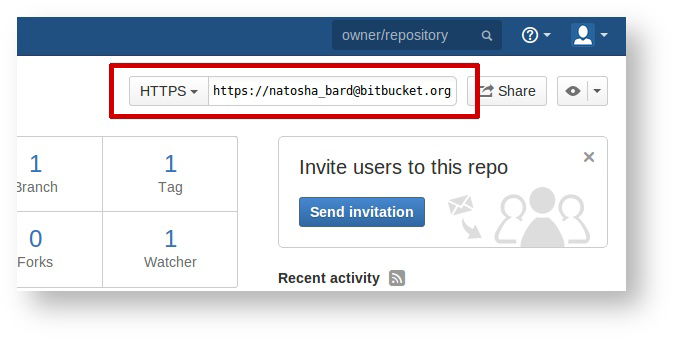
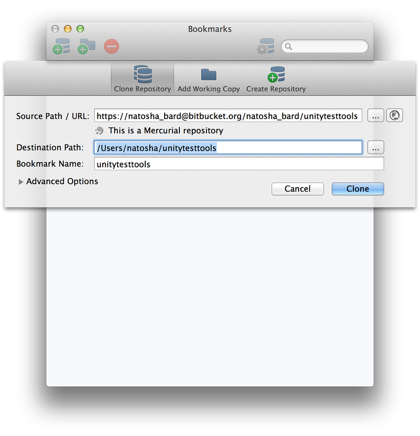

步骤 3：克隆您的分叉
============

接下来，在本地克隆您的分叉，以便可进行修改。如果代码仓库是 Mercurial 代码仓库，则需要获取 Mercurial 客户端。如果是 Git 代码仓库，则需要获取 Git 客户端。Atlassian（Bitbucket 的所有者公司）维护着一个名为 [SourceTree](https://www.atlassian.com/software/sourcetree/overview) 的应用程序，该程序可在 Windows 和 OS X 上运行，并可与 Mercurial 和 Git 代码仓库结合使用。我们在 Unity 中大量使用 SourceTree 与我们自己的 Mercurial 代码仓库进行交互。请查看 [Mercurial](http://mercurial.selenic.com/downloads) 和 [Git](http://git-scm.com/downloads) 的下载页面以了解提供的不同选项。

准备好 Mercurial 或 Git 客户端后，即可通过您的分叉页面上的 URL 来[克隆](https://confluence.atlassian.com/display/BITBUCKET/Clone+a+repository)该客户端：

 

这是我们在 SourceTree 中克隆分叉的一个示例：

 
