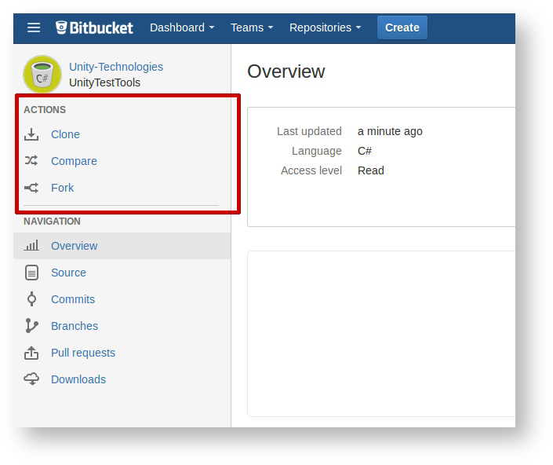
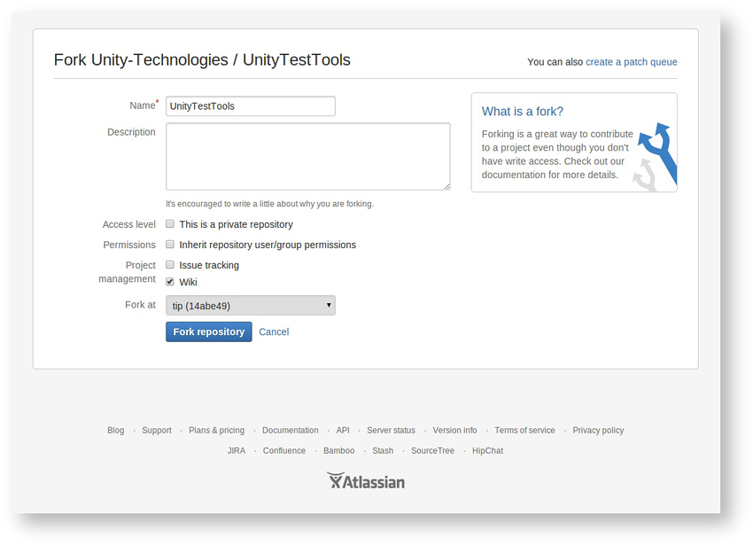
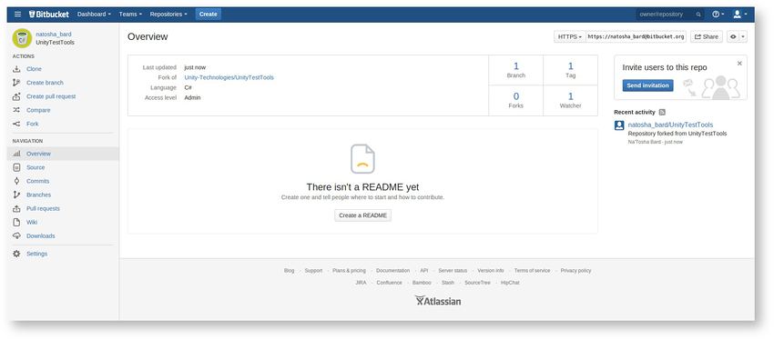

步骤 2：将您想要参与的代码仓库进行分叉
========

此演示使用的是 [Unity Test Tools](https://Bitbucket.org/Unity-Technologies/unitytesttools) 代码仓库。

代码仓库页面的左侧有一个侧边栏，其中包含 __Actions__ 部分：

 

单击 [__Fork__](https://confluence.atlassian.com/display/BITBUCKET/Forking+a+Repository) 按钮并填写打开的窗体，然后单击 __Fork repository__：

  
 
完成代码仓库的分支后，您将看到新分叉的登陆页面：

 
