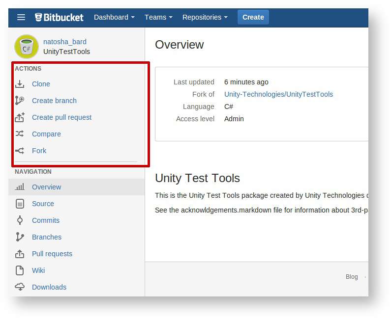
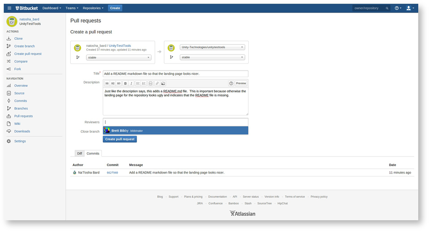
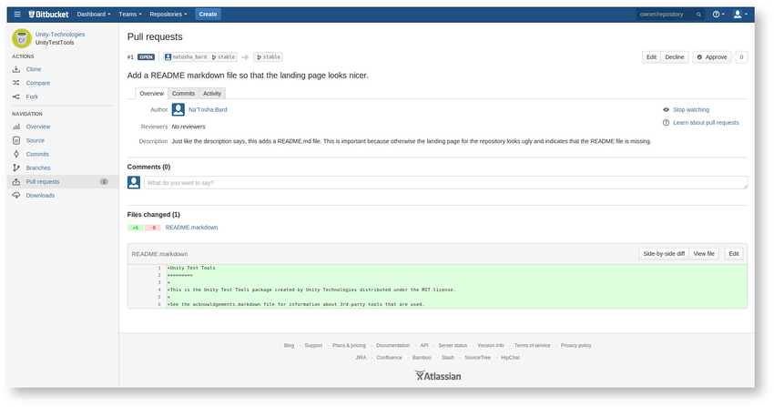

步骤 5：在 Bitbucket 上提出拉取请求
============

最后一步是在 Bitbucket 上提出拉取请求。返回我们分叉的登陆页面，再次查看侧边栏。您将看到一些新选项：

 

这次，单击 __Create Pull Request__ 链接。随后将进入一个页面，该页面自动汇总传出的变更集并显示它们的差异（“差异”显示两个版本之间的差异或变化）。您还可以添加描述（建议这样做！）和任何评论：

 

最后，您将被重定向到您的拉取请求。您可以与任何人分享此链接，包括您自己团队中的其他成员，以便他们可以参与该项目：

 
