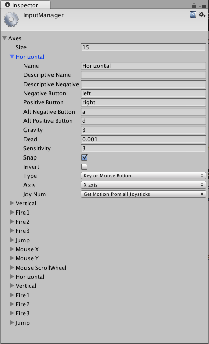

#传统游戏输入

Unity 支持键盘、游戏杆和游戏手柄输入。

可以在 __Input Manager__ 中创建虚拟轴和按钮，而最终用户可以在友好的屏幕配置对话框中配置键盘输入。

 是 Unity Technologies 发布的一款游戏。](../uploads/Main/InputSelector.png)

可以设置游戏杆、游戏手柄、键盘和鼠标，然后通过一个简单的脚本接口访问它们。通常会使用轴和按钮来模仿游戏主机控制器。也可以访问键盘上的按键。

##虚拟轴
从脚本中，可以通过名称访问所有虚拟轴。

每个项目在创建时都具有以下默认输入轴：

* __Horizontal__ 和 __Vertical__ 映射到 w、a、s、d 键和箭头键。
* __Fire1__、__Fire2__ 和 __Fire3__ 分别映射到 Control 键、Option (Alt) 键和 Command 键。
* __Mouse X__ 和 __Mouse Y__ 映射到鼠标移动的增量。
* __Window Shake X__ 和 __Window Shake Y__ 映射到窗口的移动。

###添加新的输入轴

如果要添加新的虚拟轴，请选择 __Edit &gt; Project Settings &gt; Input__ 菜单。还可以在此处更改每个轴的设置。

 

可以将每个轴映射到游戏杆上的两个按钮、鼠标或键盘键。

|**_属性：_** |**_功能：_** |
|:---|:---|
|__Name__ |用于从脚本中检查此轴的字符串名称。 |
|__Descriptive Name__ |独立构建的 __Configuration__ 对话框的 Input 选项卡中显示的正值名称。 |
|__Descriptive Negative Name__ |独立构建的 __Configuration__ 对话框的 Input 选项卡中显示的负值名称。 |
|__Negative Button__ |用于向负方向推动轴的按钮。 |
|__Positive Button__ |用于向正方向推动轴的按钮。 |
|__Alt Negative Button__ |用于向负方向推动轴的替代按钮。 |
|__Alt Positive Button__ |用于向正方向推动轴的替代按钮。 |
|__Gravity__ |未按下按钮的情况下，轴下降到中性点的速度（以单位/秒表示）。 |
|__Dead__ |模拟盲区的大小。此范围内的所有模拟设备值都会映射到中性点。 |
|__Sensitivity__ |轴向目标值移动的速度（以单位/秒表示）。仅用于数字设备。 |
|__Snap__ |如果启用，按下相反方向的按钮时，轴值将重置为零。 |
|__Invert__ |如果启用，则**负按钮 (Negative Buttons)** 将提供正值，反之亦然。 |
|__Type__ |将控制此轴的输入类型。 |
|__Axis__ |将控制此轴的已连接设备的轴。 |
|__Joy Num__ |将控制此轴的已连接游戏杆。 |

使用这些设置可以微调输入的外观。所有这些在 Editor 中的工具提示中也有说明。

###从脚本中使用输入轴
可以从脚本中查询当前状态，如下所示：

	 value = Input.GetAxis ("Horizontal");

轴的值介于 -1 到 1 之间。中性位置为 0。
这是游戏杆输入和键盘输入的情况。

但是，Mouse Delta 和 Window Shake Delta 是鼠标或窗口在最后一帧中移动的程度。这意味着，当用户快速移动鼠标时，它可以大于 1 或小于 -1。

可以使用相同的名称创建多个轴。获取输入轴时，将返回绝对值最大的轴。这样就可以将多个输入设备分配给一个轴名称。例如，为键盘输入创建一个轴，用相同名称为游戏杆输入创建一个轴。如果用户正在使用游戏杆，则输入将来自游戏杆，否则输入将来自键盘。这样一来，不必在编写脚本时考虑输入的来源。

##按钮名称

要将键映射到轴，必须在 __Inspector__ 中的 __Positive Button__ 或 __Negative Button__ 属性中输入键的名称。

##键
键的名称遵循以下约定：

* 普通键：“a”、“b”、“c”...
* 数字键：“1”、“2”、“3”...
* 箭头键：“up”、“down”、“left”和“right”
* 键盘键：“[1]”、“[2]”、“[3]”、“[+]”和“[equals]”
* 修饰键：“right shift”、“left shift”、“right ctrl”、“left ctrl”、“right alt”、“left alt”、“right cmd”、“left cmd”
* 鼠标按钮：“mouse 0”、“mouse 1”、“mouse 2”...
* 游戏杆按钮（任何游戏杆）：“joystick button 0”、“joystick button 1”、“joystick button 2”...
* 游戏杆按钮（特定游戏杆）：“joystick 1 button 0”、“joystick 1 button 1”、“joystick 2 button 0”...
* 特殊键：“backspace”、“tab”、“return”、“escape”、“space”、“delete”、“enter”、“insert”、“home”、“end”、“page up”和“page down”
* 功能键：“f1”、“f2”、“f3”...

用于标识键的名称在脚本接口中和在 Inspector 中是相同的。

	 value = Input.GetKey ("a");

另外请注意，可以使用 KeyCode 枚举参数来访问键。

	
