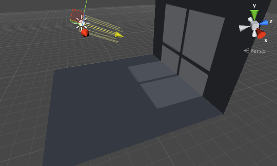
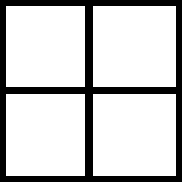
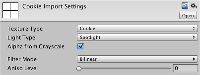

#剪影

在戏剧和电影中，长期以来一直使用光照效果来表现场景中并不真实存在物体。丛林探险家看起来像是处于虚构的树冠的阴影中。监狱场景经常出现透过铁窗投射的光线，但窗户和墙壁实际上并非该场景的一部分。虽然看起来很有气氛，但其实创建阴影的过程非常简单，只需在光源和舞台之间放置一个某种形状的遮罩。这种遮罩称为_剪影_（即 _cookie_）。Unity 光照允许您以纹理的形式添加剪影；使用这些特性可以高效地为场景增添氛围。

##创建剪影

剪影只是普通的纹理，但仅与 Alpha/透明度通道相关。导入剪影时，Unity 允许将图像亮度转换为 Alpha，这样做通常更容易将剪影设计为灰度纹理。您可以使用任何可用的图像编辑器来创建剪影，并将其保存到项目的 Assets 文件夹中。

将剪影导入 Unity 后，从 Project 视图中选择该剪影，然后在检视面板中将 _Texture Type_ 设置为 _Cookie_。除非您已经自己设计了图像的 Alpha 通道，否则还应启用 _Alpha From Grayscale_。

 

_Light Type_ 会影响光照投射阴影的方式。由于点光源向各个方向投射，因此剪影纹理必须采用立方体贴图的形式。聚光灯应使用类型设置为 _Spotlight_ 的剪影，而方向光实际上可使用 _Spotlight_ 或 _Directional_ 选项。产生方向性剪影的方向光将在整个场景中以平铺图案重复产生剪影。使用聚光灯剪影时，剪影仅会在“光束”的直接路径中出现一次；只有在这种情况下，方向光的位置才很重要。

##将剪影应用于光照

导入纹理后，应将该纹理拖动到检视面板中的 Light 的 _Cookie_ 属性以便应用该纹理。

 

聚光灯和点光源直接根据锥体或球体的大小来缩放剪影。方向光有一个附加的 _Cookie Size_ 选项可让您自行缩放剪影；缩放操作适用于 _Spotlight_ 和 _Directional_ 两种类型的剪影。

##剪影的用途

剪影通常用于改变光照形状，以便与场景中“绘制”的细节相匹配。例如，黑暗的隧道可能沿着天花板装有一些条形灯。如果您使用标准聚光灯进行光照，那么光束将具有不符合期望的圆形，但您可以使用剪影将灯光限定为瘦长的矩形。监视器屏幕可能会将绿色暗光投射到角色的脸部，但暗光应限定为小盒子形状。

请注意，剪影不一定要是完全黑白的，也可以包含任何灰度级别。这对于模拟光路中的灰尘或污垢非常有用。例如，如果游戏场景发生在长期废弃的房屋内，可通过在窗户和其他光源上使用带有噪点的“脏”剪影来增添气氛。同样，汽车前照灯玻璃通常有凹凸，因此光束将产生明暗交替的“焦散”图案；这便是剪影的另一种很好的用途。
