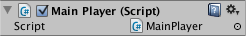

创建和使用脚本
==========================


游戏对象的行为由附加的__组件__控制。虽然 Unity 的内置组件可能用途很广泛，但是您很快就会发现，必须超越组件可提供的功能来实现自己的游戏功能。Unity 允许使用__脚本__来自行创建组件。使用脚本可以触发游戏事件，随时修改组件属性，并以所需的任何方式响应用户的输入。

Unity 本身支持两种编程语言：


* **C#**（发音为 C-sharp），一种类似于 Java 或 C++ 的行业标准语言。
* **UnityScript**，一种专门设计用于 Unity 并模仿 JavaScript 的语言。

除此之外，许多其他 .NET 语言只要能编译兼容的 DLL，就可以用于 Unity；请参阅[此处](UsingDLL.html)以了解更多详情。

学习编程艺术以及这些特定语言的用法超出了本简介的范围。但是，许多书籍、教程和其他资源介绍了如何使用 Unity 进行编程。请参阅我们网站的[学习 (Learning) 部分](http://unity3d.com/learn)以了解更多详细信息。


创建脚本
----------------


与大多数其他资源不同，脚本通常直接在 Unity 中创建。可以从 Project 面板左上方的 Create 菜单新建脚本，也可以通过从主菜单选择 __Assets &gt; Create &gt; C# Script__（或 JavaScript）来新建脚本。

此操作将在 Project 面板中选择的任何文件夹内创建新脚本。新脚本文件的名称将处于选中状态，提示输入新名称。


 

最好在此时输入新脚本的名称而不是稍后编辑名称。输入的名称将用于在文件中创建初始文本（如下所述）。


脚本文件的剖析
------------------------


双击 Unity 中的脚本资源时，将在文本编辑器中打开此脚本。默认情况下，Unity 将使用 Visual Studio，但可从 Unity 的偏好设置（选择 __Unity__ > __Preferences__）中的 __External Tools__ 面板选择所需的任何编辑器。

该文件的初始内容将如下所示：


````
using UnityEngine;
using System.Collections;

public class MainPlayer : MonoBehaviour {

	// 使用此函数进行初始化
	void Start () {
	
	}
	
	// 每帧调用一次 Update
	void Update () {
	
	}
}

````

为了连接到 Unity 的内部架构，脚本将实现一个类，此类从称为 __MonoBehaviour__ 的内置类派生而来。可以将类视为一种蓝图，用于创建可附加到游戏对象的新组件类型。每次将脚本组件附加到游戏对象时，都会创建该蓝图定义的对象的新实例。类的名称取自创建文件时提供的名称。类名和文件名必须相同才能使脚本组件附加到游戏对象。

然而，必须注意在类中定义的两个函数。**Update** 函数是放置代码的地方，用于处理游戏对象的帧更新。这可能包括移动、触发动作和响应用户输入，基本上涉及游戏运行过程中随时间推移而需要处理的任何事项。为了使 Update 函数正常运行，在进行任何游戏操作之前，通常需要确保能够设置变量、读取偏好设置以及与其他游戏对象建立连接。在游戏开始之前（即第一次调用 Update 函数之前），Unity 将调用 **Start** 函数；此函数是进行所有初始化的理想位置。

有经验的程序员可能会惊讶于没有使用构造函数来完成对象的初始化。这是因为对象的构造由编辑器处理，不会像您可能期望的那样在游戏运行过程开始时进行。如果尝试为脚本组件定义构造函数，将会干扰 Unity 的正常运行，并可能导致项目出现重大问题。

UnityScript 脚本的运行方式与 C# 脚本略有不同：


````
# pragma strict

function Start () {

}

function Update () {

}

````

在此处，Start 和 Update 函数具有相同的含义，但未显式声明该类。脚本本身将负责定义该类；将从 MonoBehaviour 隐式派生该类，并按脚本资源的文件名命名。


控制游戏对象
------------------------


如上所述，脚本只定义了组件的蓝图，因此在将脚本实例附加到游戏对象之前，不会激活任何代码。为了附加脚本，可将脚本资源拖动到层级视图面板中的游戏对象，或拖动到当前选定游戏对象的检视面板。Component 菜单上还有一个 Scripts 子菜单，其中包含项目中可用的所有脚本，包括自定义的脚本。脚本实例看起来很像检视面板中的所有其他组件：


 

附加脚本后，按 Play 并运行游戏时，脚本将开始工作。可以通过在 Start 函数中添加以下代码来检查此状态：


````
// 此函数用于初始化
void Start () {
	Debug.Log("I am alive!");
}

````

**Debug.Log** 是一个简单的命令，只是将消息输出到 Unity 的控制台。如果现在按 Play，应该会在 Unity Editor 主窗口底部以及 Console 窗口（菜单：__Window &gt; Console__）中看到此消息。

---
* <span class="page-edit">2018-03-19  Page amended with limited [editorial review](DocumentationEditorialReview.html)
</span>

* <span class="page-history">从 2018.1 开始，MonoDevelop 由 Visual Studio 取代</span>

