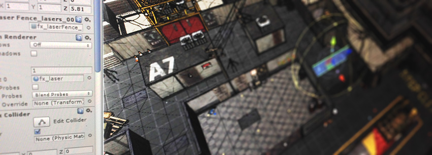

创建游戏玩法
=================

 

Unity 让游戏设计师能够制作游戏。Unity 的特别之处在于，您不需要有多年的代码编写经验或美术技能就能制作有趣的游戏。学习 Unity 需要了解一些基本的工作流程概念。一旦理解了这些概念，您会发现自己很快就能制作游戏了。您将省去保持游戏正常运行的麻烦，因此会有更多时间来完善、平衡和调整游戏，使其臻于完美。

本部分将介绍创建游戏玩法机制所需了解的核心概念。这些概念的大多数都要求编写__脚本__。有关创建和使用脚本的概述，请阅读[脚本](ScriptingSection.html)页面。

