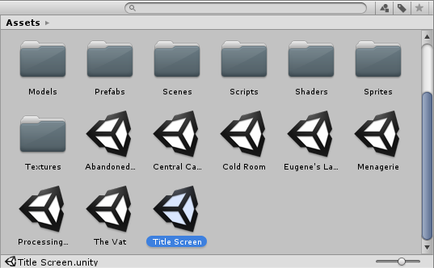

# 场景

场景包含游戏的环境和菜单。可将每个唯一场景文件视为一个唯一关卡。在每个场景中，可以放置环境、障碍物和装饰，实际上就是以碎片化的方式设计和构建游戏。

创建新的 Unity 项目时，Scene 视图将显示一个新场景。此场景*未命名*，也*未保存*。除了摄像机（称为 __Main Camera__）和光源（称为 __Directional Light__）外，场景为空。

##保存场景

要保存当前正在处理的场景，请从菜单中选择 __File__ &gt; __Save Scene__，或按 Ctrl + S (Windows) 或 Cmd + S (masOS)。

Unity 将场景作为资源保存在项目的 _Assets_ 文件夹中。这意味着它们将与其余的资源一起出现在 Project 窗口中。

##打开场景

要在 Unity 中打开场景，请在 Project 窗口中双击场景资源。必须在 Unity 中打开一个场景才能使用它。

如果当前场景包含未保存的更改，Unity 会询问是要保存还是放弃更改。

##多场景编辑

可以一次打开多个场景进行编辑。如需了解与此相关的更多信息，请参阅关于[多场景编辑](MultiSceneEditing.html)的文档。

---

* 2017-08-01  Page amended with limited [editorial review](DocumentationEditorialReview.html)

