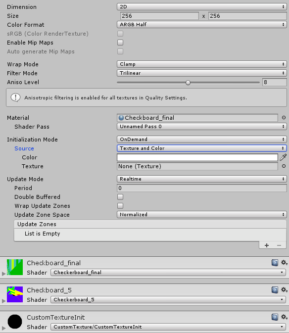
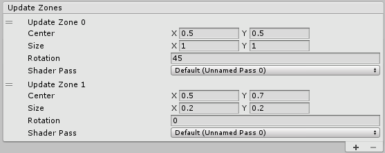

# 自定义渲染纹理

自定义渲染纹理是渲染纹理的扩展，允许用户使用着色器轻松更新相关纹理。这对于实现各种类型的复杂模拟（例如焦散、雨水效果的波纹模拟、墙上的液体喷溅等）非常有用。此外，它还提供脚本和着色器框架，从而协助进行更复杂的配置，如部分或多通道更新、改变更新频率等。

要使用自定义渲染纹理，必须创建新的自定义渲染纹理资源并为其分配材质。然后，此材质将根据各种参数更新纹理的内容。再然后，就像常规纹理一样，可将自定义渲染纹理分配给任何类型的材质，甚至可用于另一个自定义渲染纹理。

## 属性

 

自定义渲染纹理的检视面板将显示渲染纹理检视面板的大多数属性以及许多特定属性。

### 渲染纹理：

| 属性：| 功能： |
|:---|:---| 
| __Dimension__ | 渲染纹理的尺寸 |
| &nbsp;&nbsp;&nbsp;&nbsp; 2D | 渲染纹理将是二维的。 |
| &nbsp;&nbsp;&nbsp;&nbsp; Cube | 渲染纹理将是立方体贴图 |
| &nbsp;&nbsp;&nbsp;&nbsp; 3D | 渲染纹理将是三维的 |
| __Size__  | 渲染纹理的大小（以像素为单位）。 |
| __Color Format__  | 渲染纹理的格式 |
| __sRGB (Color Render Texture)__  | 此渲染纹理是否使用 sRGB 读/写转换（只读）。 |
| __Enable Mip Maps__ | 此渲染纹理是否使用 MipMap？ |
| __Auto generate Mip Maps__ | 启用此属性可自动生成 MipMap。 |
| __Wrap Mode__ | 选择纹理平铺时的行为方式 |
| &nbsp;&nbsp;&nbsp;&nbsp; Repeat | 纹理重复（平铺）自身 |
| &nbsp;&nbsp;&nbsp;&nbsp; Clamp | 纹理的边缘被拉伸 |
| __Filter Mode__ | 选择纹理在通过 3D 变换拉伸时如何进行过滤： |
| &nbsp;&nbsp;&nbsp;&nbsp; Point | 纹理在靠近时变为块状 |
| &nbsp;&nbsp;&nbsp;&nbsp; Bilinear | 纹理在靠近时变得模糊 |
| &nbsp;&nbsp;&nbsp;&nbsp; Trilinear | 与 Bilinear 类似，但纹理也在不同的 Mip 级别之间模糊 |
| __Aniso Level__  | 以大角度查看纹理时提高纹理质量。适用于地板和地面纹理 |


### 自定义纹理：

自定义纹理参数分为三个主要类别：

* Material：定义用于更新纹理的着色器。

* Initialization：控制在着色器执行更新之前如何初始化纹理

* Update：控制着色器如何更新纹理。

| 属性： | 功能： |
|:---|:---| 
| __Material__ | 用于更新自定义渲染纹理的材质 |
| &nbsp;&nbsp;&nbsp;&nbsp; Shader Pass | 用于更新自定义纹理的着色通道。该组合框将显示材质中可用的所有通道。 |
| __Initialization Mode__ | 应初始化纹理的频率。 |
| &nbsp;&nbsp;&nbsp;&nbsp; OnLoad | 纹理在创建时初始化一次。 |
| &nbsp;&nbsp;&nbsp;&nbsp; Realtime | 在每一帧初始化纹理。 |
| &nbsp;&nbsp;&nbsp;&nbsp; OnDemand | 通过脚本按需初始化纹理。 |
| __Source__ | 应如何初始化纹理。 |
| &nbsp;&nbsp;&nbsp;&nbsp; Texture and Color | 由纹理叠加颜色来初始化纹理。 |
| &nbsp;&nbsp;&nbsp;&nbsp;&nbsp;&nbsp;&nbsp;&nbsp; Initialization Color | 用于初始化自定义纹理的颜色。如果还提供了初始化纹理，则将通过叠加颜色和纹理来初始化自定义纹理。 |
| &nbsp;&nbsp;&nbsp;&nbsp;&nbsp;&nbsp;&nbsp;&nbsp; Initialization Texture | 用于初始化自定义纹理的纹理。如果还提供了初始化颜色，则将通过叠加颜色和纹理来初始化自定义纹理。 |
| &nbsp;&nbsp;&nbsp;&nbsp; Material | 纹理将由材质初始化。 |
| &nbsp;&nbsp;&nbsp;&nbsp;&nbsp;&nbsp;&nbsp;&nbsp; Initialization Material | 用于初始化自定义纹理的材质。 |
| __Update Mode__ | 着色器应更新纹理的频率。 |
| &nbsp;&nbsp;&nbsp;&nbsp; OnLoad | 纹理在创建时更新一次。 |
| &nbsp;&nbsp;&nbsp;&nbsp; Realtime | 在每一帧更新纹理。 |
| &nbsp;&nbsp;&nbsp;&nbsp; OnDemand | 通过脚本按需更新纹理。 |
| __Period__ | （仅限 Realtime 选项）更新实时纹理的间隔秒数（0.0 表示更新每一帧）。 |
| __Double Buffered__ | 纹理将接受双缓冲。每次更新都将交换两个缓冲区，因此可让用户在着色器中读取前一次更新的结果。 |
| __Wrap Update Zones__ | 启用此属性允许部分更新区域包围纹理的边框。 |
| __Cubemap Faces__ | （仅限立方体贴图）通过一系列开关允许用户对每个立方体贴图面启用/禁用更新。 |
| __Update Zone Space__ | 在此坐标系统中定义更新区域。 |
| &nbsp;&nbsp;&nbsp;&nbsp; Normalized |  所有坐标和大小都在 0 到 1 之间，左上角从 (0, 0) 开始 |
| &nbsp;&nbsp;&nbsp;&nbsp; Pixel |  所有坐标和大小都以像素宽度和高度所限制的像素表示。左上角从 (0, 0) 开始 |
| __Update Zone List__ |  纹理的更新区域列表（有关更多详细信息，请参阅下文） |


## 将自定义渲染纹理导出到文件：

可通过上下文“Export”菜单将自定义渲染纹理导出到 PNG 或 EXR 文件（具体取决于纹理格式）。

## 更新区域 (Update Zones)：

默认情况下，更新自定义渲染纹理时，材质会立即更新整个纹理。自定义纹理的一个重要功能是用户能够定义部分更新区域。有了此功能，用户可根据需要定义多个区域以及处理它们的顺序。

此功能可用于几种不同的目的。例如，您可以使用多个小区域在纹理上绘制水滴，然后执行完整通道以模拟波纹。此外，如果不需要更新完整纹理，也可以使用此功能作为优化手段。

 

更新区域具有各自的属性集。__Update Zone Space__ 将反映在显示中。根据纹理的 __Dimension__ 属性，坐标将为 2D（对于 2D 和立方体纹理）或 3D（对于 3D 纹理）。

| 属性：|  功能： |
|:---|:---|
| Center|  更新区域中心的坐标。 |
| Size|  更新区域的大小。 |
| Rotation | 更新区域的方向（以度为单位，3D 纹理中不可用）。 |
| Shader Pass | 用于此更新区域的着色器通道。如果保留为默认值，则此更新区域将使用检视面板主要部分中定义的着色器通道，否则将使用提供的着色器通道。 |
| Swap (Double Buffer) | （仅适用于双缓冲纹理）如果为 true，则在处理此更新区域之前将交换缓冲区。 |


## 双缓冲自定义纹理

自定义渲染纹理可以是“双缓冲的”(Double Buffered)。在内部有两种纹理，但从用户的角度来看，它们是相同的。每次更新后将交换两个纹理。这种机制可让用户在自定义渲染纹理中写入新结果时读取上次更新的结果。如果着色器需要使用已在纹理中写入的内容但不能将值与经典混合模式混合，则此功能尤其有用。如果着色器必须对前一结果的不同像素进行采样，也需要用到此功能。

**性能警告**：由于某些技术问题，双缓冲当前涉及每次交换时进行纹理的复制，这可能导致性能下降，具体取决于其执行频率和纹理分辨率。

## 链接自定义渲染纹理

自定义渲染纹理需要材质才能进行更新。此材质可将纹理作为输入。这意味着自定义纹理可用作生成另一个纹理的输入。这样一来，用户就可以链接多个自定义纹理以生成更复杂的多步模拟。系统将正确处理所有依赖关系，确保以正确的顺序进行不同的更新。

## 为自定义渲染纹理编写着色器

更新自定义纹理就像在渲染纹理中执行 2D 后期处理一样。为了帮助用户编写自定义纹理着色器，我们提供了一个带有实用函数和内置辅助变量的小框架。

下面是一个非常简单的示例，它将使用颜色叠加颜色的方式填充纹理：

```
Shader "CustomRenderTexture/Simple"
{
	Properties
	{
		_Color ("Color", Color) = (1,1,1,1)
                                _Tex("InputTex", 2D) = "white" {}
	 }

	 SubShader
	 {
		Lighting Off
		Blend One Zero

		Pass
		{
			CGPROGRAM
		 	#include "UnityCustomRenderTexture.cginc"
		 	#pragma vertex CustomRenderTextureVertexShader
			#pragma fragment frag
		 	 #pragma target 3.0

			float4		_Color;
                                        sampler2D	_Tex;

			float4 frag(v2f_customrendertexture IN) : COLOR
			{
				return _Color * tex2D(_Tex, IN.localTexcoord.xy);
			}
			ENDCG
	                }
	}
}
```

为自定义纹理编写着色器时，唯一必需的步骤是：

* #include "UnityCustomRenderTexture.cginc"

* 使用提供的顶点着色器 *CustomRenderTextureVertexShader*

* 为像素着色器使用提供的输入结构 *v2f_customrendertexture*

除此之外，用户可以根据自己的喜好自由编写像素着色器。

以下是在初始化材质中使用的着色器的另一个示例：

```
Shader "CustomRenderTexture/CustomTextureInit"
{
	Properties
	{
		_Color ("Color", Color) = (1,1,1,1)
		_Tex("InputTex", 2D) = "white" {}
	}

	SubShader
	{
		Lighting Off
		Blend One Zero

		Pass
		{
			CGPROGRAM
			#include "UnityCustomRenderTexture.cginc"

			#pragma vertex InitCustomRenderTextureVertexShader
			#pragma fragment frag
			#pragma target 3.0

			float4		_Color;
                                        sampler2D	_Tex;

			float4 frag(v2f_init_customrendertexture IN) : COLOR
			{
				_Color * tex2D(_Tex, IN.texcoord.xy);
			}
			ENDCG
		}
	}
}
```

与更新着色器的情况下相同，唯一必需的步骤如下：

* #include "UnityCustomRenderTexture.cginc"

* 使用提供的顶点着色器 Init*CustomRenderTextureVertexShader*

* 为像素着色器使用提供的输入结构 *v2f_init_customrendertexture*

为了帮助用户完成此过程，我们提供了一组内置值：

来自 __**_v2f_customrendertexture_**__ 结构的输入值：

| 名称| 类型 | 值 |
|:---|:---|:---| 
| `localTexcoord` | `float3` | 相对于当前正在处理的更新区域的纹理坐标。 |
| `globalTexcoord` | `float3` | 相对于自定义渲染纹理本身的纹理坐标 |
| `primitiveID` | `uint` | 当前正在处理的更新区域的索引。 |
| `direction` | `float3` | 对于立方体自定义渲染纹理，立方体贴图内当前像素的方向。 |


来自 __**_v2f_init_customrendertexture_**__ 结构的输入值：

| 名称| 类型 | 值 |
|:---|:---|:---| 
| `texcoord` | float3 | 相对于自定义渲染纹理本身的纹理坐标。 |


全局值：

| 名称| 类型 | 值 |
|:---|:---|:---| 
| `_CustomRenderTextureWidth` | `float` | 自定义纹理的宽度（以像素为单位） |
| `_CustomRenderTextureHeight` | `float` | 自定义纹理的高度（以像素为单位） |
| `_CustomRenderTextureDepth` | `float` | 自定义纹理的深度（以像素为单位，仅适用于 3D 纹理，否则将始终等于 1）。 |
| `_CustomRenderTextureCubeFace` | `float` | 仅适用于立方体贴图：正在处理的当前立方体贴图面的索引 (-X, +X, -Y, +Y, -Z, +Z)。 |
| `_CustomRenderTexture3DSlice` | `float` | 仅适用于 3D 纹理：正在处理的当前 3D 切片的索引。 |
| `_SelfTexture2D` | `Sampler2D` | 仅适用于双缓冲纹理：该纹理包含上次交换之前的上次更新的结果。 |
| `_SelfTextureCube` | `SamplerCUBE` | 仅适用于双缓冲纹理：该纹理包含上次交换之前的上次更新的结果。 |
| `_SelfTexture3D` | `Sampler3D` | 仅适用于双缓冲纹理：该纹理包含上次交换之前的上次更新的结果。 |


## 通过脚本控制自定义渲染纹理

此处描述的大多数功能均可通过脚本 API 访问到。更改材质参数、更新频率、更新区域、请求更新等全都可以使用脚本完成。

但要记住的一件事是，请求对自定义纹理进行的任何更新都将在帧的开头非常特定的时间发生，并提供自定义纹理的最新状态。这种机制可保证使用此纹理的任何材质都具有最新结果。

这意味着以下模式：

```
customRenderTexture.updateZones = updateZones1;
customRenderTexture.Update();
customRenderTexture.updateZones = updateZones2;
customRenderTexture.Update();
```

不会产生使用第一个更新区域数组完成一次更新再使用另一个数组完成第二次更新的“预期”结果。此模式将对第二个数组进行两次更新。

根据经验法则，任何修改后的属性都只能在下一帧中激活。

---

* <span class="page-edit"> 2017-05-18  Page published with no [editorial review](DocumentationEditorialReview.html)
</span>

* <span class="page-history">Unity [2017.1](../Manual/30_search.html?q=newin20171) 中的新功能 <span class="search-words">NewIn20171</span></span>

