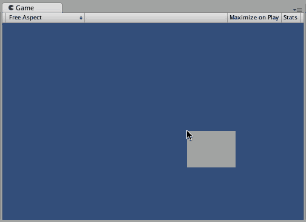
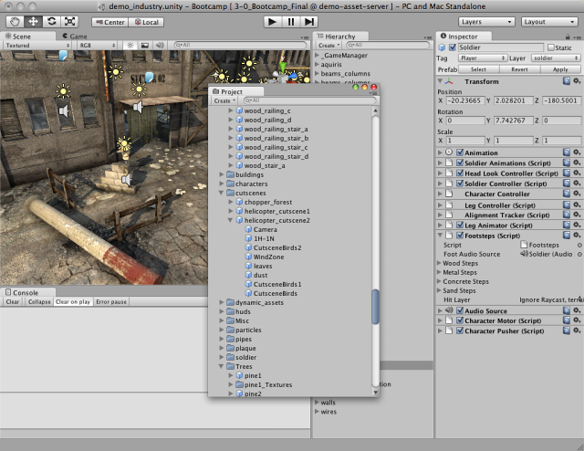
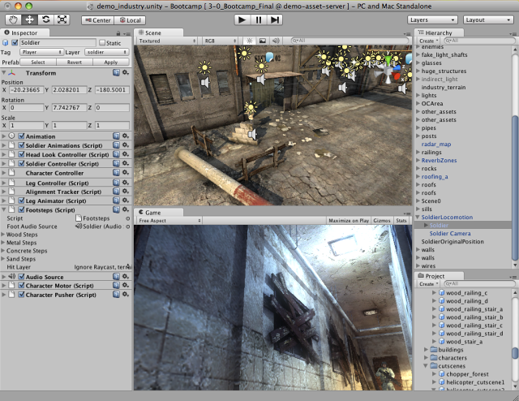

自定义工作空间
--------------------------

可以通过单击任意视图的选项卡并拖动到其中一个位置来自定义视图__布局__。将某个选项卡放在现有窗口的__选项卡区域__中会将此选项卡放在现有选项卡旁边。或者，将选项卡放在任何__停靠区域 (Dock Zone)__ 中将在新窗口中添加视图。

选项卡也可以从主 Editor 窗口中分离，并排列到它们自己的浮动 Editor 窗口中。浮动窗口可以包含视图和选项卡的排列，就像主 Editor 窗口一样。

创建 Editor 窗口布局后，可以保存布局并可随时还原。可以通过展开 Layout 下拉选单（在工具栏上）并选择 __Save Layout...__ 来完成此操作。为新布局命名并保存，然后只需从 Layout 下拉选单中选择此名称即可将恢复此布局。

可以随时右键单击任何视图的选项卡来查看其他选项，例如最大化 (Maximize) 或者在同一窗口中添加新选项卡。

 
