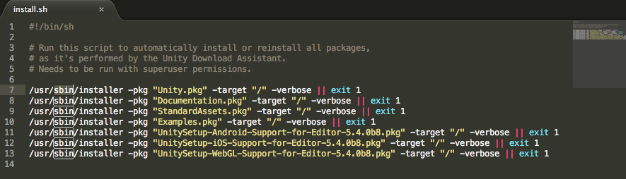

# Installing Unity offline without the Hub

Unity 下载助手 (Download Assistant) 支持离线部署。在这种部署方式中，可下载用于安装 Unity 的所有文件，然后生成脚本以便在未接入互联网的其他计算机上重复相同的安装。

## 准备

运行下载助手，并在一台计算机上正常安装 Unity。此计算机必须有足够的可用磁盘空间来下载所有文件。
单击下拉选单并选择 __Custom__，然后选择要将文件下载到的位置。

 

## 检查是否已准备好所需的一切

打开 PC 的文件管理器，导航到之前指定的自定义位置文件夹，然后在该文件夹内查找 `.sh` 或 `.bat` 文件。检查此文件的内容。文件内容应该类似于以下示例：

 

##将 Unity 部署到其他计算机

###Windows

1.将整个文件夹复制到目标 Windows PC，然后运行提供的 `.bat` 文件。
1.为了避免 Windows UAC 提示，请从管理员 shell 运行 `install.bat`。在 __Start__ 菜单中，搜索 `cmd.exe`，右键单击并选择 __Run as administrator__。
1.导航到包含脚本的文件夹。该文件夹通常在 Downloads 文件夹 (`cd C:\Users\[YourName]\Download\UnityPackages`) 中。

###Mac
1.将整个文件夹复制到目标 Mac OS X 计算机，然后运行提供的 `.sh` 文件。
运行 `sudo install.sh`。
1.导航到包含脚本的文件夹。该文件夹通常在 Downloads 文件夹 (`cd ~/Downloads/UnityPackages`) 中。
1.可以根据需要，为要安装 Unity 的每台计算机重复执行这些指令。
