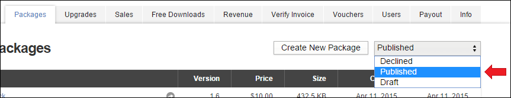
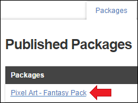
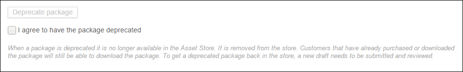
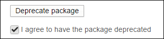

# 弃用资源指南

弃用资源包后，Asset Store 中不再提供该资源包。Asset Store 中会移除该资源包。已购买或已下载该资源包的客户仍可以下载该资源包。要让已弃用的资源包在Asset Store中重新上架，必须提交和审查新的草案。

在本指南中，我们将介绍如何弃用资源“Pixel Art - Fantasy Pack”。对于当前已在 Asset Store 中发布的所有资源，此过程的步骤都是相同的。

1.登录 [Publisher Administration](https://publisher.assetstore.unity3d.com)
2.转到 Packages 选项卡。
3.从下拉菜单中选择 **Published** 视图。
4.单击要弃用的资源包的名称。

5.向下滚动到 Deprecate package 部分。（位于_“Metadata & Artwork”_下方）

6.单击“I agree to have the package deprecated”复选框。

7.单击“Deprecate Package”按钮。
