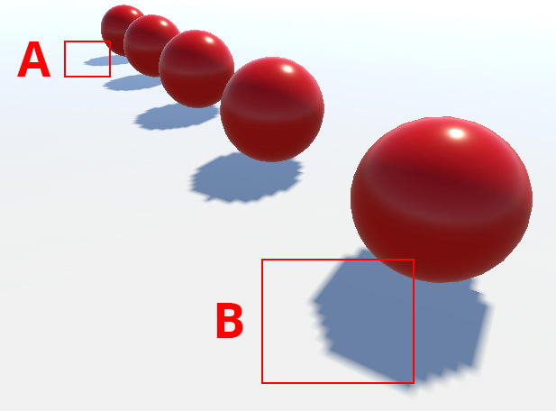
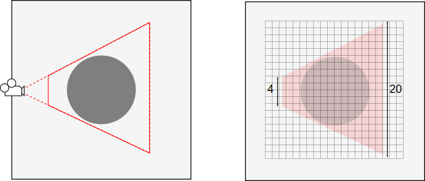
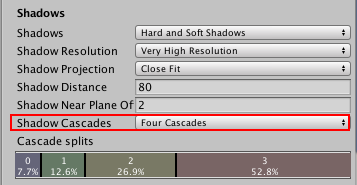
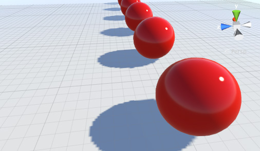

#方向光阴影

方向光通常模拟太阳光，单个光源即可照亮整个场景。这意味着阴影贴图通常会同时覆盖场景的大部分，而这使得阴影容易受到称为“透视锯齿”的问题的影响。透视锯齿是指靠近摄像机的阴影贴图像素看起来比那些更远的像素更大块。

将柔和阴影和高分辨率用于阴影贴图时，透视锯齿不会那么明显。但是，使用这些功能会增加对图形硬件的需求，因此帧率可能会受到影响。

## 阴影级联

发生透视锯齿的原因是按摄像机的视角不成比例地缩放阴影贴图的不同区域。光照阴影贴图只需覆盖摄像机可见场景的一部分；该部分是按摄像机的[视锥体](UnderstandingFrustum.html)定义的。如果想象一种简单情况，方向光直接来自上方，即可看出视锥体和阴影贴图之间的关系。

 

视锥体的远端被阴影贴图的 20 个像素覆盖，而近端仅被 4 个像素覆盖。但是，两端都在屏幕上显示为_相同大小_。结果是，对于靠近摄像机的阴影区域，贴图的分辨率实际上低得多。（请注意，在现实中，该分辨率远高于 20x20，并且贴图通常不是摄像机的完美平方。）

对整个贴图使用更高分辨率可以减少大块区域的影响，但这会在渲染时消耗更多的内存和带宽。但是，您会从图中注意到，阴影贴图的大部分会浪费在视锥体的近端，因为它永远不会被看到；远离摄像机的阴影分辨率也可能过高。可以根据与摄像机的距离将视锥体区域分成
两个区域。近端区域可以使用尺寸减小的单独阴影贴图（但具有相同分辨率），以便在一定程度上平均像素数。

 

阴影贴图大小的这些分阶段缩减做法称为**级联阴影贴图**（有时称为“平行拆分阴影贴图”）。您可以从 [Quality Settings](class-QualitySettings.html) 中为指定的质量级别设置零个、两个或四个级联。

 

使用的级联越多，阴影受透视锯齿的影响就越少，但增加此数量实际上会带来渲染开销。但是，此开销仍然会低于通常在整个阴影中使用高分辨率贴图的情况。

## 阴影距离

对象距离摄像机越远，对象的阴影就越不明显；它们在屏幕上看起来更小，而且远处对象通常不是人们关注的焦点。Unity 通过在 [Quality Settings](class-QualitySettings.html) 中提供 _Shadow Distance_ 属性，让您利用此效果。超出此距离（相对于摄像机）的对象根本不投射阴影，而接近此距离的对象的阴影将逐渐淡出。

应将阴影距离设置得尽可能短以帮助提高渲染性能。这种方法会奏效的原因是远处对象根本不需要渲染到阴影贴图中。此外，移除远处阴影后，场景通常看起来更好。正确设置阴影距离对于移动平台上的性能尤为重要，因为移动平台不支持阴影级联。如果当前摄像机远平面小于阴影距离，Unity 将使用摄像机远平面而不是阴影距离。

## 可视化阴影参数调整

Scene 视图具有称为__阴影级联__的[绘制模式](ViewModes.html)；该模式使用着色通过不同级联级别显示场景的各个部分。此模式有助于正确设置阴影距离、级联计数和级联分割比率。请注意，此可视化方法会使用通常大于阴影距离的 Scene 视图远平面，因此如果要将摄像机的游戏内行为与小远平面匹配，可能需要缩短阴影距离。

## 阴影平坠 (Shadow Pancaking)

为了进一步防止阴影暗斑，我们采用一种称为__阴影平坠__的技术。该技术旨在减少沿光照方向渲染阴影贴图时使用的光照空间范围。这可以提高阴影贴图的精度，减少阴影暗斑。

在上图中：

* **浅蓝圆圈**代表阴影投射物
* **深蓝矩形**代表原始光照空间
* **绿线**代表优化的近平面（排除了在视锥体中不可见的所有阴影投射物）

将这些阴影投射物钳制在优化空间的近裁剪面（在顶点着色器中）。请注意，虽然这通常很有效，但对于穿过近裁剪面的大型三角形，这会带来瑕疵：

在此情况下，只有蓝色三角形的一个顶点位于近裁剪面背后并被钳制到此处。但是，这会改变三角形的形状，并可能产生不正确的阴影。

您可以从 [Quality Settings](class-QualitySettings.html) 中调整 __Shadow Near Plane Offset__ 属性以避免发生此问题。这将拉回近裁剪面。但是，如果将此值设置得非常高，最终会引入阴影暗斑，因为它会提高阴影贴图需要在光照方向上覆盖的范围。或者，您也可以细分有问题的阴影投射三角形。请参阅[阴影概述](ShadowOverview.html)中的 __Bias__ 部分以了解更多信息。

