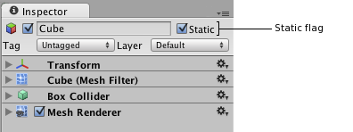

#绘制调用批处理

要在屏幕上绘制游戏对象，引擎必须向图形 API（例如 OpenGL 或 Direct3D）发出绘制调用。绘制调用通常为资源密集型操作，图形 API 为每次绘制调用执行大量工作，从而导致 CPU 端的性能开销。此开销的主要原因是绘制调用之间的状态变化（例如切换到不同材质），而这种情况会导致图形驱动程序中执行资源密集型验证和转换步骤。

Unity 使用两种方法来应对此情况：

* __动态批处理__：对于足够小的网格，此方法会在 CPU 上转换网格的顶点，将许多相似顶点组合在一起，并一次性绘制它们。
* __静态批处理__：将静态（不移动）游戏对象组合成大网格，并以较快的速度渲染它们。

与手动合并游戏对象相比，内置批处理有几个好处；最值得注意的是，仍然可以单独剔除游戏对象。但是，也有一些缺点；静态批处理会导致内存和存储开销，动态批处理会产生一些 CPU 开销。

**注意**：动态批处理与图形作业不兼容（请参阅[播放器设置 (Player Settings)](https://docs.unity3d.com/Manual/class-PlayerSettingsStandalone.html)）。如果已启用图形作业，则会在独立构建中禁用动态批处理。

### 批处理的材质设置

只有共享相同材质的游戏对象才可一起接受批处理。因此，如果想要实现良好批处理，应在尽可能多的不同游戏对象之间共享材质。

如果两种相同材质仅在纹理上不同，可将这些纹理组合成单个大纹理。此过程通常称为纹理镶嵌（请参阅有关[纹理图集 (Texture atlases)](http://en.wikipedia.org/wiki/Texture_atlas)的 Wikipedia 页面以了解更多信息）。一旦纹理位于相同图集中，即可使用单个材质。

如果需要从脚本访问共享材质属性，必须注意，修改 [Renderer.material](../ScriptReference/Renderer-material.html) 将创建该材质的副本。应改用 [Renderer.sharedMaterial](../ScriptReference/Renderer-sharedMaterial.html) 来保留共享的材质。

阴影投射物即使材质不同，通常也可以在渲染时接受批处理。Unity 中的阴影投射物即使具有不同材质也可以使用动态批处理，只要阴影 pass 所需材质中的值相同即可。例如，许多板条箱可能使用具有不同纹理的材质，但是由于渲染纹理的阴影投射物不相关，所以在此情况下，它们可以一起接受批处理。

## 动态批处理

如果移动的游戏对象共享相同材质并满足其他条件，则 Unity 可自动在同一绘制调用中批处理这些游戏对象。动态批处理是自动完成的，无需您进行任何额外工作。

* 批处理动态游戏对象在每个顶点都有一定开销，因此批处理仅会应用于总共包含少于 900 个顶点属性的网格。
    * 如果着色器使用顶点位置、法线和单个 UV，最多可以批处理 300 个顶点，而如果着色器使用顶点位置、法线、UV0、UV1 和切线，则只能批处理 180 个顶点。
    * __注意__：将来可能会更改属性数量限制。
* 如果游戏对象在变换中包含镜像，则不会对这些对象进行批处理（例如，具有 +1 缩放的游戏对象 A 和具有 -1 缩放的游戏对象 B 无法一起接受批处理）。
* 即使游戏对象基本相同，使用不同的材质实例也会导致游戏对象不能一起接受批处理。例外情况是阴影投射物渲染。
* 带有光照贴图的游戏对象具有其他渲染器参数：光照贴图索引和光照贴图偏移/缩放。通常，动态光照贴图的游戏对象应指向要批处理的完全相同的光照贴图位置。
* 多 pass 着色器会中断批处理。
    * 几乎所有的 Unity 着色器都支持前向渲染中的多个光照，有效地为它们执行额外 pass。“其他每像素光照”的绘制调用不进行批处理。
    * 旧版延迟（光照 pre-pass）渲染路径会禁用动态批处理，因为它必须绘制两次游戏对象。

因为动态批处理的工作原理是将所有游戏对象顶点转换到 CPU 上的世界空间，所以仅在该工作小于进行绘制调用的情况下，才有优势。绘制调用的资源需求取决于许多因素，主要是使用的图形 API。例如，对于游戏主机或诸如 Apple Metal 之类的现代 API，绘制调用的开销通常低得多，通常动态批处理根本没有优势。

## 静态批处理

使用静态批处理，引擎可减少任何大小的几何体的绘制调用，但前提是它共享相同材质并且不移动。这种处理方式通常比动态批处理更高效（它不会在 CPU 上转换顶点），但是使用更多内存。

为了利用静态批处理，您需要显式指定某些游戏对象是静态对象且不会在游戏中移动、旋转或缩放。为此，请使用 Inspector 中的 __Static__ 复选框，将游戏对象标记为静态：

 

使用静态批处理需要额外的内存来存储组合的几何体。如果多个游戏对象在静态批处理之前共享相同几何体，则会在 Editor 中或运行时为每个游戏对象创建几何体的副本。这可能并非总是好办法；有时您必须避免为某些游戏对象进行静态批处理，这样会牺牲渲染性能，但可保持较小的内存占用量。例如，在茂密森林关卡中，将树标记为静态可能会产生严重的内存影响。

在内部，静态批处理的工作原理是将静态游戏对象转换到世界空间并为它们构建大型的顶点和索引缓冲区。然后，针对同一批次中的可见游戏对象，执行一系列简单的绘制调用，其间几乎没有状态变化。在技术上，这种处理方式不会保存 3D API 绘制调用，但可节省它们之间的状态变化（这正是消耗大量资源的部分）。在大多数平台上，批次限制为 64k 个顶点和 64k 个索引（OpenGLES 上为 48k 个索引，在 macOS 上为 32k 个索引）。

## 提示

当前，仅对[网格渲染器](class-MeshRenderer.html)、[轨迹渲染器](class-TrailRenderer.html)、[线渲染器](class-LineRenderer.html)、[粒子系统](class-ParticleSystem.html)和[精灵渲染器](class-SpriteRenderer.html)进行批处理。这意味着不会对蒙皮网格、布料和其他类型的渲染组件进行批处理。

渲染器仅与其他相同类型的渲染器一起接受批处理。

半透明着色器通常要求游戏对象按照从后到前的顺序进行渲染，从而实现透明性。Unity 首先按此顺序对游戏对象排序，然后尝试对它们进行批处理，但是因为必须严格满足顺序，所以这通常意味着可以实现比不透明游戏对象更少的批处理。

手动组合彼此接近的游戏对象可以是绘制调用批处理的极好替代方法。例如，一个带有大量抽屉的静态橱柜通常只需在 3D 建模应用程序中或者使用 [Mesh.CombineMeshes](../ScriptReference/Mesh.CombineMeshes.html) 来组合成一个网格。

---

* 2017-10-26  Page amended with limited [editorial review](DocumentationEditorialReview.html)

* 在 2017.2 版中添加了有关动态批处理与图形作业不兼容的备注
