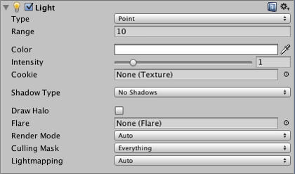
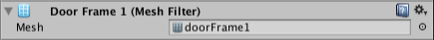
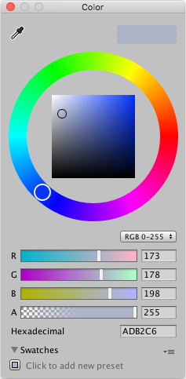
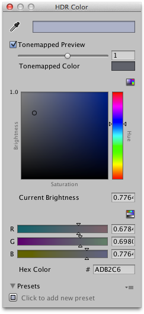
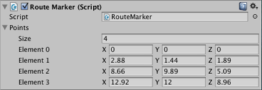
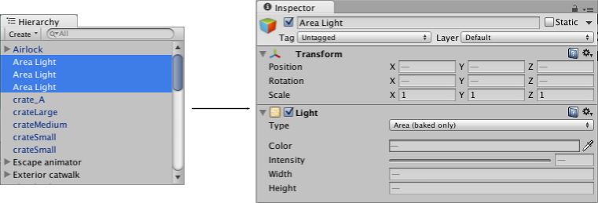

#编辑属性

__属性__是可以在 Inspector 中编辑的组件的设置和选项。

属性可以大致分为_引用_（链接到其他对象和资源）或_值_（数字、复选框、颜色等）。

##引用

可以通过将相应类型的对象或资源拖放到 Inspector 中的属性来分配引用。例如，[网格过滤器 (Mesh Filter)](class-MeshFilter.html) 组件需要在项目中某处引用[网格](class-Mesh.html)资源。最初创建该组件时，未分配引用：

 

…但可以通过将网格资源放到组件上来向其分配网格：

 

还可以使用__对象选择器 (Object Picker)__，为引用属性选择对象。如果单击 Inspector 中属性右侧的小圆圈图标，则会显示如下窗口：

 

对象选择器可用于搜索和选择场景或项目资源中的对象（窗口底部的信息面板可以根据需要而升高和降低）。为引用属性选择对象只需在选择器中双击该对象即可。

引用属性为组件类型（例如[变换组件](class-Transform.html)）时，可以将任何对象拖到该属性上；Unity 会查找此对象上该类型的第一个组件，然后将其分配给该引用。如果对象没有任何正确类型的组件，将拒绝该分配。

##值

大多数值都可以用熟悉的文本框、复选框和菜单进行编辑，具体取决于这些值的类型（为方便起见，也可以通过在属性名称标签上拖动鼠标来上移或下移数值）。但是，有一些更复杂类型的值具有自己的特定编辑器。这些类型的描述如下。

###颜色

单击颜色属性时，将打开__拾色器__。

Unity 使用自己的拾色器，但是在 Mac OS X 上，可以在 [Preferences](Preferences.html) 中选用系统拾色器（菜单：__Unity &gt; Preferences__，然后从 _General_ 面板选择 __Use OS X Color Picker__）。

###渐变

在图形和动画中，通常需要在空间或时间上逐渐将一种颜色混入另一种颜色。__渐变__是颜色渐进的可视表现，用于显示主要颜色（称为__停靠点__）以及这些颜色之间的所有中间色：

 

沿着渐变条底部的向上箭头表示停靠点。可以通过单击停靠点来将其选中；停靠点的值将显示在颜色框中。单击该框时将打开标准拾色器。在渐变条下方单击可以创建新的停靠点。只需单击并拖动即可更改任何停靠点的位置，还可以使用 __ctrl/cmd + delete__ 来移除停靠点。

渐变条上方的向下箭头也是停靠点，但是这些停靠点对应于该点处渐变的 Alpha（透明度）。默认情况下，有两个停靠点设置为 100％ Alpha（即完全不透明），但可以添加和编辑任意数量的停靠点，具体操作方式与颜色停靠点的方式大致相同。

###曲线

__曲线__是一个线形图，显示对输入变化值（在 X 轴上）的响应（在 Y 轴上）。

曲线在 Unity 中的各种不同上下文中使用，尤其可用于动画，并且具有许多不同的选项和工具。手册的[编辑曲线](EditingCurves.html)页面中对此进行了相关说明。

###数组

脚本将数组公开为公共变量时，Inspector 将显示值编辑器，从而编辑数组的大小以及其中的值或引用。

减小 _Size_ 属性时，将移除数组末尾的值。增加大小时，会将当前的最后一个值复制到添加的所有新元素中。这在设置具有大致相同值的数组时非常有用 - 可以设置第一个元素，然后更改大小以将其复制到其他所有元素。

##一次编辑多个对象

选择了两个或更多对象时，可以一起编辑这些对象共有的组件（即，将提供的值复制到所有选定对象）。

如果所有选定对象的属性值相同，则将显示该值，否则，将该值显示为短划线字符。只有_所有_对象共有的组件才会显示在 Inspector 中。如果任何选定对象具有其他对象上不存在的组件，则 Inspector 将显示一条消息，指出某些组件已隐藏。属性的上下文菜单（通过右键单击属性名称标签来打开）的某些选项允许从任何所选组件设置属性值。

请注意，也可以一次编辑预制件的多个选定实例，但常规的 _Select_、_Revert_ 和 _Apply_ 按钮将不可用。

---
* 2018-04-19  Page amended with limited [editorial review](DocumentationEditorialReview.html)

* 预设库在 2018.1 版中重命名为样本库
