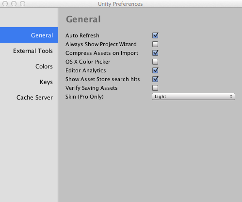

编辑器分析 (Editor Analytics)
=========

通过配置 Unity Editor 可以将匿名的使用数据发送回 Unity。此信息用于帮助改进编辑器的功能。需要使用 Google Analytics 来收集分析信息。Unity 对 Google 托管的 URI 进行调用。URI 的 URN 部分包含的详细信息将描述已使用的编辑器功能或事件。

收集的数据示例
--------------------------

以下是 Unity 可能收集的数据示例。

**已使用的菜单项。**如果一些菜单项很少使用或根本不使用，我们将来可以简化菜单系统。

**构建时间。**通过收集生成构建所需的时间，我们可以将工程工作集中于优化正确的代码。

**光照贴图烘焙。**同样，对光照贴图烘焙所需的时间进行计时和报告可以帮助我们决定花费多少精力来优化此领域。

禁用 Editor Analytics
-------------------

如果不想向 Unity 发送匿名数据，可以禁用 Editor Analytics。取消选中 Unity Preferences 的 General 选项卡中的复选框即可完成此操作。

