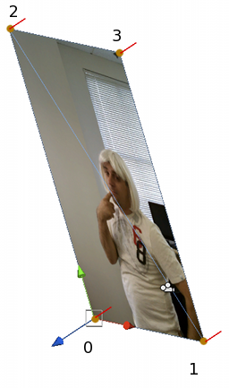

#示例 - 创建四边形


Unity 随附__平面__和__四边形__原始对象来代表平面（请参阅[原始对象](PrimitiveObjects.html)页面以了解更多详细信息）。然而，检查最小四边形网格的构造方式通常很有用，因为这可能是最简单的有用示例，只有四个顶点用于角和两个三角形。

第一件事是设置顶点数组。我们假设平面位于 X 和 Y 轴，并让其宽度和高度由参数变量确定。我们将按照左下角、右下角、左上角、右上角的顺序提供顶点。


 


````
var vertices: Vector3[] = new Vector3[4];

vertices[0] = new Vector3(0, 0, 0);
vertices[1] = new Vector3(width, 0, 0);
vertices[2] = new Vector3(0, height, 0);
vertices[3] = new Vector3(width, height, 0);

mesh.vertices = vertices;

````

（由于网格数据属性在后台执行代码，因此一种高效得多的做法是在您自己的数组中设置数据，然后将其分配给属性，而不是逐个元素访问属性数组。）
	
接下来是三角形。由于我们需要两个三角形，每个三角形由三个整数定义，因此三角形数组总共有六个元素。注意对这些角排序时应用顺时针规则，左下方三角形将使用 0、2、1 作为其角索引，而右上方的三角形则使用 2、3、1。


````
var tri: int[] = new int[6];

//	左下方三角形。
tri[0] = 0;
tri[1] = 2;
tri[2] = 1;

//	右上方三角形。	
tri[3] = 2;
tri[4] = 3;
tri[5] = 1;

mesh.triangles = tri;

````
	
只有设置了顶点和三角形的网格才会在编辑器中可见，但看起来不太令人信服，因为它没有法线，未正确着色。平面的法线非常简单，它们全部都相同，并且在平面的局部空间中指向 Z 轴负方向。添加法线后，平面将得到正确着色，但是请记住，在场景中需要光照才能看到效果。


````
var normals: Vector3[] = new Vector3[4];

normals[0] = -Vector3.forward;
normals[1] = -Vector3.forward;
normals[2] = -Vector3.forward;
normals[3] = -Vector3.forward;

mesh.normals = normals;

````

最后，将纹理坐标添加到网格将使其能够正确显示材质。假设我们想要在整个平面上显示整个图像，UV 值将全部为 0 或 1（对应于纹理的角）。


````
var uv: Vector2[] = new Vector2[4];

uv[0] = new Vector2(0, 0);
uv[1] = new Vector2(1, 0);
uv[2] = new Vector2(0, 1);
uv[3] = new Vector2(1, 1);

mesh.uv = uv;

````

完整脚本可能如下所示：


````
var width: float;
var height: float;

function Start() {	
	var mf: MeshFilter = GetComponent.<MeshFilter>();
	var mesh = new Mesh();
	mf.mesh = mesh;
	
	var vertices: Vector3[] = new Vector3[4];
	
	vertices[0] = new Vector3(0, 0, 0);
	vertices[1] = new Vector3(width, 0, 0);
	vertices[2] = new Vector3(0, height, 0);
	vertices[3] = new Vector3(width, height, 0);
	
	mesh.vertices = vertices;
	
	var tri: int[] = new int[6];

	tri[0] = 0;
	tri[1] = 2;
	tri[2] = 1;
	
	tri[3] = 2;
	tri[4] = 3;
	tri[5] = 1;
	
	mesh.triangles = tri;
	
	var normals: Vector3[] = new Vector3[4];
	
	normals[0] = -Vector3.forward;
	normals[1] = -Vector3.forward;
	normals[2] = -Vector3.forward;
	normals[3] = -Vector3.forward;
	
	mesh.normals = normals;
	
	var uv: Vector2[] = new Vector2[4];

	uv[0] = new Vector2(0, 0);
	uv[1] = new Vector2(1, 0);
	uv[2] = new Vector2(0, 1);
	uv[3] = new Vector2(1, 1);
	
	mesh.uv = uv;
}

````

请注意，如果该代码在 Start 函数中执行一次，则网格将在整个游戏中保持不变。但是，您可以轻松地将此代码放入 Update 函数中，从而允许每帧都更改网格（但是这会显著增加 CPU 开销）。
