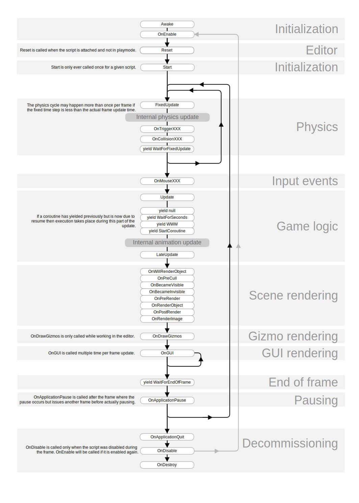

#事件函数执行顺序

在 Unity 脚本中，有许多事件函数在脚本执行时按预定顺序执行。此执行顺序如下所述：

##加载第一个场景

场景开始时将调用以下函数（为场景中的每个对象调用一次）。

* **Awake：**始终在任何 Start 函数之前并在实例化预制件之后调用此函数。（如果游戏对象在启动期间处于非活动状态，则在激活之后才会调用 Awake。）
* **OnEnable：**（仅在对象处于激活状态时调用）在启用对象后立即调用此函数。在创建 MonoBehaviour 实例时（例如加载关卡或实例化具有脚本组件的游戏对象时）会执行此调用。
* **OnLevelWasLoaded：**执行此函数可告知游戏已加载新关卡。

请注意，对于添加到场景中的对象，在为任何对象调用 Start 和 Update 等函数之前，会为_所有_脚本调用 Awake 和 OnEnable 函数。当然，在游戏运行过程中实例化对象时，不能强制执行此调用。

##Editor

* **Reset：**调用 Reset 可以在脚本首次附加到对象时以及使用 _Reset_ 命令时初始化脚本的属性。

##在第一次帧更新之前

* **Start：**仅当启用脚本实例后，才会在第一次帧更新之前调用 Start。

对于添加到场景中的对象，在为任何脚本调用 Update 等函数之前，将在所有脚本上调用 Start 函数。当然，在游戏运行过程中实例化对象时，不能强制执行此调用。

##帧之间

* **OnApplicationPause：**在帧的结尾处调用此函数（在正常帧更新之间有效检测到暂停）。在调用 __OnApplicationPause__ 之后，将发出一个额外帧，从而允许游戏显示图形来指示暂停状态。

##更新顺序

跟踪游戏逻辑和交互、动画、摄像机位置等的时候，可以使用一些不同事件。常见方案是在 __Update__ 函数中执行大多数任务，但是也可以使用其他函数。

* **FixedUpdate：**调用 __FixedUpdate__ 的频度常常超过 __Update__。如果帧率很低，可以每帧调用该函数多次；如果帧率很高，可能在帧之间完全不调用该函数。在 __FixedUpdate__ 之后将立即进行所有物理计算和更新。在 __FixedUpdate__ 内应用运动计算时，无需将值乘以 __Time.deltaTime__。这是因为 __FixedUpdate__ 的调用基于可靠的计时器（独立于帧率）。

* **Update：**每帧调用一次 __Update__。这是用于帧更新的主要函数。

* **LateUpdate：**每帧调用一次 __LateUpdate__（在 __Update__ 完成后）。__LateUpdate__ 开始时，在 __Update__ 中执行的所有计算便已完成。__LateUpdate__ 的常见用途是跟随第三人称摄像机。如果在 __Update__ 内让角色移动和转向，可以在 __LateUpdate__ 中执行所有摄像机移动和旋转计算。这样可以确保角色在摄像机跟踪其位置之前已完全移动。

##渲染

* **OnPreCull：**在摄像机剔除场景之前调用。剔除操作将确定摄像机可以看到哪些对象。正好在进行剔除之前调用 OnPreCull。
* **OnBecameVisible/OnBecameInvisible：**对象变为对任何摄像机可见/不可见时调用。
* **OnWillRenderObject：**如果对象可见，则为每个摄像机调用**一次**。
* **OnPreRender：**在摄像机开始渲染场景之前调用。
* **OnRenderObject：**所有常规场景渲染完成之后调用。此时，可以使用 [GL](../ScriptReference/GL.html) 类或 [Graphics.DrawMeshNow](../ScriptReference/Graphics.DrawMeshNow.html) 来绘制自定义几何形状。
* **OnPostRender：**在摄像机完成场景渲染后调用。
* **OnRenderImage：**在场景渲染完成后调用以允许对图像进行后处理，请参阅[后期处理效果](PostProcessingOverview.html)。
* **OnGUI：**每帧调用多次以响应 GUI 事件。首先处理布局和重新绘制事件，然后为每个输入事件处理布局和键盘/鼠标事件。
* **OnDrawGizmos** 用于在场景视图中绘制辅助图标以实现可视化。

##协程

Update 函数返回后将运行正常协程更新。协程是一个可暂停执行 (yield) 直到给定的 YieldInstruction 达到完成状态的函数。
协程的不同用法：

* **yield** 在下一帧上调用所有 Update 函数后，协程将继续。
* **yield WaitForSeconds** 在为帧调用所有 Update 函数后，在指定的时间延迟后继续协程
* **yield WaitForFixedUpdate** 在所有脚本上调用所有 FixedUpdate 后继续协程
* **yield WWW** 在 WWW 下载完成后继续。
* **yield StartCoroutine** 将协程链接起来，并会等待 MyFunc 协程先完成。

##销毁游戏对象时

* **OnDestroy：**对象存在的最后一帧完成所有帧更新之后，调用此函数（可能应 Object.Destroy 要求或在场景关闭时销毁该对象）。

##退出时

在场景中的所有活动对象上调用以下函数：

* **OnApplicationQuit：**在退出应用程序之前在所有游戏对象上调用此函数。在编辑器中，用户停止播放模式时，调用函数。
* **OnDisable：**行为被禁用或处于非活动状态时，调用此函数。

##脚本生命周期流程图

下图总结了脚本生命周期中事件函数的排序和重复出现情况。

 

**注意**：有些浏览器不支持 SVG 图像文件。如果以上图像未正确显示（例如，如果看不到任何文字），请尝试其他浏览器，例如 [Google Chrome](https://www.google.com/chrome/) 或 [Mozilla Firefox](https://www.mozilla.org/)。
