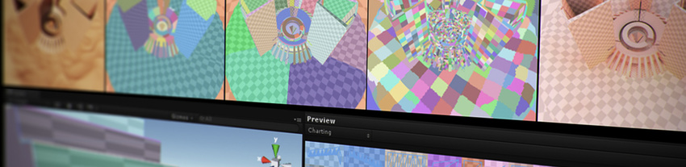

专家指南
=======

 

本部分中的专家指南由 Unity 各领域的专家用自己的语言编写而成。在这些文档中，Unity 开发者详细探讨了 Unity 的各种功能以及与高效使用 Unity 相关的主题。

有些文档是由开发者专门撰写的博客文章，他们希望能将自己的知识直接传达给您。由于这些内容的长度和格式与用户手册的正常样式不同，因此我们以可供下载的 PDF 或 Google 文档形式将这些文档提供给您。

## 指南

[**_Windows 性能分析 (Windows Performance Analysis)_**](../uploads/ExpertGuides/Analyzing_your_game_performance_using_Event_Tracing_for_Windows.pdf) 
__作者：__Tautvydas Zilys，开发者 - Windows 团队  
__日期：__2016-06-15 
__提要：__Tautvydas 提供的这套全面指南说明了如何使用 _Event Tracing for Windows_ 来分析基于 Windows 平台的游戏，包括在所有 PC 和设备上运行的独立平台播放器和通用 Windows 平台播放器游戏以及 Unity Editor 中的游戏。

本专家指南中使用的示例文件：
[Unity+CPU+MF+DotNet+DXGI](../uploads/Examples/Unity+CPU+MF+DotNet+DXGI.wprp)
[Unity+CPU+MF+DXGI](../uploads/Examples/Unity+CPU+MF+DXGI.wprp)
[VirtualAlloc](../uploads/Examples/VirtualAlloc.wprp)

[**_粒子系统模块常见问题解答 (Particle System Modules FAQ)_**](../uploads/ExpertGuides/Particle_System_Modules.pdf) 
__作者：__Karl Jones，开发者 - 持续性工程 
__日期：__2016-04-20 
__提要：__Karl 探讨了如何通过脚本访问粒子系统模块，并说明了在代码中访问和编辑粒子系统属性时在底层发生了什么。_（最初发布在 Unity 博客上）_

[**_台式机和游戏主机上的实时 GI (Realtime GI on desktops and consoles)_**](../uploads/ExpertGuides/Realtime_GI_on_desktops_and_consoles.pdf) 
__作者：__Jesper Mortensen，图形工程师 - GI 和光照负责人 
__日期：__2015-11-05 
__已使用以下 Unity 版本进行验证：__5 
__提要：__Jesper 详细介绍了用于制作 _The Courtyard_ 演示的技术，该演示充分利用了 Unity 5 中预先计算的实时全局光照 (GI) 功能。_（最初发布在 Unity 博客上）_

[**_显示器校准 (Monitor Calibration)_**](../uploads/ExpertGuides/Monitor_Calibration_Tutorial.pdf) 
__作者：__Laurent Harduin，高级灯光师 
__日期：__2016-10-28 
__已使用以下 Unity 版本进行验证：__5.5 
__提要：__通过显示器校准可确保在显示器上获得真实一致的色彩和亮度。在与美术师或开发人员合作时，这是一项经常被忽视的开发实践。本指南将逐步指导您完成校准显示器的过程。

[**_Enlighten 与 Unity 结合使用 (Using Enlighten with Unity)_**](../uploads/ExpertGuides/Using_Enlighten_with_Unity.pdf) 
__作者：__Kasper Engelstoft，开发者 - 光照团队 
__日期：__2017-01-17 
__已使用以下 Unity 版本进行验证：__ 5.5 
__提要：__本指南详细介绍了 Unity 如何使用 Enlighten 计算全局光照 (GI)。Kasper Englestoft 说明了 Unity 用于计算光照的工作流程和方程式以及使用光照的好处。

[**_高动态范围成像 (High Dynamic Range Imaging, HDRI)_**](../uploads/ExpertGuides/High_Dynamic_Range_Imaging_HDRI.pdf) 
__作者：__Sébastien Lagarde，开发者 - 渲染研究 
__日期：__2017-03-09 
__已使用以下 Unity 版本进行验证：__5.5 
__提要：__本全面性指南详细介绍了捕获和使用 HDRI 的许多方面。Sébastien Lagarde 说明了在 Unity 中实现和校准 HDRI 的方法，旨在帮助您实现准确的真实世界环境光照。

[**_Unity 摄影测量法工作流程 (Unity Photogrammetry Workflow)_**](https://docs.google.com/document/d/1bULvVgAA3MGePuRlB3-_KFWp9Oc2o3Drv1OwT6dkL0w/preview) 
__作者：__ Sébastien Lagarde，开发者 - 渲染研究 
__日期：__2017-06-23 
__已使用以下 Unity 版本进行验证：__2017.1 
__提要：__本文档面向游戏工作室。文档介绍了一个专门的摄影测量法工作流程，按照此流程便能以合理预算制作游戏资源。虽然可以使用摄影测量法为非游戏用途创作质量极高的资源，但本文档侧重于介绍使用摄影测量法进行游戏开发。文档中介绍了如何在游戏开发的常规时间和预算限制内获得最佳结果。

[**_Unity 中的去光照 (De-Lighting in Unity)_**](https://github.com/Unity-Technologies/DeLightingTool/blob/master/Assets/DeLightingTool/Documentation/De-LightingTool.pdf) 
__作者：__Sébastien Lagarde，开发者 - 渲染研究 
__日期：__2017-10-20 
__已使用以下 Unity 版本进行验证：__ 2017.1 
__提要：__摄影测量法在 CG 行业中越来越受欢迎。在创作逼真的 3D 资源时，能够使用普通摄像机作为强大的 3D 扫描仪现在已经是必不可少的条件。但是，以这种方式生成原始纹理时，纹理中通常包含大量的光照信息，应删除这些信息来获得渲染的真实基色。本文档介绍了如何使用 Unity 去光照工具 (De-Lighting Tool) 解决此问题。

[**_材质制作指南：深色介电材质 (Materials Authoring Guidelines: Dark Dielectric Materials)_**](../uploads/ExpertGuides/Dark_Dielectric_Materials.pdf) 
__作者：__Laurent Harduin，高级灯光师 
__日期：__2017-07-04 
__已使用以下 Unity 版本进行验证：__2017.1 
__提要：__本指南提供了在 Unity 物理着色系统中创作人造（非天然）材质时的提示信息和经校准的反照率颜色测量。

[**_Collaborate - 保证用户安全 (Collaborate - Keep The User Safe)_**](../uploads/ExpertGuides/Collaborate_-_Keep_The_User_Safe.pdf) 
__作者：__Hollie Figueroa，Collaborate 软件测试工程师 
__日期：__2017-07-19 
__已使用以下 Unity 版本进行验证：__2017.1 
__提要：__Collaborate 位于 Unity Editor 与 Unity 拥有的服务器之间，用于进行基于云的客户端/服务器配对。本指南将指导您完成设置和运行 Collaborate 的过程，并提供有关使用 Unity 进行并行开发的最佳实践建议和注意事项。

-----

* 2017-10-20  Page amended with [editorial review](DocumentationEditorialReview.html)

* 在 Unity [2017.3] 中更新了去光照工具 (De-Lighting Tool) 文档
