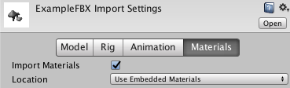
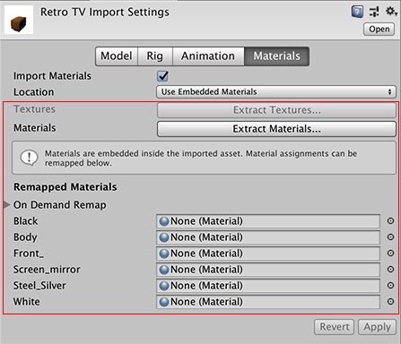
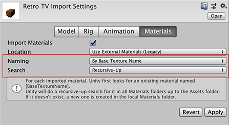

# Materials 选项卡

可以使用此选项卡更改 Unity 在导入模型时处理材质和纹理的方式。

当 Unity 导入没有指定任何材质的模型时，它使用 Unity 漫反射材质。如果模型有材质，Unity 会将这些材质导入为子资源。可以使用 __Extract Textures__ 按钮将嵌入式纹理提取到项目中。

| __属性__|| __功能__ |
|:---|:---|:---| 
|__Import Materials__||为导入材质启用其余设置。|
|__Location__||定义如何访问材质和纹理。根据选择的这些选项，可以使用不同的属性。|
||__Use Embedded Materials__ | 选择此选项可[将导入的材质保持在导入的资源中](#Embedded)。从 Unity 2017.2 版本开始，这是默认选项。 |
||__Use External Materials (Legacy)__ | 选择此选项可[将导入的材质提取为外部资源](#Legacy)。这是旧版的材质处理方式，适用于使用 Unity 2017.1 或早期版本创建的项目。  |

 
## Use Embedded Materials

从 __Location__ 选项中选择 __Use Embedded Materials__ 时，将显示以下导入选项：

| __属性__|| __功能__ |
|:---|:---|:---| 
| __Textures__|| 单击 __Extract Textures__ 按钮可提取导入的资源中嵌入的纹理。如果没有需要提取的纹理，此按钮显示为灰色。 |
| __Materials__|| 单击 __Extract Materials__ 按钮可提取导入的资源中嵌入的材质。如果没有需要提取的材质，此按钮显示为灰色。 |
| __Remapped Materials__|||
| __On Demand Remap__|| 如果将 __Location__ 设为 [Use External Materials (Legacy)](#Legacy)，这些设置与检视面板中显示的设置相匹配。  |
|| __Naming__ | 定义 Unity 对材质的命名方式。 |
|| _By Base Texture Name_ | 使用导入材质的漫射纹理名称来命名材质。未将漫射纹理分配给材质的情况下，Unity 将使用导入材质的名称。 |
|| _From Model’s Material_ | 使用导入材质的名称来命名材质。 |
|| _Model Name + Model’s Material_ | 使用模型文件的名称与导入材质的名称相结合来命名材质。 |
|| __Search__ | 定义 Unity 尝试使用 __Naming__ 选项定义的名称查找现有材质的位置。 |
|| _Local Materials Folder_ | 仅在“本地”Materials 文件夹（即与模型文件同名的 *Materials* 子文件夹）中查找现有材质。 |
|| _Recursive-Up_ | 在所有父文件夹（一直向上追溯到 Assets 文件夹）中的所有 Materials 子文件夹中查找现有材质。 |
|| _Project-Wide_ | 在所有 Unity 项目文件夹中查找现有材质。 |
|| __Search and Remap__ | 单击此按钮可使用与旧版导入选项相同的设置将导入的材质重新映射到现有材质资源。单击此按钮不会从资源中提取材质，如果 Unity 无法找到具有正确名称的任何材质，此操作不会更改任何内容。  |
| __List of imported materials__|| 此列表将显示在资源中找到的所有导入材质。可以将每个材质重新映射到项目中的现有材质资源。 |

如果要修改 Unity 中的材质的属性，可使用 __Extract Materials__ 按钮一次性全部提取这些材质。如果要逐个提取材质，请选择 __Assets__ &gt; __Extract From Prefab__。通过这种方式提取材质时，材质将在 __Remapped Materials__ 列表中显示为引用。

新导入操作或对原始资源的更改不会影响提取的材质。如果要从源资源重新导入材质，必须删除 __Remapped Materials__ 列表中对提取的材质的引用。要从该列表中删除某一项，请选择该项，然后按键盘上的 Backspace 键。

 
## Use External Materials (Legacy)

从 __Location__ 选项中选择 __Use External Materials (Legacy)__ 时，将显示以下导入选项：

| __属性__|| __功能__ |
|:---|:---|:---| 
| __Naming__ || 定义 Unity 对材质的命名方式。 |
|| __By Base Texture Name__ | 使用导入材质的漫射纹理名称来命名材质。未将漫射纹理分配给材质的情况下，Unity 将使用导入材质的名称。 |
|| __From Model’s Material__ | 使用导入材质的名称来命名材质。 |
|| __Model Name + Model’s Material__ | 使用模型文件的名称与导入材质的名称相结合来命名材质。 |
| __Search__|| 定义 Unity 尝试使用 __Naming__ 选项定义的名称查找现有材质的位置。 |
|| __Local Materials Folder__ | 仅在“本地”Materials 文件夹（即与模型文件同名的 *Materials* 子文件夹）中查找现有材质。  |
|| __Recursive-Up__ | 在所有父文件夹（一直向上追溯到 Assets 文件夹）中的所有 Materials 子文件夹中查找现有材质。 |
|| __Project-Wide__ | 在所有 Unity 项目文件夹中查找现有材质。 |

在 Unity 2017.2 版之前，这是默认的材质处理方式。

---

*  2018-04-25  Page amended with limited [editorial review](DocumentationEditorialReview.html)

