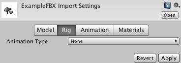
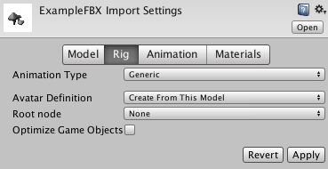
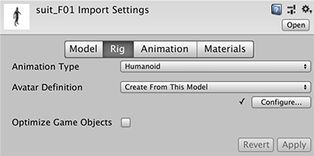

# Rig 选项卡

__Rig__ 选项卡上的设置定义了 Unity 如何将变形体映射到导入模型中的网格，以便能够将其动画化。对于人形 (Humanoid) 角色，这意味着需要[分配或创建 Avatar](ConfiguringtheAvatar.html)。对于非人形角色（_通用 (Generic)_ 角色），这意味着需要[在骨架中确定根骨骼](GenericAnimations.html)。

默认情况下，在__项目__视图中选择模型时，Unity 会确定哪个__动画类型 (Animation Type)__ 与所选的模型最匹配，然后将其显示在 __Rig__ 选项卡中。如果 Unity 从未导入该文件，则 Animation Type 设置为 __None__：

|**_属性：_** ||**_功能：_** |
|:---|:---|:---|
|__Animation Type__ ||指定动画类型。|
||__None__|不存在动画|
||__Legacy__|使用[旧版动画系统](#LegacyRig)。与 Unity 3.x 及更早版本一样导入和使用动画。|
||__Generic__|如果骨架为*非人形*（四足动物或任何要动画化的实体），请使用[通用动画系统](#GenericRig)。Unity 会选择一个根节点，但可以确定另一个用作__根节点__的骨骼。|
||__Humanoid__|如果骨架为*人形*（有两条腿、两条手臂和一个头），请使用[人形动画系统](#HumanoidRig)。Unity 通常会检测骨架并将其正确映射到 Avatar。有些情况下，可能需要更改 __Avatar 定义 (Avatar Definition)__ 并手动对映射进行__配置 (Configure)__。 |

 
## 通用动画类型

[通用动画](GenericAnimations.html)不会像人形动画那样使用 Avatar。由于骨架可以是任意形状，必须指定哪个骨骼是__根节点 (Root node)__。通过使用根节点，Unity 可在通用模型的动画剪辑之间建立一致性，并在尚未“在正确位置”（即，整个模型在动画化时移动其世界位置的位置）制作的动画之间正确混合。

指定根节点有助于 Unity 区分骨骼相对于彼此的移动与根节点在世界中的运动（通过 [OnAnimatorMove](../ScriptReference/MonoBehaviour.OnAnimatorMove.html) 进行控制）。

|**_属性：_** ||**_功能：_** |
|:---|:---|:---|
|__Avatar Definition__||选择获取 Avatar 定义的位置。 |
||__Create from this model__|根据此模型创建 Avatar|
||__Copy from Other Avatar__|指向另一个模型上设置的 Avatar。 |
|__Root node__||选择要用作此 Avatar 的根节点的骨骼。  仅当 __Avatar Definition__ 设置为 __Create From This Model__ 时才可用。 |
|__Source__||复制另一个具有相同骨架的 Avatar 以导入其动画剪辑。  仅当 __Avatar Definition__ 设置为 __Copy from Other Avatar__ 时才可用。|
|__Optimize Game Object__||在 Avatar 和 Animator 组件中删除和存储所导入角色的游戏对象变换层级视图。如果启用此选项，角色的 SkinnedMeshRenderer 将使用 Unity 动画系统的内部骨架，因此可提高动画角色的性能。  仅当 __Avatar Definition__ 设置为 __Create From This Model__ 时才可用。  对最终产品应启用此选项。  **注意**：在优化模式下，蒙皮网格矩阵提取也是多线程的。 |

 
## 人形动画类型

除了极少数例外情况，人形模型具有相同的基本结构。此结构代表了身体的主要关节部位：头部和四肢。使用 Unity 的[人形动画功能](ConfiguringtheAvatar.html)的第一步是[设置和配置](class-Avatar.html) __Avatar__。Unity 使用 Avatar 将简化的人形骨骼结构映射到模型骨架中的实际骨骼。

|**_属性：_** ||**_功能：_** |
|:---|:---|:---|
|__Avatar Definition__||选择获取 Avatar 定义的位置。 |
||__Create from this model__|根据此模型创建 Avatar|
||__Copy from Other Avatar__|指向另一个模型上设置的 Avatar。 |
|__Source__||复制另一个具有相同骨架的 Avatar 以导入其动画剪辑。  仅当 __Avatar Definition__ 设置为 __Copy from Other Avatar__ 时才可用。|
|__Configure...__||打开 [Avatar 配置](class-Avatar.html)。  仅当 __Avatar Definition__ 设置为 __Create From This Model__ 时才可用。 |
|__Optimize Game Object__||在 Avatar 和 Animator 组件中删除和存储所导入角色的游戏对象变换层级视图。如果启用此选项，角色的 SkinnedMeshRenderer 将使用 Unity 动画系统的内部骨架，因此可提高动画角色的性能。  仅当 __Avatar Definition__ 设置为 __Create From This Model__ 时才可用。  对最终产品应启用此选项。  **注意**：在优化模式下，蒙皮网格矩阵提取也是多线程的。 |

 
## 旧版动画类型

](../uploads/Main/Rig-3.png)

|**_属性：_** ||**_功能：_** |
|:---|:---|:---|
|__Generation__||选择动画导入方法。|
||__Don't Import__|不导入动画|
||__Store in Original Roots (Deprecated)__|已弃用。请勿使用。 |
||__Store in Nodes (Deprecated)__|已弃用。请勿使用。 |
||__Store in Root (Deprecated)__|已弃用。请勿使用。 |
||__Store in Root (New)__|导入动画并将其存储在模型的根节点中。这是默认设置。 |

---

*  2018-04-25  Page amended with limited [editorial review](DocumentationEditorialReview.html)

*  2017-12-05  Page amended with limited [editorial review](DocumentationEditorialReview.html)

* [2017.2](https://docs.unity3d.com/2017.2/Documentation/Manual/30_search.html?q=newin20172) 中添加了 __Materials__ 选项卡 NewIn20172
