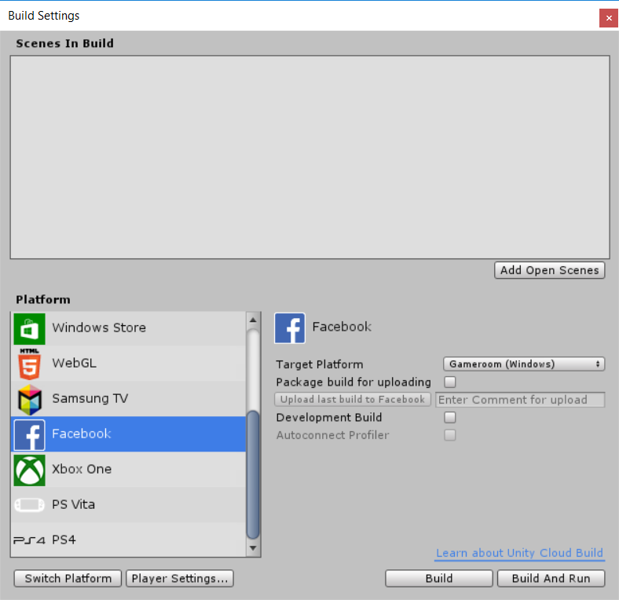

# Facebook 开发入门

## Facebook 构建目标是什么？

Facebook 构建目标可让开发者轻松地将 Unity 游戏发布到 Facebook 并在游戏中使用 Facebook 功能。通过使用 Facebook 构建目标，可将内容构建为 [WebGL](webgl-gettingstarted.html) 播放器，然后可将其发布到 [facebook.com](http://facebook.com)，或者构建为自定义本机 [Windows 独立平台](class-PlayerSettingsStandalone.html)播放器，然后可将其发布到 [Facebook Gameroom](https://www.facebook.com/gameroom/) 客户端。

选择 Facebook 构建目标后，可自动访问脚本中的 [Facebook SDK](https://developers.facebook.com/docs/unity/)，这样便可与 Facebook 进行交互并访问其社交功能。

## 将游戏发布到 Facebook

### 配置

要将游戏发布到 Facebook，首先需要[在 Facebook 开发者页面上创建新的应用程序](https://developers.facebook.com/?advanced_app_create=true)。完成后便会提供一个 AppID，应将其粘贴到 [Facebook PlayerSettings](class-PlayerSettingsFacebook.html) 中。现在，可从 Facebook 的应用程序配置页面的 __Web Hosting__ 选项卡下获取*上传访问令牌 (Upload access token)*。同样，将其粘贴到 Facebook Player Settings 中。这样一来，就可以直接将游戏从 Unity Editor 上传到 Facebook。

### 构建

可通过 __Build Settings__ 对话框（菜单：__File__ > __Build Settings…__）访问 Facebook 构建设置。在该对话框中，从 __Platform__ 列表中选择 __Facebook__。

 

在此处，可选择将内容构建为 WebGL 或适用于 Gameroom 的 Windows 独立平台。如果计划上传游戏，请选择 __Package build for uploading__，此选项将生成可上传到 Facebook 的压缩包。

进行构建后，__Upload last build to Facebook__ 按钮将变为可用状态。如果已正确配置 AppID 和上传访问令牌，可单击此按钮将构建上传到 Facebook。__Enter Comment for upload__ 字段可用于指定可选的备注信息以描述该构建。

将构建上传到 Facebook 后，它将显示在 Facebook 的应用程序配置页面的 __Web Hosting__ 选项卡下。在此处，可选择将构建推送到生产阶段，或分阶段部分推广到较小比例的用户。

## 使用 Facebook SDK

当 Facebook 构建目标处于激活状态时，您可以在脚本中使用 Facebook SDK。如此便可在 Facebook 上共享内容、跟踪分析事件、使用 Facebook 付款 (Facebook Payments) 等。有关如何使用该 SDK 的更多信息，请参阅 [Facebook 的文档](https://developers.facebook.com/docs/unity/reference/current)。

在 Unity Editor 的 [Facebook Player Settings](class-PlayerSettingsFacebook.html) 中选择要使用的 SDK 版本（单击 Build Settings 窗口中的 __Player Settings__ 按钮，或选择菜单：__Edit > Project Settings > Player__）。这些设置会显示 Facebook 为您的 Unity 版本提供的所有 SDK 版本。

### 使用自定义的 Facebook SDK

如果要使用其他版本的 Facebook SDK 而非 Unity 默认包含的 Facebook SDK，这是允许的，只要版本不低于 7.9.1（因此支持 Facebook 构建目标）即可。只需从 Facebook [下载](https://developers.facebook.com/docs/unity/downloads/)一个 SDK 版本，并将其拖入 Assets 文件夹。Unity 将检测到这一版本，并禁用内置的 SDK。这样就可以使用 Facebook 构建目标之外的 Facebook SDK，让您能够在 Facebook 支持的其他平台上使用 Facebook 功能。

  

---

*  2017-05-16  Page published with no [editorial review](DocumentationEditorialReview.html)

