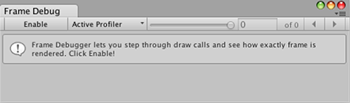
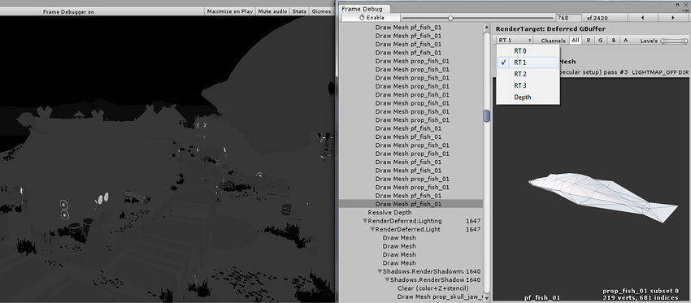
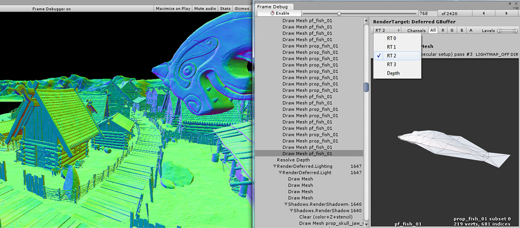
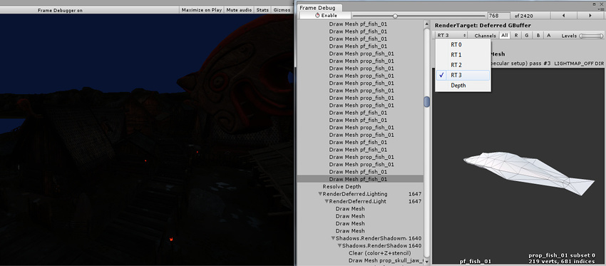
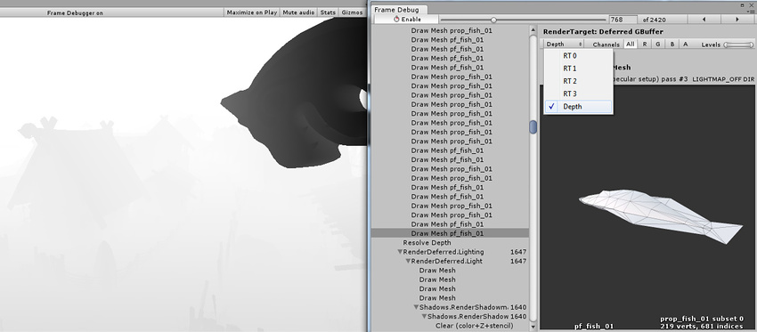
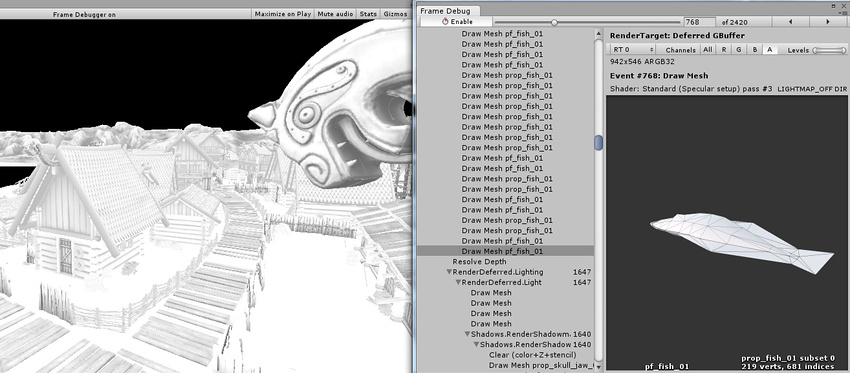
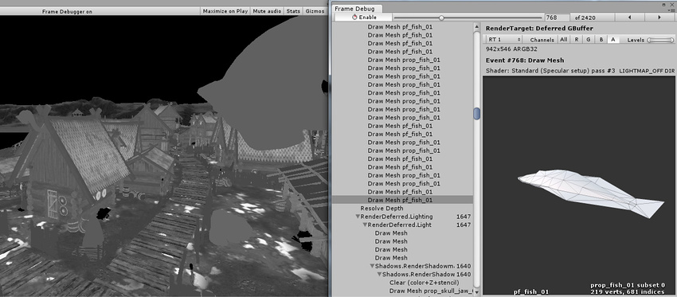
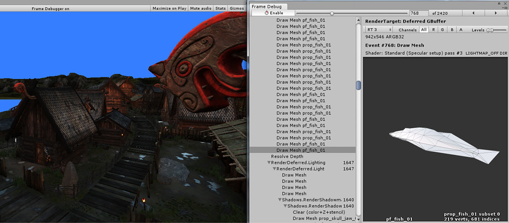
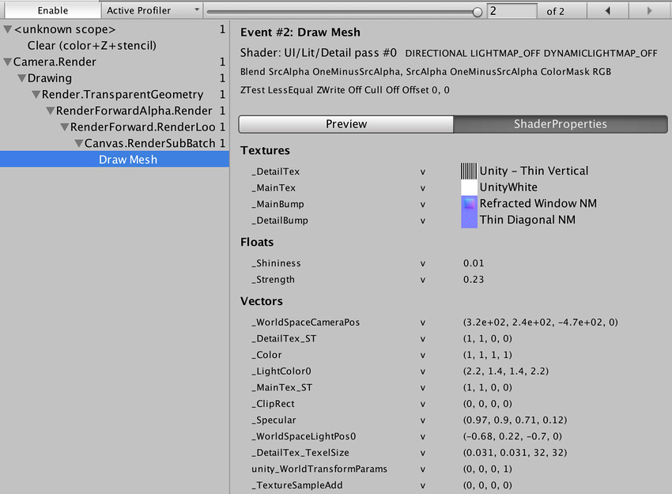

#帧调试器

__帧调试器 (Frame Debugger)__ 可将正在运行的游戏的状态冻结到特定帧来自由回放，并查看用于渲染该帧的各个_绘制调用_。除了列出绘制调用，调试器还可逐个单步执行这些调用，以便您详细查看场景是如何从场景的图形元素构建的。

 

##使用帧调试器

Frame Debugger 窗口（菜单：__Window > Frame Debugger__）会显示绘制调用信息，并允许您控制正在构建的帧的“回放”。

主列表以层级视图形式显示绘制调用（以及其他事件，例如帧缓冲区清除）的序列，并在其中标识绘制调用的来源。列表右侧面板提供有关绘制调用的更多信息，例如几何体细节和用于渲染的着色器。

单击列表中的某项将显示该场景（在 Game 视图中）截止到并包括该绘制调用的情况。工具栏中的左右箭头按钮用于在列表中向前和向后移动一步，您也可以使用箭头键来实现相同效果。此外，窗口顶部的滑动条可让您在绘制调用中快速拖动来迅速定位要关注的事项。如果绘制调用对应于游戏对象的几何体，则会在主 Hierarchy 面板中突出显示该对象以便于识别。

如果在选定的绘制调用中，RenderTexture 发生渲染，那么该 RenderTexture 的内容将显示在 [Game 视图](GameView.html)中。这可用于检查各种屏幕外渲染目标是如何构建的，例如延迟着色中的漫射 G 缓冲区：

 

或者查看阴影贴图的渲染方式：

 

##远程帧调试器

 

要远程使用帧调试器，播放器必须支持多线程渲染（例如，WebGL，iOS 不支持这种渲染方式，因此无法运行帧调试器），大多数 Unity 平台都支持多线程渲染，其次在构建时必须选中“Development Build”。

桌面平台的注意事项：确保在构建之前选中“Run In Background”选项。否则，将帧调试器连接到播放器时，它将不会反映任何渲染变化，直至其获得焦点为止。假设在同一台机器上运行 Editor 和播放器，您在 Editor 中控制帧调试器时，将从播放器获取焦点。

快速启动：

* 从 Editor 中针对目标平台构建项目（选择 Development Player）
* 运行播放器
* 返回到 Editor
* 打开 Frame Debugger 窗口
* 单击 **Active Profiler**，然后选择播放器
* 单击 **Enable**，帧调试器应该会在播放器上启用

### 渲染目标显示选项

信息面板的顶部是一个工具栏，可让您为 Game 视图的当前状态隔离红色、绿色、蓝色和 Alpha 通道。同样，您可以使用这些通道按钮右侧的 _Levels_ 滑动条，根据亮度级别来隔离视图区域。这些功能仅在渲染到 RenderTexture 时才会启用。

一次渲染到多个渲染目标时，您可以在 Game 视图中选择显示哪个渲染目标。下面分别显示在 5.0版本中的延迟着色模式下的漫射、镜面反射、法线和发光/间接光照缓冲区：

 

 

 

 

此外，可通过从下拉选单中选择“Depth”来查看深度缓冲区内容：

 

通过隔离渲染纹理的 Alpha 通道，可以看到延迟 G 缓冲区的遮挡（存储在 RT0 Alpha 中）和平滑度（存储在 RT1 Alpha 中）：

 

 

此场景中的发光和环境/间接光照非常暗；我们可以通过更改 Levels 滑动条使其更明显：

 

### 查看着色器属性值

对于绘制调用，帧调试器还可以显示所用的[着色器属性
值](SL-PropertiesInPrograms.html)。单击“Shader Properties”选项卡即可显示属性：

 

对于每个属性，将显示该属性的值，以及在哪些着色器阶段
（顶点、片元、几何体、外壳、域）中使用了它。请注意，在使用 OpenGL 时（例如在 Mac 上），由于 GLSL 着色器的工作原理，所有着色器属性都被视为顶点着色器阶段的一部分。

在 Editor 中，还会显示纹理的缩略图，单击它们
会在项目窗口中突出显示纹理。

## 备用帧调试技术

您还可以使用外部工具来调试渲染。通过现有的 Editor 集成可轻松启动 [RenderDoc](RenderDocIntegration.html) 以检查 Editor 中的 Scene 或 Game 视图。

此外还可构建独立平台播放器并通过以下任何方式使其运行：

* [Visual Studio 图形调试器](http://msdn.microsoft.com/en-us/library/hh315751.aspx)
* [Intel GPA](https://software.intel.com/en-us/vcsource/tools/intel-gpa)
* [RenderDoc](https://github.com/baldurk/renderdoc)
* [NVIDIA NSight](http://www.nvidia.com/object/nsight.html)
* [AMD GPU PerfStudio](http://developer.amd.com/tools-and-sdks/graphics-development/gpu-perfstudio-2/)
* [Xcode GPU Frame Capture](https://developer.apple.com/library/ios/recipes/xcode_help-debugger/articles/debugging_opengl_es_frame.html)
* [GPU Driver Instruments](https://developer.apple.com/library/ios/documentation/DeveloperTools/Conceptual/InstrumentsUserGuide/Instrument-GPUDriver.html)
 
完成此操作后，捕获一帧渲染，然后逐步执行绘制调用和其他渲染事件以查看运行情况。这是一种非常强大的方法，因为这些工具可为您提供大量信息来真正进行深入研究。
