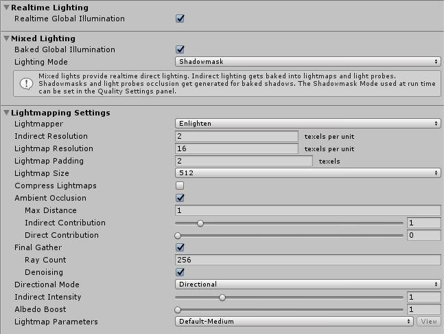

# Enlighten

Unity 提供了两种不同的技术来预先计算全局光照 (GI) 和反射光照。它们分别是__烘焙全局光照 (Baked Global Illumination)__ 和__预计算实时全局光照 (Precomputed Realtime Global Illumination)__。Enlighten 光照系统提供了这两种技术的解决方案。

要找到以下设置，请导航到 Unity 的顶部菜单，然后选择 __Window__ > __Lighting__。

 

| __属性：__| __功能：__ |
|:---|:---| 
| __Realtime Global Illumination__| 使 Unity 实时计算和更新光照。有关更多信息，请参阅[实时全局光照](LightMode-Realtime.html)文档以及有关[预计算实时 GI](https://unity3d.com/learn/tutorials/topics/graphics/introduction-precomputed-realtime-gi?playlist=17102) 的 Unity 教程。 |
| __Lighting Mode__| 指定要在场景中用于所有混合光源的光照模式。选项包括 [Baked Indirect](LightMode-Mixed-BakedIndirect.html)、[Distance Shadowmask](LightMode-Mixed-DistanceShadowmask.html)、[Shadowmask](LightMode-Mixed-Shadowmask.html) 和 [Subtractive](LightMode-Mixed-Subtractive.html)。  |
| __Lightmapper__| 指定用于计算场景中的光照贴图的内部光照计算软件。选项包括 __Progressive__ 和 __Enlighten__。默认值为 __Progressive__；将其设置为 __Enlighten__ 便可以使用本页面中描述的系统。如果要使用 __Progressive__ 系统，请参阅有关[渐进光照贴图](ProgressiveLightmapper.html)的文档。  |
| __Indirect Resolution__| 仅当启用了 __Realtime Global Illumination__ 选项时，此属性才可用。使用此值指定用于间接光照计算的每个单位的纹理像素数。增大此值可提高间接光的视觉质量，但也会增加烘焙光照贴图所需的时间。默认值为 2。要了解有关间接分辨率 (Indirect Resolution) 的详细信息，请参阅有关[实时分辨率 (Realtime Resolution)](https://unity3d.com/learn/tutorials/topics/graphics/realtime-resolution?playlist=17102) 的 Unity 教程。 |
| __Lightmap Resolution__| 指定用于光照贴图的每个单位的纹理像素数。增大此值可提高光照贴图质量，但也会增加烘焙时间。新场景中的默认值为 40。 |
| __Lightmap Padding__| 指定烘焙光照贴图中不同形状之间的间距（以纹理像素为单位）。默认值为 2。 |
| __Lightmap Size__| 完整光照贴图纹理的大小（以像素为单位），其中包含单个对象纹理的单独区域。默认值为 1024。 |
| __Compress Lightmaps__| 压缩光照贴图，以减少其所需要的存储空间。但是，压缩过程可能会在纹理中引入不需要的视觉效果。默认情况下会选中此属性。 |
| __Ambient Occlusion__| 打开一组设置，允许您控制[环境光遮挡](LightingBakedAmbientOcclusion.html)中的表面的相对亮度。值越高，表示遮挡区域和完全照亮区域之间的对比度越大。这仅适用于 GI 系统计算的间接光照。默认情况下会启用此属性。 |
|     Max Distance| 设置一个值以控制光照系统投射光线的距离，从而确定是否将遮挡应用于对象。较大的值会产生较长的光线并为光照贴图提供更多阴影，而较小的值会产生较短的光线，只有当对象彼此非常接近时才会产生阴影。值为 0 会投射无限长光线，没有最大距离。默认值为 1。 |
|     Indirect Contribution| 使用滑动条在值 0 到 10 之间缩放最终光照贴图中的间接光（即环境光，或从对象反射和发出的光）的亮度。默认值为 1。小于 1 的值会减小强度，大于 1 的值会增加强度。 |
|     Direct Contribution| 使用滑动条可以从值 0 到 10 之间缩放直射光的亮度。默认值为 0。此值越大，应用于直接光照的对比度越大。 |
| __Final Gather__| 如果希望 Unity 使用与烘焙光照贴图相同的分辨率来计算 GI 计算中的最终光反射，请启用此选项。这样可以提高光照贴图的视觉质量，但代价是 Editor 中的烘焙时间增加。 |
|     Ray Count| 定义每个最终聚集点发射的光线数量。默认值为 256。 |
|     Denoising| 对 __Final Gather__ 输出应用去噪滤波器。默认情况下会选中此属性。 |
| __Directional Mode__| 您可以设置光照贴图，以存储有关游戏对象表面上每个点的主要入射光的信息。请参阅有关[方向光照贴图](LightmappingDirectional.html)的文档以了解更多详细信息。默认模式为 __Directional__。 |
|     Directional| 在 __Directional__ 模式下，Unity 将再生成一个光照贴图以存储入射光的主要方向。因此，可将漫射法线贴图材质用于 GI。Directional 模式需要大约两倍的存储空间来存储额外的光照贴图数据。Unity 无法在 SM2.0 硬件上或使用 GLES2.0 时解码方向光照贴图。此时将回退到非方向光照贴图。 |
|     Non-directional| 在 __Non-directional__ 模式下，Unity 不会为入射光的主要方向生成第二个光照贴图，而是将所有光照信息存储在同一位置。  |
| __Indirect Intensity__| 控制 Unity 在实时和烘焙光照贴图中存储的间接光的亮度，值在 0 到 5 之间。大于 1 的值会增加间接光的强度，小于 1 的值会降低间接光强度。默认值为 1。 |
| __Albedo Boost__| 通过增强场景中材质的反照率来控制 Unity 在表面之间反弹的光量，值在 1 到 10 之间。增加此值会将反照率值倾向于绘制为白色以进行间接光计算。默认值为 1，这在物理上是准确的。 |
| __Lightmap Parameters__| Unity uses a set of general parameters for the lightmapping in addition to Lighting window properties of the. A few defaults are available from the menu for this property, but you can also use the __Create New__ option to create your own lightmap parameter file. See the [Lightmap Parameters](class-LightmapParameters.html) page for further details. The default value is __Default-Medium__. |

请参阅[预计算实时 GI 教程](https://unity3d.com/learn/tutorials/topics/graphics/introduction-precomputed-realtime-gi?playlist=17102)以详细了解 Enlighten 优化。

---

在 [2018.1](https://docs.unity3d.com/2018.1/Documentation/Manual/30_search.html?q=newin20181) 版中添加了渐进光照贴图 NewIn20181

 2017-05-18  Page published with limited [editorial review](DocumentationEditorialReview.html)

