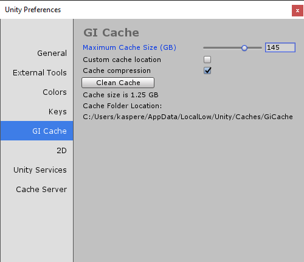

# GI 缓存

预先计算实时 GI 时以及烘焙静态光照贴图、光照探针和反射探针时，全局光照 (GI) 系统使用 GI 缓存来存储中间文件。该缓存将在计算机上的所有 Unity 项目之间共享，因此具有相同内容和相同版本的光照系统 (Enlighten) 的项目可以共享文件并加速后续构建。

在 Windows 上的 __Edit__ > __Preferences__ > __GI Cache__ 中或在 macOS 上的 __Unity__ > __Preferences__ > __GI Cache__ 中查找 GI 缓存的设置。

 

|**属性：** |**功能：** |
|:---|:---|
| __Maximum Cache Size (GB)__ | 使用滑动条来定义 GI 缓存的最大大小（以 GB 为单位）。当 GI 缓存的大小增长到大于 __Preferences__ > __GI Cache__ 中指定的大小时，Unity 会生成一个调整缓存的作业。此调整作业会删除一些文件，使 GI 缓存不会超过指定的大小。它根据上次访问文件的时间删除文件；删除最早以前访问过的文件，并保留最近使用过的文件。 **注意：**：如果 GI 缓存中的所有文件当前正被当前场景使用（可能是因为场景非常大或缓存大小设置得太低），请增加缓存大小。否则，在烘焙时会进行非常耗费资源的重新计算。 |
| __Custom cache location__ | 默认情况下，GI 缓存存储在 _Caches_ 文件夹中。勾选 __Custom cache location__ 可覆盖默认位置并设置您自己的位置。 **注意**：将 GI 缓存存储在 SSD 驱动器上可以在烘焙过程受 I/O 限制的情况下加速进行烘焙。 |
| __Cache compression__ | 勾选此复选框可允许 Unity 压缩 GI 缓存中的文件。默认情况下，文件采用 LZ4 压缩格式，命名方式为哈希与文件扩展名的组合。哈希计算是基于光照系统的输入进行的，因此更改以下任何内容都可能导致重新计算光照： - 材质（纹理、反照率、发光） - 光源 - 几何体 - 静止标记 - 光照探针组 - 反射探针 - 光照贴图参数 |
| __Clean Cache__ | 使用 __Clean Cache__ 按钮可删除 GI Cache 目录。 在 Editor 运行时手动删除 GI Cache 目录是不安全的做法。这是因为 _GiCache_ 文件夹是在 Editor 启动时创建的，而 Editor 维护着一组哈希，这些哈希用于查找 _GiCache_ 文件夹中的文件。如果文件或目录突然消失，系统无法始终从故障中恢复，并会在控制台中输出错误。__Clean Cache__ 按钮可确保 Editor 在删除磁盘上的文件之前释放对这些文件的所有引用。 |

## GI 缓存和光照

* 要在重新加载场景时确保在很短的时间内从 GI 缓存加载光照数据，请打开 Lighting 窗口（菜单：__Window__ > __Lighting__），然后勾选 Build 按钮旁边的 __Auto__ 复选框。此设置将使光照贴图自动进行烘焙，这意味着光照贴图数据会存储在 GI 缓存中。

* 在 Lighting 窗口中，可清除场景中的烘焙数据（取消勾选 __Auto__ 复选框，单击 __Build__ 按钮下拉选单，然后选择 __Clear Baked Data__）。此操作不会清除 GI 缓存，因为这样做会增加烘焙时间。

* 您可以在不同的计算机之间共享 _GiCache_ 文件夹。这种做法可以使光照构建速度更快，因为文件是从 _GiCache_ 文件夹进行下载的，无需在本地进行计算。请注意，构建过程未针对慢速的网络连接存储 (NAS) 进行优化，因此请在将缓存移至 NAS 之前测试烘焙时间是否受到严重影响。
