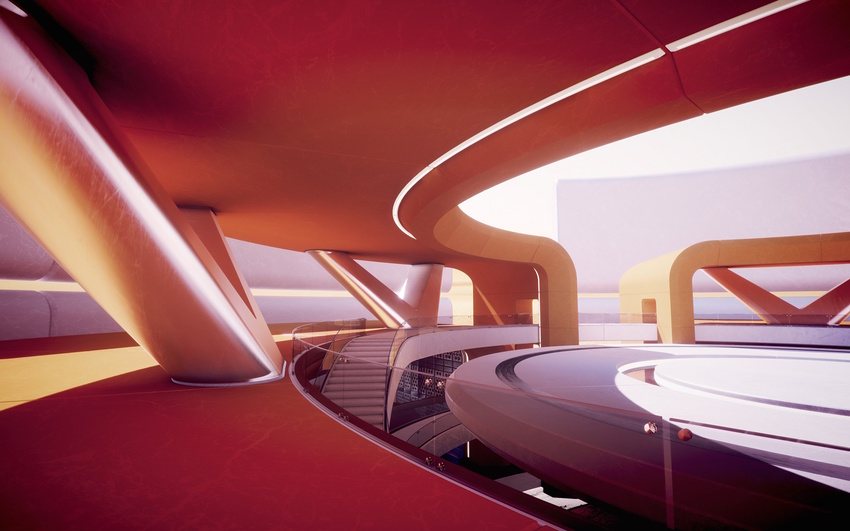

##全局光照

**全局光照** (GI) 系统可对光从表面反射到其他表面（间接光）的方式进行建模，不仅仅局限于直接从光源照射到表面的光（直射光）。间接光照建模使得构成虚拟世界的效果看起来更逼真且具有相关性，因为对象会影响彼此的外观。一个典型的例子是“渗色”，例如，阳光照射到红色沙发上会导致红光反射到其后面的墙壁上。另一个例子是阳光在洞穴入口照射到地面上并在内部反射，因此洞穴的内部也被照亮。

Scene 视图中的全局光照。注意间接光照的微妙效果。

##GI 概念

视频游戏和其他实时图形应用程序一直以来仅限于直接光照，而间接光照所需的计算运行太慢，因此它们只能用于非实时情况，例如 CG 动画电影。对于游戏来说，解决此限制的一种方法是：仅为事先已知不会移动的对象和表面（也就是处于静态）计算间接光照。这样，慢速计算可以提前完成，但由于对象不移动，因此以这种方式预先计算的间接光在运行时仍然是正确的。Unity 支持这种称为“烘焙 GI”（也称为“烘焙光照贴图”）的技术，该技术以“烘焙”命名，是指间接光预先计算和存储（烘焙）的过程。除了间接光之外，烘焙 GI 可以利用的计算时间更长，与实时技术通常能够实现的效果相比，烘焙 GI 可以通过面光源和间接光生成更逼真的柔和阴影。

此外，Unity 5.0 还增加了对称为“预计算实时 GI”的新技术的支持。它仍然需要类似于上面提到的烘焙的预计算阶段，并且它仍然限于静态对象。然而，这项技术不仅在构建场景时预先计算场景中光线反射的方式，而且还会预先计算所有可能的光线反射并对此信息进行编码以便在运行时使用。因此，它主要针对所有静态对象回答了以下问题：“如果光线照射到这个表面，光线会反射到哪里？”Unity 然后保存关于光可以传播的路径的信息以备后用。最终光照将在运行时完成，方法是将存在的实际光馈送到这些先前计算的光传播路径中。

这意味着光照的数量和类型、位置、方向和其他属性都可以更改，而且间接光照也会相应更新。同样，也可以改变对象的材质属性，例如它们的颜色、它们吸收的光量或它们自身发出的光量。

虽然预计算实时 GI 也会产生柔和阴影，但较之于使用烘焙 GI 可以实现的精细程度，预计算实时 GI 通常必须更加粗糙，除非场景非常小。另外请注意，虽然预计算实时 GI 在运行时执行最终光照，但它会对多个帧迭代执行，因此如果在光照中进行了重要更改，则需要更多帧后才能完全生效。虽然这对于实时应用程序来说足够快，但如果目标平台具有非常有限的资源，那么最好是使用烘焙 GI 以获得更好的运行时性能。

##GI 的局限性
烘焙 GI 和预计算实时 GI 都有局限性：只有静态对象可以包含在烘焙/预计算中，因此移动的对象不能将光反射到其他对象上，反之亦然。然而，这两种 GI 仍然可以使用[光照探针](LightProbes.html)从静态对象中拾取反射光。光照探针是在烘焙/预计算期间测量（探测）光照的场景位置，然后在运行时，系统将使用来自某些探针（对象在任何给定时刻最接近的探针）的值来估算照射到非静态对象的间接光。例如，在白色墙壁旁边卷起的红色球不会将其颜色渗透到墙壁上，但是红色墙壁旁边的白色球可以通过光照探针从墙壁上拾取红色。

##GI 效果示例

* 改变方向光的方向和颜色来模拟太阳在天空中移动的效果。通过修改天空盒以及方向光，可以创建在运行时更新的逼真时间变化效果。（实际上，新的内置程序化天空盒可以轻松实现这一点）。

* 随着一天中时间的推移，通过窗户流入的阳光穿过地板移动，这种光照逼真地在房间周围反射，并反射到天花板。当阳光照射到红色沙发上时，红色光会反射到它背后的墙壁上。
将沙发的颜色从红色变为绿色会导致其后面墙壁上的颜色也从红色变为绿色。

* 模拟霓虹灯招牌材质的放射性的动画效果，开启后便会在周围开始发光。

以下各部分将详细介绍如何使用此功能。

