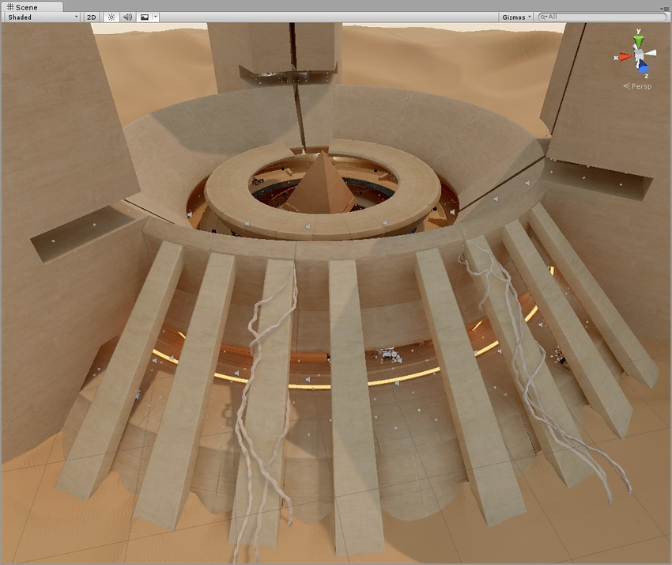
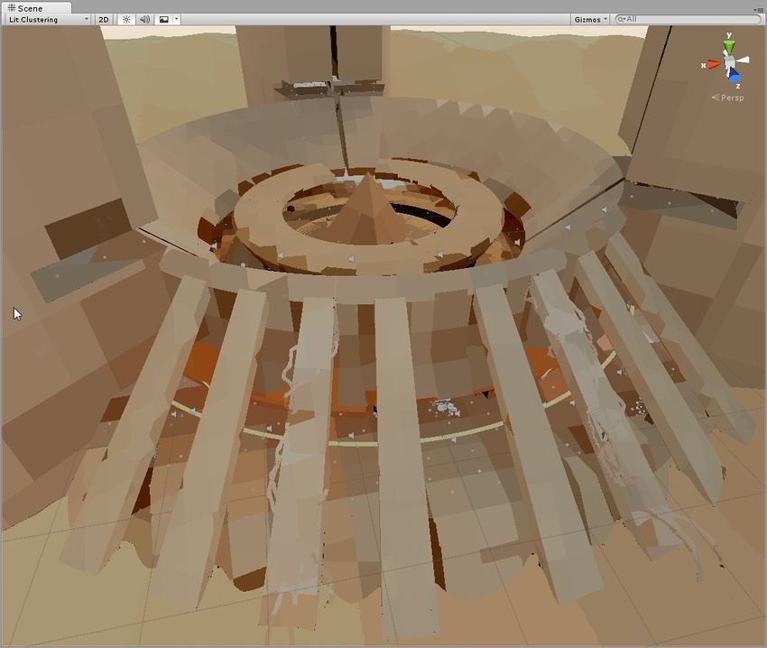
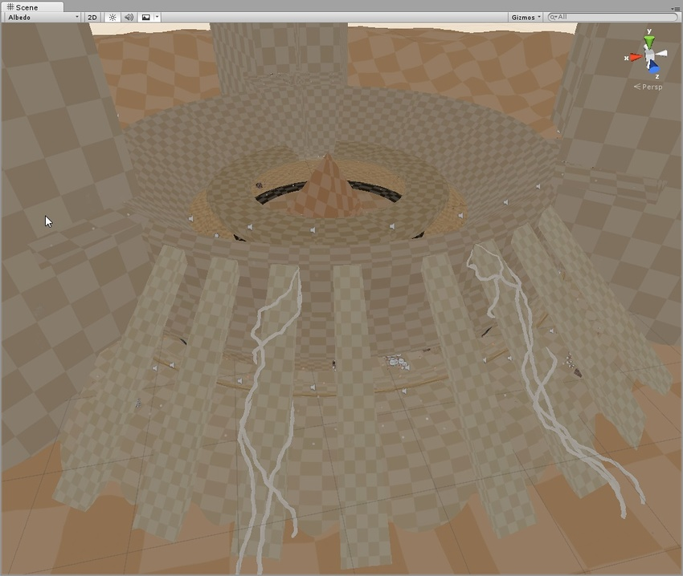
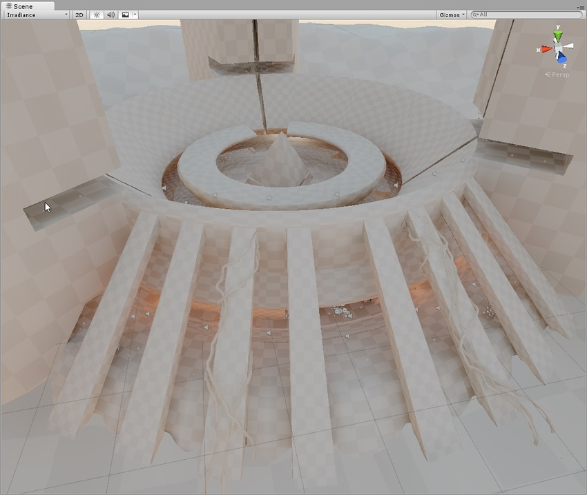
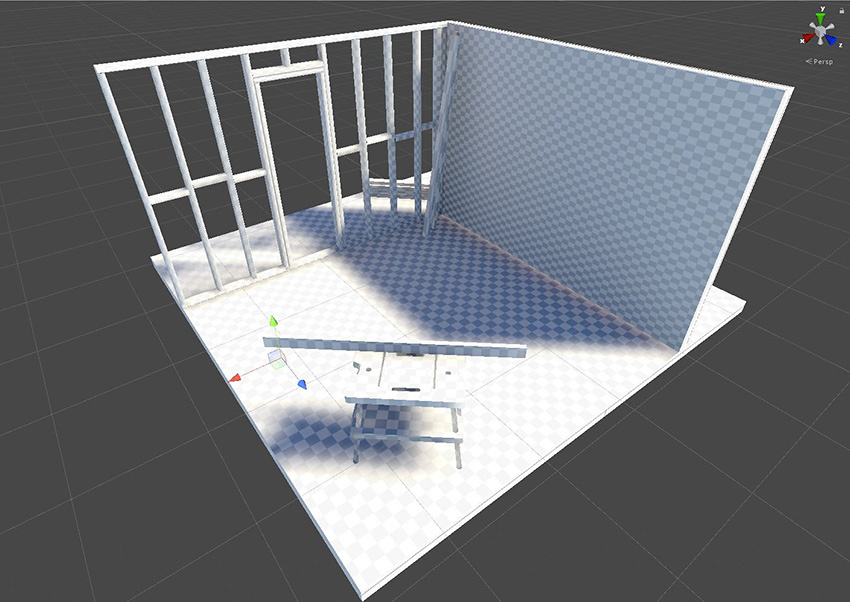
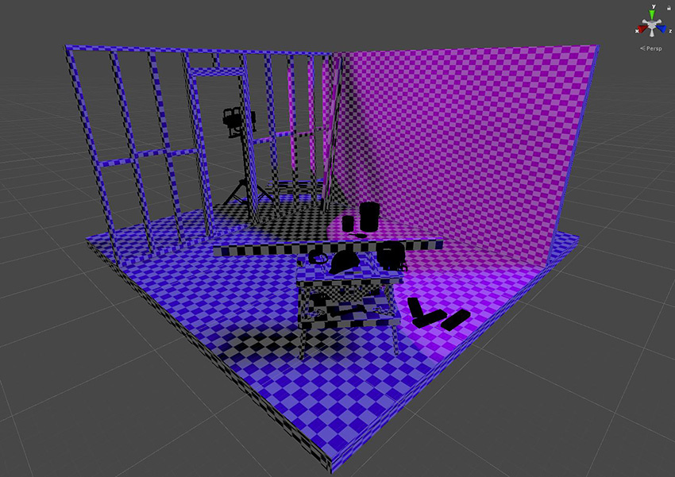

#GI visualizations in the Scene view

The Scene view has a number of [Draw Modes](ViewModes.html) to help you visualize different aspects of the Scene’s content. Among these are a set of modes to let you see exactly how global illumination (GI) is affecting your Scene. This page goes into more detail about the visualisation modes that are most relevant to GI. 

请注意，在 [Lighting 窗口](GlobalIllumination.html)中，__Object__ 选项卡显示所选游戏对象的一些不同模式，其 UV 通道在纹理空间中渲染为线框网格。勾选 __Show Lightmap Resolution__ 复选框可在每个视图的顶部应用棋盘纹理，通过缩放可显示分辨率。

GI visualizations are not designed to work in Play Mode.

 

##Shading Mode

###Shaded

__Shading Mode__ 的默认设置为 __Shaded__。此选项表示场景根据当前的光照设置完全点亮。

 

## Global Illumination

###Systems

预计算阶段将基于接近度和光照贴图参数自动将场景细分为系统（即，共享相同实时光照贴图的对象组）。这样做是为了在更新间接光照时允许多线程和优化。此可视化将显示具有不同颜色的系统。

 

###Clustering

This shows the clusters that Enlighten generates from the lightmap static geometry. Enlighten calculates indirect lighting using clusters that are generated in the Clustering step. Resulting clusters should be larger than lightmap texels (the ratio is controlled by the Cluster Resolution parameter in [Lightmap Parameters](class-LightmapParameters.html). The step where geometry is converted to clusters can be quite memory intensive if the scale isn't set correctly.
If you are seeing high memory usage or long baking times it could be because the static geometry in your scene is getting cut up into many more clusters than what is actually needed. The clustering scene view mode can help you identify the geometry that needs to have UVs or Realtime Resolution tweaked.

 

###Lit Clustering

这些是与聚类视图中看到的相同聚类，但应用了实时 GI。

 

###UV Charts

此选项显示在计算预计算实时 GI 时使用的优化 UV 布局。这是预计算过程中将自动生成的。完成了实例预计算阶段便立即可用。UV Charts 的 Scene 视图模式可以帮助您识别需要调整 UV 或缩放的几何体（使用光照贴图参数中的 Resolution 参数来更改比例）。调整实时分辨率时，此视图也很有用。每个图表的颜色不同。

 

##Realtime Global Illumination

###Albedo

此选项显示计算 GI 时使用的反照率。反照率是根据材质信息生成的，可以通过添加自定义 Meta pass 来完全自定义。方格覆盖层可显示传递给 Enlighten 的反照率纹理的分辨率。

 

###Emissive

显示计算 GI 时使用的发射。发射是根据材质信息生成的，可通过添加自定义 Meta pass 来完全自定义。方格覆盖层可显示传递给 Enlighten 的发射纹理的分辨率。

 

###Indirect

此选项仅显示间接光照（Enlighten 生成的实时 GI 光照贴图的内容）。方格覆盖层可显示辐照度纹理的分辨率。如果禁用实时 GI，则此视图模式不可选。

 

###Directionality

该视图显示最主要的光线方向矢量。请参阅[方向光照贴图](LightmappingDirectional.html)页面以了解更多信息。方格覆盖层可显示方向性纹理的分辨率。

 

## Baked Global Illumination

###Baked Lightmap

此选项显示应用于场景几何体的烘焙光照贴图。方格覆盖层可显示烘焙光照贴图分辨率。

 

###Shadowmask

此选项显示阴影遮罩纹理遮挡值。它以相同的颜色为网格和光源辅助图标着色，因此用户可以验证光照遮挡因子是否按预期烘焙。

 

###Texel Validity

此模式显示哪些纹理像素由于主要看到背面而被标记为无效。在光照贴图烘焙期间，Unity 从每个纹理像素发出光线。如果纹理像素光线的很大一部分照射到背面几何体，则该纹理像素被标记为无效。这是因为纹理像素首先不应该能够看到背面。Unity 处理此问题的方法是用有效相邻纹理像素替换无效纹理像素。您可以使用 __Backface Tolerance__ 参数 (__LightmapParameters__ > __General GI__) 来调整此行为。

 

###UV Overlap
如果光照贴图图表在 UV 空间中距离太近，则当 GPU 对光照贴图进行采样时，它们内部的像素值可能会相互渗色。这可能导致意外瑕疵。此模式允许您识别哪些纹理像素过于靠近其他图表中的纹理像素。在解决 UV 问题时，这非常有用。

 

##Light Overlap

此模式允许您查看是否所有静态光源都已烘焙到阴影遮罩。如果关卡某个区域被四个以上的静态光源照亮，超出的光源将回退到完全烘焙并显示为红色。与此计算相关的不是实际光照表面，而是光源的体积的交点区域。因此，即使在下面的截屏中看起来好像网格上的彩色斑点不重叠，但四个聚光灯的锥体最终也会与方向光一起重叠在地平面下方。

 

---
* 2018-03-28  Page amended with limited [editorial review](DocumentationEditorialReview.html)

* 5.6 版更新

* 2018.1 版更新
