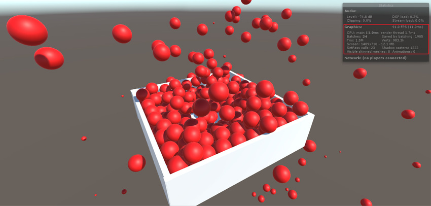
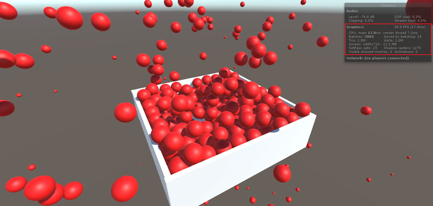

<!--  see https://unity3d.atlassian.net/browse/UNI-3131 --> 

# GPU 实例化

## 简介

使用 GPU 实例化可使用少量[绘制调用](DrawCallBatching.html)一次绘制（或渲染）同一网格的多个副本。它对于绘制诸如建筑物、树木和草地之类的在场景中重复出现的对象非常有用。

GPU 实例化在每次绘制调用时仅渲染相同的网格，但每个实例可以具有不同的参数（例如，颜色或比例）以增加变化并减少外观上的重复。

GPU 实例化可以降低每个场景使用的绘制调用数量。可以显著提高项目的渲染性能。

## 为材质添加实例化

要对材质启用 GPU 实例化 (GPU Instancing)，请在 Project 窗口中选择材质，然后在 Inspector 中勾选 __Enable Instancing__ 复选框。


仅当材质着色器支持 GPU 实例化时，Unity 才会显示此复选框。这包括标准 (Standard)、标准镜面反射 (StandardSpecular) 和所有表面[着色器](Shaders.html)。请参阅有关[标准着色器](shader-StandardShader.html)的文档以了解更多信息。

下面的截屏显示了具有多个游戏对象的相同场景；在顶部图像中，启用了 GPU 实例化，在底部图像中没有启用。请注意 __FPS__、__Batches __和 __Saved by batching__ 中的差异。





使用 GPU 实例化时，存在以下限制：

* Unity 自动选取要实例化的网格渲染器组件和 `Graphics.DrawMesh` 调用。请注意，不支持 [SkinnedMeshRenderer](https://docs.unity3d.com/ScriptReference/SkinnedMeshRenderer.html)。

* Unity 仅在单个 GPU 实例化绘制调用中批量处理那些共享相同网格和相同材质的游戏对象。使用少量网格和材质可以提高实例化效率。要创建变体，请修改着色器脚本为每个实例添加数据（请参阅下一部分了解有关此内容的更多信息）。

您还可以使用 [Graphics.DrawMeshInstanced](../ScriptReference/Graphics.DrawMeshInstanced.html) 和 [Graphics.DrawMeshInstancedIndirect](../ScriptReference/Graphics.DrawMeshInstancedIndirect.html) 调用来通过脚本执行 GPU 实例化。

GPU 实例化可在以下平台和 API 上使用：

* Windows 上的 __DirectX 11__ 和 __DirectX 12__

* Windows、macOS、Linux、iOS 和 Android 上的 __OpenGL Core 4.1+/ES3.0+__

* macOS 和 iOS 上的 __Metal__

* Windows 和 Android 上的 __Vulkan__

* __PlayStation 4__ 和 __Xbox One__

* __WebGL__（需要 WebGL 2.0 API）

## 添加每个实例的数据

默认情况下，仅当游戏对象在每个实例化绘制调用中具有不同的[变换](Transforms.html)时，Unity 才会对这些游戏对象的实例进行批处理。要为实例化的游戏对象添加更多变体，请修改着色器以添加每实例属性，例如材质颜色。

下面的示例演示了如何为每个实例创建具有不同颜色值的实例化着色器。

```

Shader "Custom/InstancedColorSurfaceShader" {
	Properties {
		_Color ("Color", Color) = (1,1,1,1)
		_MainTex ("Albedo (RGB)", 2D) = "white" {}
		_Glossiness ("Smoothness", Range(0,1)) = 0.5
		_Metallic ("Metallic", Range(0,1)) = 0.0
	}

	SubShader {
		Tags { "RenderType"="Opaque" }
		LOD 200
		CGPROGRAM
		// 基于物理的标准光照模型，并对所有光照类型启用阴影
		#pragma surface surf Standard fullforwardshadows
		// 使用 Shader Model 3.0 目标
		#pragma target 3.0
		sampler2D _MainTex;
		struct Input {
			float2 uv_MainTex;
		};
		half _Glossiness;
		half _Metallic;
		UNITY_INSTANCING_BUFFER_START(Props)
	       UNITY_DEFINE_INSTANCED_PROP(fixed4, _Color)
		UNITY_INSTANCING_BUFFER_END(Props)
		void surf (Input IN, inout SurfaceOutputStandard o) {
			fixed4 c = tex2D (_MainTex, IN.uv_MainTex) * UNITY_ACCESS_INSTANCED_PROP(Props, _Color);
			o.Albedo = c.rgb;
			o.Metallic = _Metallic;
			o.Smoothness = _Glossiness;
			o.Alpha = c.a;
		}
		ENDCG
	}
	FallBack "Diffuse"
}

```

将 `_Color` 声明为实例化属性时，Unity 将从游戏对象上设置的 MaterialPropertyBlock 对象中收集 `_Color` 值，并将它们放在单个绘制调用中。

```

MaterialPropertyBlock props = new MaterialPropertyBlock();
MeshRenderer renderer;

foreach (GameObject obj in objects)
{
   float r = Random.Range(0.0f, 1.0f);
   float g = Random.Range(0.0f, 1.0f);
   float b = Random.Range(0.0f, 1.0f);
   props.SetColor("_Color", new Color(r, g, b));
   
   renderer = obj.GetComponent<MeshRenderer>();
   renderer.SetPropertyBlock(props);
}
```

请注意，在通常情况下（不使用实例化着色器，或者 `_Color` 不是每个实例的属性），由于 MaterialPropertyBlock 中的值不同，绘制调用批次会被破坏。

要使这些更改生效，必须启用 GPU 实例化。为此，请在 Project 窗口中选择您的着色器，然后在 Inspector 中勾选 __Enable Instancing__ 复选框。


## 向顶点和片元着色器中添加实例化

下面的示例采用简单的无光照着色器，并使其能够使用不同的颜色进行实例化：

```

Shader "SimplestInstancedShader"
{
    Properties
    {
        _Color ("Color", Color) = (1, 1, 1, 1)
    }

    SubShader
    {
        Tags { "RenderType"="Opaque" }
        LOD 100

        Pass
        {
            CGPROGRAM
            #pragma vertex vert
            #pragma fragment frag
            #pragma multi_compile_instancing
            #include "UnityCG.cginc"

            struct appdata
            {
                float4 vertex : POSITION;
                UNITY_VERTEX_INPUT_INSTANCE_ID
            };

            struct v2f
            {
                float4 vertex : SV_POSITION;
                UNITY_VERTEX_INPUT_INSTANCE_ID // 仅当您要访问片元着色器中的实例化属性时才需要。
            };

            UNITY_INSTANCING_BUFFER_START(Props)
                UNITY_DEFINE_INSTANCED_PROP(float4, _Color)
            UNITY_INSTANCING_BUFFER_END(Props)
           
            v2f vert(appdata v)
            {
                v2f o;

                UNITY_SETUP_INSTANCE_ID(v);
                UNITY_TRANSFER_INSTANCE_ID(v, o); // 仅当您要访问片元着色器中的实例化属性时才需要。

                o.vertex = UnityObjectToClipPos(v.vertex);
                return o;
            }
           
            fixed4 frag(v2f i) : SV_Target
            {
                UNITY_SETUP_INSTANCE_ID(i); // 仅当要在片元着色器中访问任何实例化属性时才需要。
                return UNITY_ACCESS_INSTANCED_PROP(Props, _Color);
            }
            ENDCG
        }
    }
}
```

## 着色器修改

| 添加| 功能 |
|:---|:---| 
| `#pragma multi_compile_instancing`| 用于命令 Unity 生成实例化变体。对于表面着色器来说是不需要的。 |
| `UNITY_VERTEX_INPUT_INSTANCE_ID`| 用于在顶点着色器输入/输出结构中定义实例 ID。请参阅 `SV_InstanceID` 以了解更多信息。 |
| `UNITY_INSTANCING_BUFFER_START(name)` / `UNITY_INSTANCING_BUFFER_END(name)`| 必须在特殊命名的常量缓冲区中定义每个实例的属性。使用这对宏来包装对每个实例唯一的属性。 |
| `UNITY_DEFINE_INSTANCED_PROP(float4, _Color)`  | 用于根据类型和名称定义每个实例着色器的属性。在此示例中，`_Color` 属性是唯一的。 |
| `UNITY_SETUP_INSTANCE_ID(v);`| 用于使着色器函数可以访问实例 ID。它必须在顶点着色器的最开头使用，并且对于片元着色器是可选的。 |
| `UNITY_TRANSFER_INSTANCE_ID(v, o);`| 用于将实例 ID 从顶点着色器的输入结构体复制到输出结构体中。仅当需要访问片元着色器中的每个实例的数据时才有必要这样做。 |
| `UNITY_ACCESS_INSTANCED_PROP(arrayName, color)`| 用于访问在实例化常量缓冲区中声明的每个实例着色器的属性。它使用实例 ID 来索引到实例数据数组。该宏中的 `arrayName` 必须与 `UNITY_INSTANCING_BUFFER_END(name)` 宏中的匹配。|


**注意**：

* 使用多个每个实例的属性时，不需要在 `MaterialPropertyBlocks` 中填入所有这些属性。

* 如果一个实例缺少该属性，Unity 将从引用的材质中获取默认值。如果材质没有该指定属性的默认值，Unity 会将值设置为 0。请勿将非实例化属性放在 `MaterialPropertyBlock` 中，因为这会禁用实例化。请为非实例化属性创建不同材质。


## 高级 GPU 实例化技巧

### 批处理优先级

进行批处理时，Unity 将优先处理[静态批处理](DrawCallBatching.html)，然后再处理实例化。如果您将其中一个游戏对象标记为静态批处理，并且 Unity 成功对其进行批处理，则 Unity 会禁用该游戏对象的实例化，即使其渲染器使用实例化着色器也是如此。发生这种情况时，Inspector 窗口将显示一条警告消息，建议您禁用静态批处理。要禁用静态批处理，请打开 Player Settings (__Edit__ > __Project Settings__ > __Player__)，打开 __Other Settings__，然后在 __Rendering__ 部分下面取消勾选 __Static Batching__ 复选框。

Unity 将优先处理实例化，然后再处理动态批处理。如果 Unity 可以实例化网格，则会对该网格禁用动态批处理。

### Graphics.DrawMeshInstanced

某些因素可能会阻止游戏对象同时自动实例化。这些因素包括材质变化和深度排序。使用 [Graphics.DrawMeshInstanced](../ScriptReference/Graphics.DrawMeshInstanced.html) 可强制 Unity 使用 GPU 实例化来绘制这些对象。类似于 [Graphics.DrawMesh](../ScriptReference/Graphics.DrawMesh.html)，此函数为一帧绘制网格，不会创建不必要的游戏对象。

### Graphics.DrawMeshInstancedIndirect

在脚本中使用 `DrawMeshInstancedIndirect` 可从计算缓冲区中读取实例化绘制调用的参数，包括实例数量。如果要从 GPU 填充所有实例数据，并且 CPU 不知道要绘制的实例数（例如，执行 GPU 剔除时），这非常有用。请参阅 [Graphics.DrawMeshInstancedIndirect](../ScriptReference/Graphics.DrawMeshInstancedIndirect.html) 的 API 文档以了解详细说明和代码示例。

### 全局光照支持

从 Unity 2018.1 开始，GPU 实例化以光照探针、遮挡探针（在 [Shadowmask](LightMode-Mixed-ShadowmaskMode.html) 模式下）和光照贴图 ST 的形式支持全局光照 (GI) 渲染。标准着色器和表面着色器会自动启用 GI 支持。

受场景中烘焙的光照探针和遮挡探针影响的动态渲染器，以及烘焙到相同光照贴图纹理的静态渲染器，可以由前向和延迟渲染循环使用 GPU 实例化一起自动进行批处理。

对于 Graphics.DrawMeshInstanced，通过将 LightProbeUsage 参数设置为 CustomProvided 并提供复制了探针数据的 MaterialPropertyBlock，即可启用光照探针和遮挡探针渲染。请参阅 [LightProbes.CalculateInterpolatedLightAndOcclusionProbes](../ScriptReference/LightProbes.CalculateInterpolatedLightAndOcclusionProbes.html) 的 API 文档以了解详细说明和代码示例。

### 全局光照和 GPU 实例化

GPU 实例化支持 Unity 中的全局光照 (GI) 渲染。每个 GPU 实例可支持来自不同[光照探针](LightProbes.html)、一个[光照贴图](Lightmapping.html)（但该光照贴图中有多个图集区域）或一个[光照探针代理体](class-LightProbeProxyVolume.html)组件（为包含所有实例的空间体积进行烘焙）的 GI。标准着色器和表面着色器默认启用该支持。

您可以通过[前向](RenderTech-ForwardRendering.html)和[延迟](RenderTech-DeferredShading.html)渲染循环，使用 GPU 实例化来自动批处理受烘焙光照探针（包括其遮挡数据）影响的动态[网格渲染器](class-MeshRenderer.html)，或烘焙到相同光照贴图纹理的静态网格渲染器。请参阅有关[渲染管线](Rendering-Tech.html)的文档以了解更多信息。

对于 [Graphics.DrawMeshInstanced](../ScriptReference/Graphics.DrawMeshInstanced.html)，通过将 [LightProbeUsage](../ScriptReference/Rendering.LightProbeUsage.html) 参数设置为 [CustomProvided](../ScriptReference/Rendering.LightProbeUsage.CustomProvided.html) 并提供复制了探针数据的 [MaterialPropertyBlock](../ScriptReference/MaterialPropertyBlock.html)的方式，来启用光照探针（包括其遮挡数据）的渲染。请参阅 [LightProbes.CalculateInterpolatedLightAndOcclusionProbes](../ScriptReference/LightProbes.CalculateInterpolatedLightAndOcclusionProbes.html) 的 API 文档以了解详细说明和代码示例。

或者，您可以将 LPPV 组件引用和 [LightProbeUsage.UseProxyVolume](../ScriptReference/Rendering.LightProbeUsage.UseProxyVolume.html) 传递到 `Graphics.DrawMeshInstanced`。执行此操作时，所有实例都会对光照探针数据的 L0 和 L1 带宽进行采样。如果您希望补充 L2 数据和遮挡数据，请使用 `MaterialPropertyBlock`。有关更多信息，请参阅[光照探针：技术信息](LightProbes-TechnicalInformation.html)。

### 着色器预热

从 Unity 2017.3 开始，如果您希望在着色器第一次渲染时获得绝对平滑的渲染，则需要预热着色器以便在 OpenGL 上使用实例化。如果您在不需要着色器预热的平台上为着色器进行实例化预热，则不会发生任何操作。

请参阅 [ShaderVariantCollection.WarmUp](../ScriptReference/ShaderVariantCollection.WarmUp.html) 和 [Shader.WarmupAllShaders](../ScriptReference/Shader.WarmupAllShaders.html) 以了解更多信息。

### #pragma instancing_options

`#pragma instancing_options` 指令可以使用以下开关：

| **开关**| **功能** |
|:---|:---| 
| `forcemaxcount:batchSize` 和 `maxcount:batchSize`| 在大多数平台上，Unity 通过以下方式自动计算实例化数据数组大小：将目标设备上的最大常量缓冲区大小除以包含所有每个实例的属性的结构的大小。通常您不必担心批次大小。但是，在某些平台（Vulkan、Xbox One 和 Switch）上，仍然需要固定的数组大小。您可以使用 `maxcount` 选项来为这些平台指定批次大小。在其他平台上，将完全忽略此选项。如果确实希望强制设定所有平台的批次大小，请使用 `forcemaxcount`（例如，当您知道自己只会通过 DrawMeshInstanced 发出包含 256 个实例化精灵的绘制时）。这两个选项的默认值为 500。|

| `assumeuniformscaling`| 用于命令 Unity 假设所有实例都具有统一的缩放（所有 X、Y 和 Z 轴的比例相同）。|

| `nolodfade`| 用于防止 Unity 对 [LOD](LevelOfDetail.html) 淡化值应用 GPU 实例化。|

| `nolightprobe`| 用于防止 Unity 对[光照探针](LightProbes.html)值（包括其遮挡数据）应用 GPU 实例化。如果您完全确定没有任何游戏对象正在使用 GPU 实例化和光照探针，那么这个参数对提升性能非常有用。|

| `nolightmap`| 用于防止 Unity 对光照贴图 ST（图集信息）值应用 GPU 实例化。如果您完全确定没有任何游戏对象正在使用 GPU 实例化和光照贴图，那么这个参数对提升性能非常有用。|

| `procedural:FunctionName`| 用于命令 Unity 生成额外变体以用于 [Graphics.DrawMeshInstancedIndirect](../ScriptReference/Graphics.DrawMeshInstancedIndirect.html)。<br/>在顶点着色器阶段开始时，Unity 调用在冒号后面指定的函数。要手动设置实例数据，请按照通常将每个实例数据添加到着色器的方式将每个实例数据添加到此函数。如果片元着色器中包含任何获取的实例属性，Unity 还会在片元着色器的开头调用此函数。|


### UnityObjectToClipPos

编写着色器脚本时，请务必使用 `UnityObjectToClipPos(v.vertex)` 而非 `mul(UNITY_MATRIX_MVP,v.vertex)`。

虽然您可以继续在实例化的着色器中正常使用 `UNITY_MATRIX_MVP`，但 `UnityObjectToClipPos` 是将顶点位置从对象空间转换为裁剪空间的最有效方法。Unity 还实现了一个着色器升级程序，此程序可扫描项目中的所有着色器，并自动用 `UnityObjectToClipPos(v)` 替换任何出现的 `mul(UNITY_MATRIX_MVP, v)`。

如果仍有某些地方在使用 `UNITY_MATRIX_MVP`（以及 `UNITY_MATRIX_MV`），控制台窗口（菜单：__Window__ > __Console__）会显示性能警告。

## 其他注意事项

* 表面着色器具有默认情况下生成的实例化变体，除非您在 `#pragma` 表面指令中指定 `noinstancing`。标准着色器和标准镜面反射着色器已经过修改以支持实例化，但除了变换之外并没有定义每个实例的属性。Unity 将在表面着色器中忽略 `#pragma multi_compile_instancing` 的使用。

* 如果未在场景中的任何游戏对象上启用 GPU 实例化，Unity 会剥离实例化变体。要覆盖此剥离行为，请打开 [Graphics Settings](class-GraphicsSettings.html)（菜单：__Edit__ > __Project Settings__ > __Graphics__），找到 __Shader stripping__ 部分，并更改 __Instancing Variants__。

* 对于 `Graphics.DrawMeshInstanced`，您需要在脚本传递到此方法的材质上启用 GPU 实例化。但是，`Graphics.DrawMeshInstancedIndirect` 不会要求您启用 GPU 实例化。间接实例化关键字 `PROCEDURAL_INSTANCING_ON` 不受剥离的影响。

* 实例化的绘制调用在[帧调试器 (Frame Debugger)](FrameDebugger.html) 中显示为 __Draw Mesh (instanced)__。

* 并非总是需要定义每个实例的属性。但是，必须设置实例 ID，因为世界矩阵需要它才能正常运行。表面着色器会自动设置实例 ID。您必须手动设置自定义顶点和片元着色器的实例 ID。为此，请在着色器开头使用 `UNITY_SETUP_INSTANCE_ID`。

* 使用前向渲染时，Unity 无法有效地实例化受多个光源影响的对象。只有基础 pass 能有效使用实例化，但添加的 pass 不行。有关光照 pass 的更多信息，请参阅有关[前向渲染](RenderTech-ForwardRendering.html)和 [Pass 标签](SL-PassTags.html)的文档

* 如果多 pass 着色器有两个以上的 pass，则只有第一个 pass 可以实例化。这是因为 Unity 强制将后续 pass 针对每个对象一起渲染，从而强制更改材质。

* 以上示例中使用的所有着色器宏都在 *UnityInstancing.cginc* 中定义。请在以下目录中查找此文件：*[Unity 安装文件夹]\Editor\Data\CGIncludes*。


------

* <span class="page-edit">2017-10-24  Page amended with [editorial review](DocumentationEditorialReview.html)
</span>

* <span class="page-history">在 5.6 版中增加了 Enable Instancing 复选框指南、DrawMeshInstancedIndirect 和 #pragma multi-compile</span>

* <span class="page-history">在 [2017.3](https://docs.unity3d.com/2017.3/Documentation/Manual/30_search.html?q=newin20173) 版中增加了针对 GPU 实例化的着色器预热 <span class="search-words">NewIn20173</span></span>

* <span class="page-history">在 [2018.1](https://docs.unity3d.com/2018.1/Documentation/Manual/30_search.html?q=newin20181) 版中增加了 GPU 实例化的全局光照 (GI) 支持 <span class="search-words">NewIn20181</span></span>
