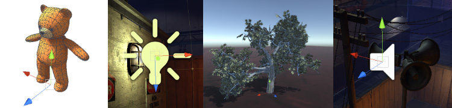

# 游戏对象

__游戏对象__是 Unity Editor 中最重要的概念。

游戏中的每个对象（从角色和可收集物品到光源、摄像机和特效）都是__游戏对象__。但是，游戏对象本身无法执行任何操作；您需要向游戏对象提供属性，然后游戏对象才能成为角色、环境或特效。

为了向游戏对象提供成为光源、树或摄像机所需的属性，需要向游戏对象添加[组件](Components.html)。根据要创建的对象类型，可以向游戏对象添加不同的组件组合。

可以将游戏对象视为空的“烹饪锅”，而将组件视为构成游戏“菜谱”的不同材料。Unity 拥有许多不同的内置组件类型，而且还可以使用 [Unity Scripting API](CreatingComponents.html) 来创建自己的组件。

本部分将介绍游戏对象、组件和脚本 API 如何组合在一起，以及如何创建和使用它们。

---

* 2017-08-01  Page amended with limited [editorial review](DocumentationEditorialReview.html)

