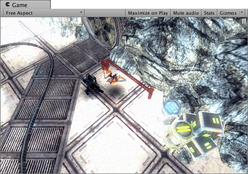
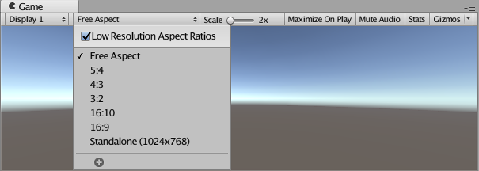
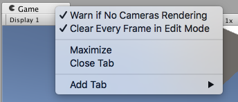

#Game 视图

 

从游戏中的摄像机渲染 Game 视图。该视图代表最终发布的游戏。需要使用一个或多个摄像机来控制玩家在玩游戏时实际看到的内容。有关摄像机的更多信息，请查看[摄像机组件页面](class-Camera.html)。

##播放模式

 

可使用工具栏中的按钮来控制 Editor 播放模式以及查看发布的游戏的播放情况。在播放模式下，所做的任何更改都是暂时的，在退出播放模式后将会重置。Editor UI 会变暗来提醒此情况。

##Game 视图控制栏

 

|**_按钮：_** |**_功能：_** |
|:---|:---|
|__显示屏__|如果场景中有多个摄像机，可单击此按钮从摄像机列表中进行选择。默认情况下，此按钮设置为 __Display 1__。（可以在摄像机模块中的 __Target Display__ 下拉菜单下将显示分配给摄像机。）|
|__Aspect__|可选择不同值来测试游戏在具有不同宽高比的显示器上的显示效果。默认情况下，此设置为 __Free Aspect__。 |
|&nbsp;&nbsp;&nbsp;&nbsp;_Low Resolution Aspect Ratios_|如果要模拟更旧显示屏的像素密度，请选中此框：选择宽高比后，此功能会降低 Game 视图的分辨率。Game 视图位于非 Retina 显示屏上时，此复选框始终处于启用状态。 （仅当 Editor 在 macOS 上运行时，此复选框才可见。） |
|__Scale 滑动条__|向右滚动可放大并更详细地检查游戏屏幕的区域。设备分辨率高于 Game 视图窗口大小的情况下，该滚动条还可缩小视图以查看整个屏幕。在游戏停止或暂停时，也可以使用滚轮和鼠标中键来执行此操作。|
|__Maximize on Play__|单击按钮启用：进入播放模式时，使用此按钮可使 Game 视图最大化（Editor 窗口的 100%）以便进行全屏预览。|
|__Mute audio__|单击按钮启用：进入播放模式时，使用此按钮可将任何游戏内的音频静音。|
|__Stats__|单击此按钮可以切换 Statistics 覆盖层，其中包含有关游戏音频和图形的[渲染统计信息](RenderingStatistics.html)。这对于在播放模式下监控游戏性能非常有用。|
|__Gizmos__|单击此按钮可切换[辅助图标](GizmosMenu.html)的可见性。要在播放模式下仅查看某些类型的辅助图标，请单击 __Gizmos__ 一词旁边的下拉箭头，然后仅选中要查看的辅助图标类型的复选框。（请参阅以下的辅助图标选项。）|

##Gizmos 菜单

Gizmos 菜单包含用于控制对象、图标和辅助图标的显示方式的许多选项。此菜单在 Scene 视图和 Game 视图中均可用。请参阅有关 [Gizmos 菜单](GizmosMenu.html)的文档以了解更多信息。

##高级选项

右键单击 Game 选项卡可以显示 Game 视图的高级选项。

 

__Warn if No Cameras Rendering__：此选项默认为启用状态：如果没有摄像机渲染到屏幕，会显示警告。这对于诊断意外删除或禁用摄像机等问题非常有用。除非故意不使用摄像机来渲染游戏，否则应将此选项保持启用状态。

__Clear Every Frame in Edit Mode__：此选项默认为启用状态：在游戏未播放时，会每帧清除 Game 视图。这可以防止在配置游戏时出现拖尾效果。除非在未处于播放模式时依赖于前一帧的内容，否则应将此选项保持启用状态。
