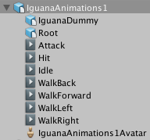

# 导入非人形动画

*人形 (Humanoid)* 模型是一种非常特别的结构，包含至少 [15 种骨骼](ConfiguringtheAvatar.html)，这些骨骼的组织方式与实际人体骨架大致相符。所有其他使用 [Unity 动画系统](AnimationOverview.html)的模型则属于*非人形*或__通用 (Generic)__ 类别。这意味着通用模型可能是从茶壶到飞龙的任何物体，因此非人形骨架可能拥有大量各式各样的骨骼结构。

为了处理这种复杂性，Unity 只需知道哪个骨骼是__根节点 (Root node)__。就通用角色而言，这是人形角色质心的最佳近似值。它有助于 Unity 确定如何以最可靠的方式渲染动画。由于只有一个骨骼要映射，通用设置不使用 [Humanoid Avatar 窗口](class-Avatar.html)。因此，准备将非人形模型文件导入 Unity 时所需的步骤比人形模型所需的步骤要少。

1.[设置 Rig](#RigSetup) 为 __Generic__。
2.可以选择通过[定义 Avatar 遮罩](#AvatarMask)来限制在某些骨骼上导入的动画。
3.从 __Animation__ 选项卡中，启用 __Import Animation__ 选项，然后设置其他特定于资源的属性。
4.如果文件包含多个动画或动作，可[将特定帧范围定义为动画剪辑](Splittinganimations.html)。
5.对于文件中定义的每个动画剪辑，可以：
    * [设置姿势和根变换](class-AnimationClip.html#ClipProperties)
    * [优化循环](LoopingAnimationClips.html)
    * [向剪辑添加曲线](AnimationCurvesOnImportedClips.html)以便动画化其他项的时序
    * [向剪辑添加事件](AnimationEventsOnImportedClips.html)以便在动画期间触发某些动作
    * [丢弃动画的一部分](AnimationMaskOnImportedClips.html)（类似于使用运行时 [Avatar 遮罩](class-AvatarMask.html)，但却是在导入时执行的）
    * [选择其他根运动节点](AnimationRootMotionNodeOnImportedClips.html)来驱动动作
    * [阅读 Unity 提供的有关导入剪辑的任何消息](class-AnimationClip.html#ImportMessages)
    * [观看动画剪辑的预览](class-AnimationClip.html#AnimationPreview)
6.要保存更改，请单击 __Import Settings__ 窗口底部的 __Apply__ 按钮，也可单击 __Revert__ 放弃所做的更改。

 
## 设置骨架

从 [Inspector 窗口的 Rig 选项卡](FBXImporter-Rig.html)中，将 __Avatar__（动画）类型设置为 __Generic__。默认情况下，__Avatar Definition__ 属性设置为 __Create From This Model__，而 __Root node__ 选项设置为 __None__。

在某些情况下，可将 __Avatar Definition__ 选项更改为 __Copy From Other Avatar__，从而使用事先为其他模型文件定义的 Avatar。例如，如果在 3D 建模应用程序中使用多个不同的动画来创建一个网格（皮肤），则可以将网格导出到一个 FBX 文件，并将每个动画导出到各自的 FBX 文件。将这些文件导入 Unity 时，只需为导入的第一个文件（通常是网格）创建一个 Avatar 即可。只要所有文件都使用相同的骨骼结构，便可以将该 Avatar 用于其余文件（例如，所有动画）。

如果保留 __Create From This Model__ 选项，则必须从 __Root node__ 属性中选择一种骨骼。

如果将 __Avatar Definition__ 选项更改为 __Copy From Other Avatar__，必须通过设置 __Source__ 属性来指定要使用的 Avatar。

单击 __Apply__ 按钮。Unity 会创建__通用__ __Avatar__，并将 Avatar 子资源添加到模型资源（可以在项目视图中找到该资源）下。

**注意：**通用 Avatar 与人形 Avatar 不同，但它会显示在项目视图中，也会保存根节点映射。但是，如果单击项目视图中的 Avatar 图标在 __Inspector__ 中显示其属性，则仅会显示其名称，不显示 __Configure Avatar__ 按钮。

 
## 创建 Avatar 遮罩

可以在导入时或运行时将遮罩应用于动画剪辑。最好是在导入时应用遮罩，因为这样做允许从构建中忽略丢弃的动画数据，从而使文件更小，进而使用更少的内存。此外还可以提高处理速度，因为在运行时需要混合的动画数据更少。在某些情况下，导入遮罩可能对您不适用。这种情况下，可在运行时应用遮罩，为此需要创建 __Avatar 遮罩 (Avatar Mask)__ 资源，并在 __Animator Controller__ 的[层设置中使用该资源](AnimationLayers.html)。

要创建空的 Avatar 遮罩资源，可以：

* 从 __Assets__ 菜单中选择 __Create__ &gt; __Avatar Mask__。
* 在__项目__视图中单击要定义遮罩的模型对象，然后单击右键并选择 __Create__ &gt; __Avatar Mask__。

新资源将显示在__项目__视图中：

现在可以从 [Transform 层级视图](class-AvatarMask.html#Transform)中选择要包含或排除的骨骼，然后将遮罩添加到[动画层](AnimationLayers.html)或添加对遮罩的引用（在 [Animation 选项卡](class-AnimationClip.html)的 [Mask](AnimationMaskOnImportedClips.html) 部分）。

---

*  2018-04-25  Page amended with limited [editorial review](DocumentationEditorialReview.html)

