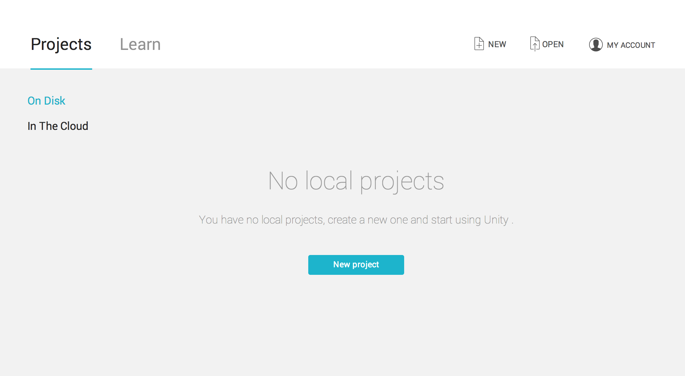
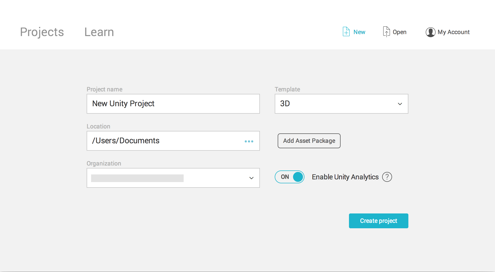

# 首次启动 Unity

可通过两种方法来创建新项目：

* 使用 Unity Hub - Unity Hub 是一个独立应用程序，可简化查找、下载和管理 Unity 项目和安装内容的方式。有关安装 Unity Hub 的信息，请参阅[使用 Hub 来安装 Unity](GettingStartedInstallingHub.html)。
* 使用 Unity Launcher - 有关使用 Unity Launcher 下载助手来安装 Unity Editor 的更多信息，请参阅[使用下载助手来安装 Unity](DeployingUnityOffline.html)。

## 使用 Hub 来创建项目

要创建新项目（并指定打开此项目所用的 Editor 版本），请单击 __New__。

| 设置| 功能 |
|:---|:---| 
| __Project name__| 设置项目的名称。此名称是主项目文件夹的名称，该文件夹用于存储与项目相关的资源、场景和其他文件。  |
| __Unity Version__| 选择要用于创建项目的 Editor 版本。**注意**：只有在 Hub 中安装了多个版本的 Editor 时，才能使用该下拉菜单。 |
| __Location__| 使用此设置可定义计算机文件系统中存储项目的位置。项目的位置默认为计算机上的主文件夹。要更改位置，请在 Location 字段中输入所需存储位置的文件路径。或者，单击 Location 字段中的省略号图标。这将打开计算机的文件浏览器（Explorer、Finder 或 Files，具体取决于计算机的操作系统）。在文件浏览器中，导航到要存储项目的文件夹，然后单击 Select Folder 或 Open。 |
| __Template__| 选择项目模板。项目模板基于项目的共同最佳实践而提供预选的设置。这些设置针对 Unity 支持的所有平台上的 2D 和 3D 项目进行了优化。默认模板类型为 3D。  |
| __Add Asset Package__| 使用此按钮可将预先生成的内容添加到项目。Unity 随附的资源包中包括预制的模型、粒子效果和示例脚本，以及其他有用的工具和内容。要将 Unity 提供的资源包导入到项目中，请单击 Add Asset Package 按钮，然后勾选要导入的每个资源包左侧的复选框，并单击 Done。创建项目时，Unity 会自动导入所选资源。Add Asset Package 屏幕还包含从 Unity Asset Store 下载的资源。此外，也可以在创建项目后添加资源包。要在 Unity Editor 中执行此操作，请选择 __Assets > Import Package__，然后选择要导入的包。 |
| __Enable Unity Analytics__| 选择是否启用 Unity Analytics。Unity Analytics 是一个数据平台，可为 Unity 游戏提供分析功能。可以使用 Analytics 来查看游戏玩家的身份及其在游戏中的行为。Unity Analytics 会默认启用。 |

## 使用 Unity Launcher 来创建项目

要使用 Unity Editor，必须拥有 Unity Developer Network (UDN) 帐户。如果已经拥有帐户，请登录并进入 [Projects 选项卡](#projects)部分。

如果没有帐户，请按照提示来创建帐户。想了解帐户和订阅的更多相关信息，请参阅 [Unity Organizations](OrgsUnityOrganizations.html)。

启动 Unity Editor 时，将显示 Unity Launcher 主屏幕。

屏幕中有两个选项卡：__Projects__ 选项卡和 __Learn__ 选项卡。

在 __Projects__ 选项卡中可以创建新项目或打开现有项目。

从 __Learn__ 选项卡可以访问教程和学习资源以帮助您开始使用 Unity。如果不熟悉如何使用 Unity，可以在开始新项目之前完成 Unity Learn 学习教程。

 
## Projects 选项卡

在主屏幕上，单击 __Projects__ 可查看 __Projects__ 选项卡的内容。

Unity 将项目存储在两个位置：

* __磁盘上 (On Disk)__：要打开存储在计算机上的现有 Unity 项目，请单击 __Projects__ 选项卡中的项目名称，或单击 __Open__ 以浏览计算机来查找 Project 文件夹。
* __在云端 (In the Cloud)__：要访问 [Unity Collaborate](UnityCollaborate.html) 项目，请单击 __In the Cloud__，然后选择要加载的项目。Hub 会提示您在计算机上为项目选择存储位置。

### 创建项目

在主窗口右上角中，单击 __New__ 以打开 Create Project View。

在 Create Project View 中，填写所需的项目设置，然后 Unity 将创建项目。这些设置详述如下。

| 设置| 功能 |
|:---|:---| 
| __Project name__| 设置项目的名称。此名称是主项目文件夹的名称，该文件夹用于存储与项目相关的资源、场景和其他文件。  |
| __Location__| 使用此设置可定义计算机文件系统中存储项目的位置。项目的位置默认为计算机上的主文件夹。要更改位置，请在 Location 字段中输入所需存储位置的文件路径。或者，单击 Location 字段中的省略号图标。这将打开计算机的文件浏览器（Explorer、Finder 或 Files，具体取决于计算机的操作系统）。在文件浏览器中，导航到要存储项目的文件夹，然后单击 Select Folder 或 Open。 |
| __Template__| 选择项目模板。项目模板基于项目的共同最佳实践而提供预选的设置。这些设置针对 Unity 支持的所有平台上的 2D 和 3D 项目进行了优化。默认模板类型为 3D。  |
| __Add Asset Package__| 使用此按钮可将预先生成的内容添加到项目。Unity 随附的资源包中包括预制的模型、粒子效果和示例脚本，以及其他有用的工具和内容。要将 Unity 提供的资源包导入到项目中，请单击 Add Asset Package 按钮，然后勾选要导入的每个资源包左侧的复选框，并单击 Done。创建项目时，Unity 会自动导入所选资源。Add Asset Package 屏幕还包含从 Unity Asset Store 下载的资源。此外，也可以在创建项目后添加资源包。要在 Unity Editor 中执行此操作，请选择 __Assets__ > __Import Package__，然后选择要导入的包。 |
| __Enable Unity Analytics__| 选择是否启用 Unity Analytics。Unity Analytics 是一个数据平台，可为 Unity 游戏提供分析功能。可以使用 Analytics 来查看游戏玩家的身份及其在游戏中的行为。Unity Analytics 会默认启用。 |

完成后，单击 __Create Project__ 按钮。Unity 会自动生成所需文件，创建项目，并打开该项目。

--------------------------------
2018-06-12 Page published with [editorial review](DocumentationEditorialReview.html)

