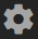
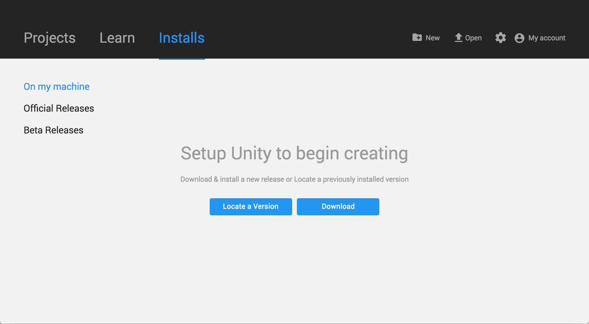
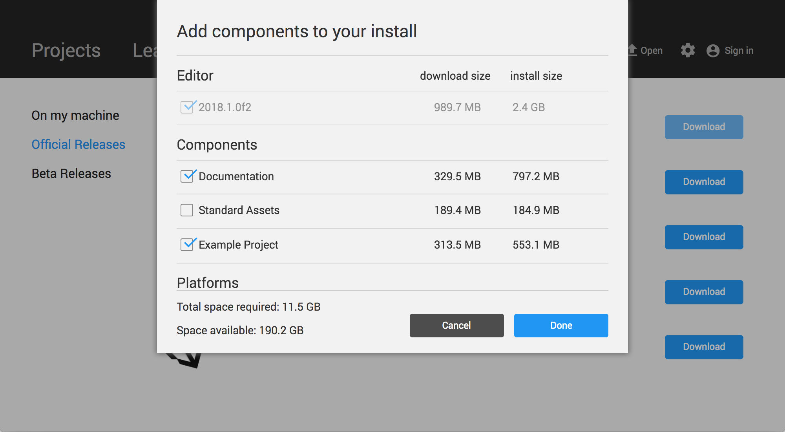
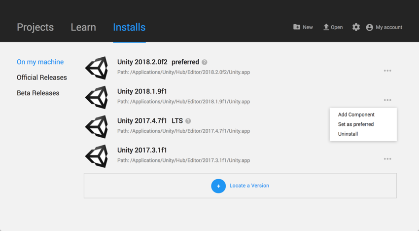

# 使用 Hub 来安装 Unity

Unity Hub 是一种管理工具，可让您管理自己的所有 Unity 项目和安装。使用 Hub 可以管理 Unity Editor 的多个安装及其关联组件，创建新项目，以及打开现有项目。

## 安装 Unity Hub

要安装 Unity Hub，请访问 Unity 网站上的[下载 Unity Personal (Download Unity Personal)](https://store.unity.com/download?ref=personal)。

要安装并使用 Unity Editor，必须拥有 Unity Developer Network (UDN) 帐户。如果已经拥有帐户，请登录并进入[安装 Unity Editor](#install) 部分。

如果没有帐户，请按照提示来创建帐户。可以选择创建 Unity ID，也可以使用社交网站登录帐户之一。想了解帐户和订阅的更多相关信息，请参阅 [Unity Organizations](OrgsUnityOrganizations.html)。

<a name="install"></a> 
## 安装 Unity Editor

要安装 Editor，请执行以下操作：

1.单击 __Installs__ 选项卡。默认安装位置为：

    Windows：
    
    ```
    C:\Program Files\Unity\Hub\Editor
    ```
    
    Mac：

    ```
    /Application/Unity/Hub/Editor
    ```
    
    1.（可选）要更改默认安装位置，请单击齿轮图标：。

    2.在 __Editor Folder Location__ 对话框中，输入新安装位置，然后单击 __Done__。

2.如果要安装已发布的 Editor 版本，请单击 __Official Releases__；如果要安装 Editor 的最新测试版，请单击 __Beta Releases__。

     

3.单击要安装的 Editor 版本的 __Download__ 按钮。这样将打开名为 __Add components to your install__ 的对话框。

4.在 __Add components to your install__ 对话框中，选择要与 Editor 一起安装的组件，然后单击 __Done__。如果现在不安装组件，可以在以后根据需要添加组件。

如果要安装多个 Editor 版本，第一个安装会在下载完成后立即启动。其他选定版本同时下载并排队，从而在当前安装完成时启动。

 

Hub 会在相应的版本标签下显示每个 Editor 的安装位置。

要将某个 Editor 版本设置为首选版本、向其中添加组件或将其卸载，请单击该 Editor 版本旁边的三个点。

 

如果已删除或卸载首选 Editor 版本，则另一个安装的 Editor 版本将成为首选版本。

## 将 Editor 的现有实例添加到 Hub

可以将 Hub 外部安装的 Editor 的实例添加到 Hub 中。
 
1.单击 __Installs__ 选项卡。
2.单击 __On my machine__ 选项卡。要查找 Editor 的现有安装，请单击 __Locate a Version__。
3.在文件对话框中，导航到 Editor 的安装位置，然后选择 Unity 可执行文件。在 MacOS 中，此文件是 *Unity.app*。在 Windows 中，此文件是 *Unity.exe*。

在 macOS 中，此路径一般为：

```
/Applications/Unity/Hub/Editor/<version>/Unity.app
```
    
在 Windows 中，此路径一般为：

```
C:\Program Files\Unity\Editor\Unity.exe
```

或者

```
C:\Program Files\Unity<version>\Editor\Unity.exe
```

4.单击 __Select Editor__ 按钮。

要将 Editor 设置为首选版本，或从 Hub 删除 Editor，请单击 Editor 版本旁边的三个点。

以此方式删除添加的 Editor 不会卸载或以任何方式修改此 Editor。

## 对 2017.1 之前的 Editor 版本的支持

对于通过 Hub 打开的 2017.1 之前的 Editor 版本，不会共享登录状态。执行__管理许可证 (Manage License)__、__打开项目 (Open Project)__、__创建项目 (Create Project)__ 和__登录 (Sign in)__ 等任务将打开 Unity Launcher 而不是 Hub。

如果尝试使用 Unity Hub 来打开 Editor 版本 5 或更早版本但没有相应的许可证文件，Editor 将在启动画面阶段挂起。

为了避免此问题，请直接在 Unity Hub 外部运行 Editor；即使未检测到许可证文件，Editor 也会正确加载。

--------------------------------
<span class="page-edit">2018-06-12 Page published with [editorial review](DocumentationEditorialReview.html)
</span>
