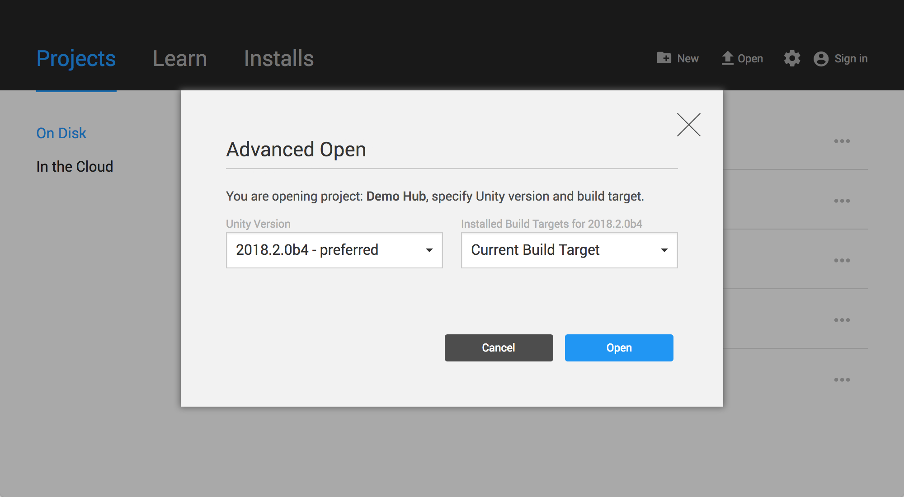
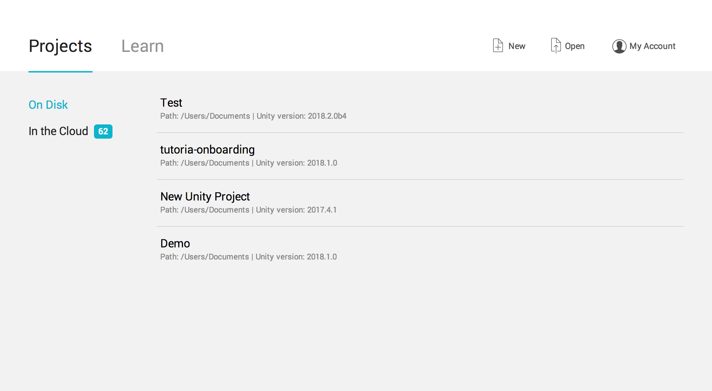

# 打开现有项目

本页面将详细介绍如何从 Hub 和 Unity Launcher 打开现有项目。

## 从 Hub 打开项目

从 Hub 打开现有项目时，有多个选项。您可以：

* 单击项目，然后使用分配的 Editor 版本和目标平台来打开此项目。
* 使用 __Advanced Open__ 对话框来选择其他 Editor 版本或指定其他目标平台。要使用 __Advanced Open__，单击项目名称右侧的三个点，然后选择要使用的版本。

 

Hub 还提供了使用任何已安装的 Editor 版本来打开项目的方法。单击 __Open__ 来使用现有项目时，Unity Hub 会尝试使用项目的相应 Editor 版本来打开项目。如果 Hub 找不到与项目匹配的 Editor 版本，则会显示警告消息，并让您可以选择是下载所选版本，还是用首选版本来打开项目。

## 从 Launcher 打开项目

主屏幕的 __Project__ 选项卡会列出先前在此计算机上打开过的项目。单击列表中的项目即可将打开一个项目。

如果刚安装 Editor，或者尚未在此次安装的 Unity 中打开过所需的项目，请单击 __Open__ 来打开文件浏览器并找到 Project 文件夹。请注意，Unity 项目是文件和目录的集合，而不仅仅是一个特定的 Unity 项目文件。要打开项目，必须选择主 Project 文件夹，而不是特定文件。

要在 Unity Editor 内查看主屏幕的 __Projects__ 选项卡，请选择 __File__ > __Open Project__。

--------------------------------
2018-06-12 Page published with [editorial review](DocumentationEditorialReview.html)

