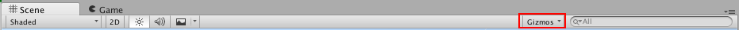
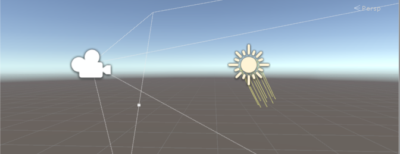
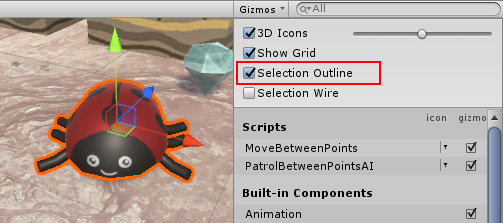
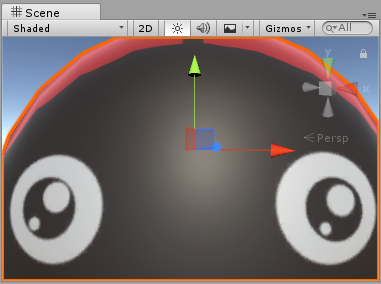
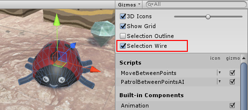
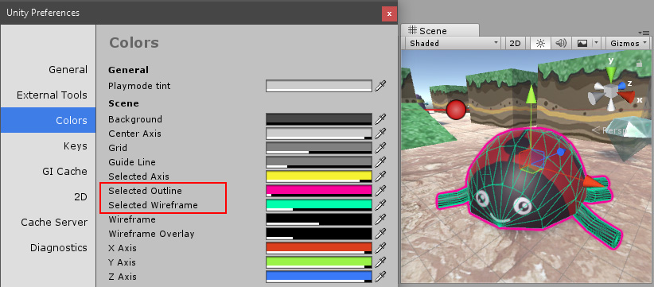
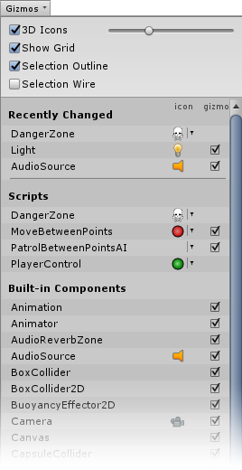

# Gizmos 菜单

[Scene 视图](UsingTheSceneView.html)和 [Game 视图](GameView.html)都有 __Gizmos__ 菜单。单击 Scene 视图或 Game 视图的工具栏中的 __Gizmos__ 按钮，即可访问 __Gizmos__ 菜单。

| **属性** | **功能** |
|:---|:---| 
| __3D Icons__| __3D Icons__ 复选框控制是否在 Scene 视图中由 Editor 绘制 3D 组件图标（例如光源和摄像机的图标）。  勾选 __3D Icons__ 复选框后，组件图标由 Editor 根据组件与摄像机的距离进行缩放，并被场景中的游戏对象遮挡。可使用滑动条来控制外观的总体大小。未勾选 __3D Icons__ 复选框时，以固定大小绘制组件图标，且这些图标始终绘制在 Scene 视图中所有游戏对象之上。  请参阅下面的[辅助图标和图标](#GizmosIcons)以查看图像以及更多信息。 |
| __Show Grid__| __Show Grid__ 复选框用于在 Scene 视图中打开（选中）和关闭（取消选中）标准场景测量网格。要更改网格的颜色，请访问 __Unity__ > __Preferences__ > __Colors__，然后更改 __Grid__ 设置。  此选项仅在 Scene 视图的 Gizmos 菜单中可用；无法在 Game 视图的 Gizmos 菜单中启用该选项。  请参阅下面的 [Show Grid](#ShowGrid) 以查看图像以及更多信息。|
| __Selection Outline__| 选中 __Selection Outline__ 可以通过彩色轮廓来显示所选的游戏对象。如果所选的游戏对象超出 Scene 视图的边缘，则会裁剪轮廓以便沿用窗口的边缘。要更改 Selection Outline 的颜色，请选择 __Unity__ > __Preferences__ > __Colors__，然后更改 __Selected Outline__ 设置。  此选项仅在 Scene 视图的 Gizmos 菜单中可用；无法在 Game 视图的 Gizmos 菜单中启用该选项。  请参阅下面的 [Selection Outline 和 Selection Wire](#SelectionOutlineWire) 以查看图像以及更多信息。|
| __Selection Wire__| 选中 __Selection Wire__ 可以在显示所选的游戏对象时使其线框网格可见。要更改 Selection Wire 的颜色，请选择 __Unity__ > __Preferences__ > __Colors__，然后更改 __Selected Wireframe__ 设置。  此选项仅在 Scene 视图的 Gizmos 菜单中可用；无法在 Game 视图的 Gizmos 菜单中启用该选项。  请参阅下面的 [Selection Outline 和 Selection Wire](#SelectionOutlineWire) 以查看图像以及更多信息。 |
| __Built-in Components__ | __Built-in Components__ 列表决定了具有图标或辅助图标的所有组件类型是否显示图标和辅助图标。  请参阅下面的 [Built-in Components](#Components) 以了解更多信息。|

 
## 辅助图标和图标

### 辅助图标

__辅助图标__是与场景中的游戏对象相关联的图形。有些辅助图标仅在选择游戏对象时才会显示，而其他辅助图标由 Editor 显示（无论选择什么游戏对象）。这些辅助图标通常是线框，使用代码而不是位图图形来绘制，还可以交互。**摄像机**辅助图标和**光线方向**辅助图标（如下图所示）是内置辅助图标的两个示例；还可以使用脚本来创建自己的辅助图标。请参阅[了解视锥体](UnderstandingFrustum.html)相关文档以了解有关摄像机的更多信息。

有些辅助图标是被动图形覆盖层，显示来供参考（例如，**光线方向**辅助图标用于显示光线的方向）。其他辅助图标具有交互性，例如[音频源 (AudioSource)](class-AudioSource.html) **球形范围**辅助图标，可以单击并拖动此辅助图标来调整音频源的最大范围。

__移动__、__缩放__、__旋转__和__变换__工具也是交互式辅助图标。请参阅关于[游戏对象定位](PositioningGameObjects.html)的文档以了解关于这些工具的更多信息。

请参阅 [OnDrawGizmos](../ScriptReference/MonoBehaviour.OnDrawGizmos.html) 函数的脚本参考页面以了解关于在脚本中实现自定义辅助图标的更多信息。

### 图标

可以在 Game 视图或 Scene 视图中显示__图标__。图标是扁平、公告牌式覆盖层，可以用来清楚地指示在处理游戏时游戏对象在游戏中的位置。**摄像机**图标和**光源**图标便是内置图标的示例；还可以将您自己的图标分配给游戏对象或各个脚本（请参阅关于[分配图标](AssigningIcons.html)的文档以了解如何执行此操作）。

 
## Show Grid

__Show Grid__ 功能可在场景平面上启用网格。以下图像显示了网格在 Scene 视图中的显示情况：

要更改网格的颜色，请选择 __Unity__ > __Preferences__ > __Colors__，然后更改 __Grid__ 设置。在此图像中，Scene 视图网格为深蓝色，因此在浅色地板上更显眼：

 

 
## Selection Outline 和 Selection Wire

### Selection Outline
启用 __Selection Outline__ 后，在 Scene 视图或 Hierarchy 窗口中选择游戏对象时，将在 Scene 视图中的该游戏对象周围显示橙色轮廓：

 

如果所选的游戏对象占据了大部分 Scene 视图并延伸到窗口边缘之外，则 Selection Outline 将沿窗口边缘显示：

 

### Selection Wire

启用 __Selection Wire__ 后，在 Scene 视图或 Hierarchy 窗口中选择游戏对象时，将在 Scene 视图中显示该游戏对象的线框网格：
 
 

### 选择颜色

可为选择线框设置自定义颜色；要执行此操作，选择 __Unity__ > __Preferences__ > __Colors__，然后更改 __Selected Outline__ 设置以改变 __Selection Outline__，或者更改 __Selected Wireframe__ 以改变 __Selection Wire__ 设置。

 

 
## Built-in Components

使用 __Built-in Components__ 列表可以控制具有图标或辅助图标的所有组件类型是否显示图标和辅助图标。

此处未列出某些内置组件类型（例如刚体），因为它们不会在 Scene 视图中显示图标或辅助图标。只会列出具有图标或辅助图标的组件。

Editor 还在此处列出一些项目脚本（位于内置组件之上）。如下：

* 已分配图标的脚本（请参阅关于[分配图标](AssigningIcons.html)的文档）。

* 实现 [OnDrawGizmos](../ScriptReference/MonoBehaviour.OnDrawGizmos.html) 函数的脚本。

* 实现 [OnDrawGizmosSelected](../ScriptReference/MonoBehaviour.OnDrawGizmosSelected.html) 函数的脚本。

最近更改的项位于列表顶部。

__icon__ 列显示或隐藏每个列出的组件类型的图标。单击 __icon__ 列下的小图标即可切换该图标的可视性。如果菜单中的图标为全彩色，该图标将显示在 Scene 视图中；如果图标在菜单中显示为灰色，该图标将在 Scene 视图中不可见。带有自定义图标的所有脚本都会显示一个下拉菜单小箭头。单击此箭头可以显示图标选择器 (icon selector) 菜单，可以在其中更改脚本的图标。

**注**：如果列表中的项具有辅助图标而没有图标，则 icon 列中没有它的选项。

勾选 __Gizmo__ 列中的复选框可以选择 Editor 是否为特定组件类型绘制辅助图标图形。例如，碰撞体具有预定义的线框辅助图标来显示其形状，而摄像机具有辅助图标来显示[视锥体](UnderstandingFrustum.html)。自有的脚本可以绘制适合自身用途的自定义辅助图标；应实现 [OnDrawGizmos](../ScriptReference/MonoBehaviour.OnDrawGizmos.html) 或 [OnDrawGizmosSelected](../ScriptReference/MonoBehaviour.OnDrawGizmosSelected.html) 来执行此操作。取消选中此列中的复选框可以关闭这些辅助图标。

**注意**：如果列表中的项具有图标而没有辅助图标，则此列中没有它的复选框。
