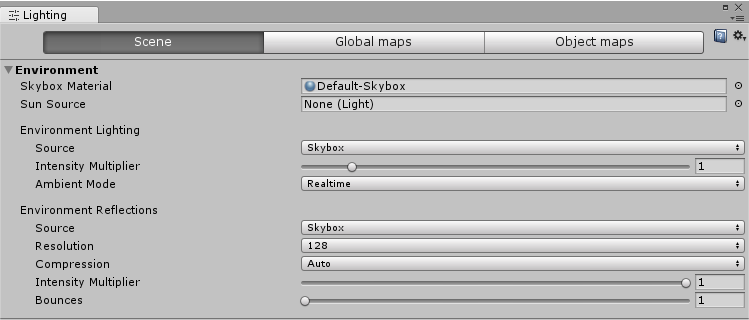
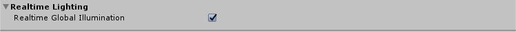
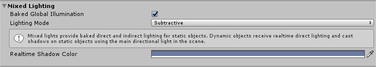
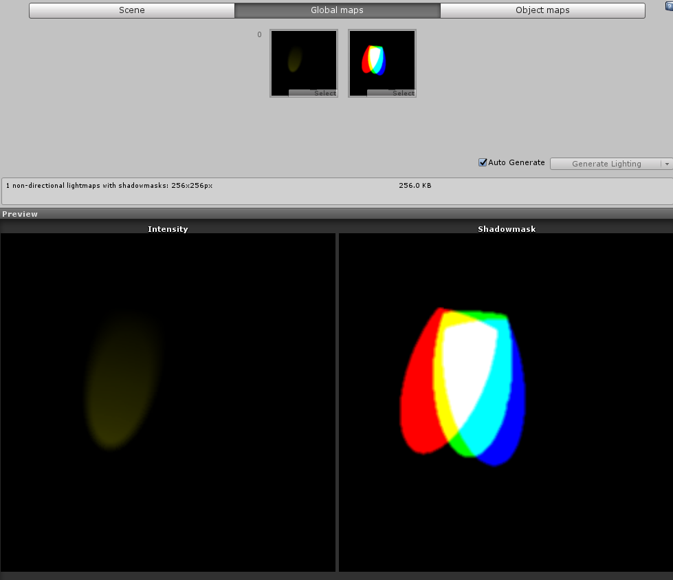

# Lighting 窗口

Lighting 窗口（菜单：__Window__ > __Lighting > Settings__）是 Unity 的[全局光照](GIIntro.html) (GI) 功能的主要控制点。虽然 Unity 中的 GI 可以使用默认设置提供良好的效果，但 Lighting 窗口的属性允许您调整 GI 过程的许多方面，自定义场景，或根据需要优化质量、速度和存储空间。此窗口还包括环境光、光环、剪影和雾效的设置。

## 概述

Lighting 窗口的控件分为三个选项卡：

* __Scene__ 选项卡设置适用于整体场景，而不是个别游戏对象。这些设置控制光照效果和优化选项。

* __Global maps__ 选项卡显示 GI 光照过程生成的所有光照贴图资源文件。

* __Object maps__ 选项卡显示当前所选游戏对象的 GI 光照贴图纹理（包括阴影遮罩）的预览。

此窗口还会在内容下面显示 __Auto Generate__ 复选框。如果您勾选此复选框，则 Unity 将在您编辑场景时更新光照贴图数据。请注意，更新通常需要几秒钟时间，而不是立即完成。如果您不勾选 __Auto Generate__ 复选框，则该复选框右侧的 __Generate Lighting__ 按钮将激活；使用此按钮可在您需要的时候触发光照贴图更新。如果要在不清除 [GI 缓存](GICache.html)的情况下清除场景中的烘焙数据，请使用 __Generate Lighting__ 按钮。

## Scene 选项卡

__Scene__ 选项卡包含适用于整体场景（而不是个别游戏对象）的设置。__Scene__ 选项卡包含若干部分：

* [Environment](#Environment)
* [Realtime Lighting](#RealtimeLighting)
* [Mixed Lighting](#MixedLighting)
* [Lightmapping Settings](#LightmappingSettings)
* [Other Settings](#OtherSettings)
* [Debug Settings](#DebugSettings)

 

### Environment

Environmental Lighting 部分包含天空盒、漫射光照和反射的设置。

 

| __属性：__| __功能：__ |
|:---|:---| 
| __Skybox Material__| 天空盒是一种材质，它出现在场景中的所有其他对象后方，用于模拟天空或其他遥远的背景。使用此属性可选择要用于场景的天空盒材质。默认值是[标准资源 (Standard Assets)](AssetTypes.html#Standard) 中的 __Default-Skybox__ 材质。 |
| __Sun Source__| 使用程序化天空盒时，使用此选项可指定带有方向光组件的游戏对象，从而指示“太阳”（或任何照亮场景的大型远距离光源）的方向。如果设置为 __None__（默认值），则假设场景中最亮的方向光代表太阳。 |
| __Environment Lighting__ | 这些设置会影响来自远处环境的光线。 |
| __Source__| 漫射环境光（也称为环境光）是场景周围存在的光，并非来自任何特定的光源对象。此项可用于定义光源颜色。默认值为 __Skybox__。|
|&nbsp;&nbsp;&nbsp;&nbsp;Color| 选择此选项可将单调颜色用于场景中的所有环境光。  |
|&nbsp;&nbsp;&nbsp;&nbsp;Gradient| 选择此选项可为来自天空、地平线和地面的环境光选择单独的颜色，并在它们之间平滑混合。  |
|&nbsp;&nbsp;&nbsp;&nbsp;Skybox| 选择此选项可使用天空盒的颜色（如果已通过 __Skybox Material__ 指定）来确定来自不同角度的环境光。这可以实现比 __Gradient__ 更精细的效果。 |
| __Intensity Multiplier__| 使用此属性可设置场景中漫射环境光的亮度，定义为 0 到 8 之间的值。默认值为 1。 |
| __Ambient Mode__| 使用此属性可指定应该用于处理场景中的环境光的全局光照模式。仅当场景中同时启用了[实时光照](LightMode-Realtime.html)和[烘焙光照](LightMode-Baked.html)时，此属性才可用。  |
|&nbsp;&nbsp;&nbsp;&nbsp;Realtime| 如果希望实时计算和更新场景中的环境光，请选择 __Realtime__。 |
|&nbsp;&nbsp;&nbsp;&nbsp;Baked| 如果希望预先计算环境光并在运行时将其放入到场景中，请选择 __Baked__。 |
| __Environment ____Reflections__| 这些设置用于控制[反射探针](class-ReflectionProbe.html)烘焙中涉及的全局设置，以及影响全局反射的设置。 |
| __Source__| 使用此设置指定是要将天空盒用于反射效果，还是使用您选择的立方体贴图。默认值为 __Skybox__。 |
|&nbsp;&nbsp;&nbsp;&nbsp;Skybox| 选择此选项可对反射使用天空盒。如果您选择 __Skybox__，则将显示一个名为 __Resolution__ 的额外选项。使用此选项可设置用于反射的天空盒的分辨率。 |
|&nbsp;&nbsp;&nbsp;&nbsp;Custom| 选择此选项可对反射使用立方体贴图。如果您选择 Custom，则将显示一个名为 __Cubemap__ 的额外选项。使用此选项可设置用于反射的立方体贴图的分辨率。  |
| __Compression__| 使用此属性可定义是否压缩反射纹理。默认设置是 __Auto__。 |
|&nbsp;&nbsp;&nbsp;&nbsp;Auto| 如果压缩格式合适，则压缩反射纹理。 |
|&nbsp;&nbsp;&nbsp;&nbsp;Uncompressed| 反射纹理以非压缩状态存储在内存中。 |
|&nbsp;&nbsp;&nbsp;&nbsp;Compressed| 压缩纹理。 |
| __Intensity Multiplier__| 反射源（在 __Reflection Source__ 属性中指定的天空盒或立方体贴图）在反射对象中可见的程度。 |
| __Bounces__| 当来自一个对象的反射随后被另一个对象反射时，便发生反射“反弹”。应通过使用[反射探针](ReflectionProbes.html)在场景中捕获反射。使用此属性可设置反射探针评估对象之间来回反弹的次数。如果设置为 1，则 Unity 只会考虑初始反射（来自 __Reflection Source__ 属性中指定的天空盒和立方体贴图）。 |

 
### Realtime Lighting

 

| __属性：__| __功能：__ |
|:---|:---|
| __Realtime Global Illumination__ | 如果勾选此复选框，则 Unity 将实时计算和更新光照。请参阅有关[实时全局光照](LightMode-Realtime.html)的文档以了解更多信息。 |

 
### Mixed Lighting

 

| 属性：| 功能： |
|:---|:---| 
| __Baked Global Illumination__ | 如果选中此复选框，则 Unity 将预计算光照并在运行时将其放入到场景中。请参阅有关[烘焙全局光照](LightMode-Baked.html)的文档以了解更多信息。 |
| __Lighting Mode__| __Lighting Mode__ 确定[混合光源](LightMode-Mixed.html)和阴影在场景中作用于游戏对象的方式。 __注意__：当您更改 __Lighting Mode__ 时，您还需要重新烘焙场景。如果在 Lighting 窗口中启用了 __Auto Generate__，则会自动进行此操作。如果未启用 __Auto Generate__，则单击 __Generate Lighting__ 即可看到更新后的光照效果。 |
| __Realtime Shadow Color__ | 定义用于渲染实时阴影的颜色。仅当 __Lighting Mode__ 设置为 __Subtractive__ 时，此设置才可用。 |

 
### Lightmapping Settings

Lightmapping Settings（光照贴图设置）特定于光照贴图后端。与其他设置不同，这些设置并不共享，并且具有自己的参数。要了解每个光照系统的完整设置信息，请参阅有关[渐进光照贴图](ProgressiveLightmapper.html)和 [Enlighten](GI-Enlighten.html) 的文档。

#### Other Settings

本节提供了有关 __Other Settings__ 部分的文档。

 

|||| 属性： | 功能： |
|:---|:---|:---|:---|:---| 
| __Other Settings__|||| 雾效、[光环](class-Halo.html)、[光晕](class-Flare.html)和[剪影](Cookies.html)的设置。 |
| __Fog__|||| 在场景中启用或禁用雾效。请注意，此模式无法用于[延迟渲染路径](RenderingPaths.html)。对于延迟渲染，[后期处理雾效](PostProcessing-Fog.html)效果可能比较合适。 |
|| Color ||| 使用拾色器设置 Unity 用于在场景中绘制雾的颜色。 |
|| Mode ||| 定义雾化效果随着与摄像机距离变化而积累的方式。 |
||| __Linear__ || 雾效强度随着距离线性增加。 |
|||| Start | 设置在距离摄像机多远时开始雾效。 |
|||| End | 设置在距离摄像机多远时雾效完全遮挡场景游戏对象。 |
||| __Exponential__ || 雾效强度随着距离呈指数增加。 |
|||| Density | 用于控制雾效的强度。雾效随着 __Density__ 增加而显示为更强。 |
||| __Exponential Squared__ || 雾效强度随着距离更快速增加（指数和平方）。 |
|||| Density | 用于控制雾效的强度。雾效随着 __Density__ 增加而显示为更强。 |
| __Halo Texture__|||| 设置要用于在光源周围绘制[光环](class-Halo.html)的纹理。 |
| __Halo Strength__|||| 定义光源周围光环的可见性，值在 0 到 1 之间。 |
| __Flare Fade Speed__|||| 定义最初出现[镜头光晕](class-LensFlare.html)之后从视图中淡出的时间（以秒为单位）。默认情况下，该值设置为 3。 |
| __Flare Strength__|||| 定义光源下镜头光晕的可见性，值在 0 到 1 之间。 |
| __Spot Cookie__|||| 设置要用于[点光源](Lighting.html)的[剪影](HOWTO-LightCookie.html)纹理。 |

 
### Debug Settings

 

| __属性：__| __功能：__ |
|:---|:---| 
| __Debug Settings__| 这些设置可帮助您调试场景。 |
| __Light Probe Visualization__| 用于过滤哪些[光照探针](LightProbes.html)显示在 Scene 视图中。默认值为 __Only Probes Used By Selection__。 |
|&nbsp;&nbsp;&nbsp;&nbsp;Only Probes Used By Selection| 只有影响当前选择的光照探针才会显示在 Scene 视图中。 |
|&nbsp;&nbsp;&nbsp;&nbsp;All Probes No Cells| 所有光照探针都将显示在 Scene 视图中。 |
|&nbsp;&nbsp;&nbsp;&nbsp;All Probes With Cells| 所有光照探针都将显示在 Scene 视图中，还会显示用于光照探针数据插值的四面体。 |
|&nbsp;&nbsp;&nbsp;&nbsp;None| 任何光照探针都不显示在 Scene 视图中。 |
| __Display Weights__| 勾选此复选框时，Unity 将从用于有效选择的光照探针到用于插值的四面体上的位置绘制一条线。这是一种调试探针插值和放置问题的方法。|
| __Display Occlusion__| 勾选此复选框时，如果混合光照模式为 [Distance Shadowmask](LightMode-Mixed-DistanceShadowmask.html) 或 [Shadowmask](LightMode-Mixed-Shadowmask.html)，则 Unity 将显示光照探针的遮挡数据。 |

## Global maps 选项卡

使用 __Global maps__ 选项卡可查看光照系统正在使用的实际纹理。这些内容包括强度光照贴图、阴影遮罩和方向贴图。仅当使用[烘焙光照](LightMode-Baked.html)或[混合光照](LightMode-Mixed.html)时可用；对于[实时光照](LightMode-Realtime.html)，预览为空白。

 

 

## Object maps 选项卡

使用 __Object maps__ 选项卡可查看仅限当前所选*游戏对象*的烘焙纹理的预览，包括阴影遮罩。

 

---

*  2017-06-08  Page published with limited [editorial review](DocumentationEditorialReview.html)

* 5.6 版更新

* 在 [2018.1](https://docs.unity3d.com/2018.1/Documentation/Manual/30_search.html?q=newin20181) 版中更新了光照贴图部分和调试设置 NewIn20181
