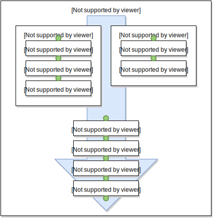
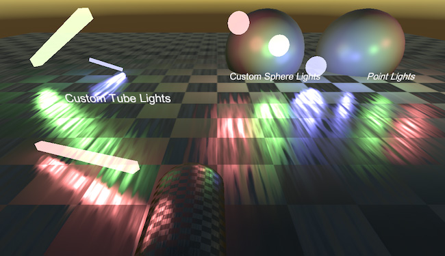
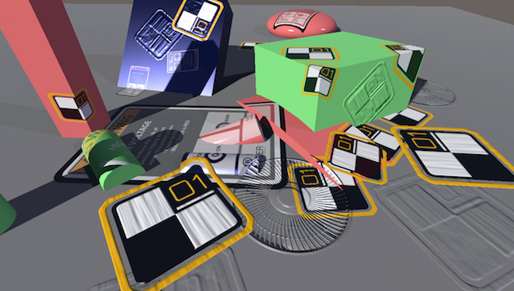
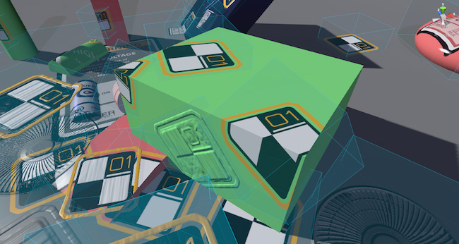

# 图形命令缓冲区

可以使用所谓的“命令缓冲区”扩展 Unity 的[渲染管线](SL-RenderPipeline.html)。
命令缓冲区可保存渲染命令列表（“设置渲染目标、绘制网格等等”），并且可以在摄像机渲染的过程中设置
执行点。

例如，您可以在所有常规对象处理完毕后将一些其他对象渲染到[延迟着色](RenderTech-DeferredShading.html)
G 缓冲区。

下面显示了摄像机如何在 Unity 中渲染场景的高层面的概述。在标有绿点的
每个节点上，您可以添加命令缓冲区来执行命令。

 

有关更多详细信息，请参阅 [CommandBuffer 脚本类](../ScriptReference/Rendering.CommandBuffer.html)和
[CameraEvent 枚举](../ScriptReference/Rendering.CameraEvent.html)。

命令缓冲区可用来替代[图像效果](PostProcessingWritingEffects.html)或与其结合使用。

## 代码示例

以下示例项目演示了可使用命令缓冲区实现的某些技巧：
**[RenderingCommandBuffers.zip](../uploads/Examples/RenderingCommandBuffers.zip)**。

### 模糊折射

以下场景显示了一个“模糊折射”技术。

 

渲染不透明对象和天空盒后，当前图像将被复制到临时
渲染目标中，进行模糊处理，并设置一个全局着色器属性。然后，玻璃对象上的着色器
对模糊图像进行采样，并基于法线贴图对 UV 坐标进行偏移
以模拟折射。

这类似于[着色器 GrabPass](SL-GrabPass.html) 所执行的操作，但不同之处在于
您可以设置更多自定义内容（在本示例中为模糊）。

### 延迟着色中的自定义面光源

以下场景显示了“自定义延迟光源”的实现：球形光源
和管形光源。

 

在系统完成常规延迟着色光源 pass 之后，
将为每个自定义光源绘制一个带有负责计算光照的着色器球体
并将该球体添加到光照缓冲区。

### 延迟着色中的贴花

以下场景基本实现了“延迟贴花”。

 

思路是：在 G 缓冲区完成后，在每个“形状”的位置绘制贴花（一个盒子）
并修改 G 缓冲区内容。这非常类似于在延迟着色中
对于光照的处理方式，只不过我们修改 G 缓冲区纹理，
而不是累积光照。

 

这里，每个贴花都作为一个盒子来实现，并且会影响盒子容积内的所有
几何体。
