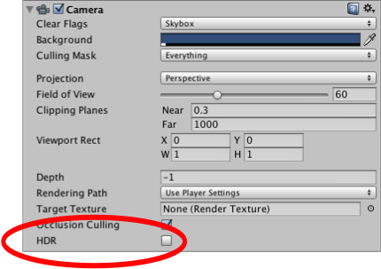
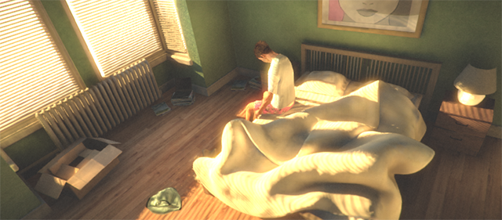
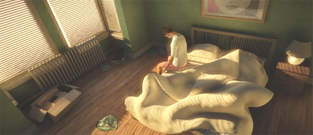

#高动态范围渲染

在标准渲染中，像素的红色、绿色和蓝色值均由 0 到 1 范围内的分数表示，其中 0 表示零强度，1 表示显示设备的最大强度。虽然这很容易使用，但它并不能准确反映在现实生活场景中光照的运作方式。人眼倾向于适应局部光照条件，因此在光线昏暗的房间中看起来是白色的物体实际上可能还不如在强烈日光下看起来是灰色的物体明亮。此外，眼睛对昏暗范围的亮度差异比对明朗范围的亮度差异更敏感。

如果能调整渲染使像素值的范围来更准确地反映其在真实场景中的光照情况，则可以实现更真实的视觉效果。虽然这些值最终需要映射回显示设备上的可用范围，但任何中间计算（例如 Unity 的图像效果）都将提供更真实的结果。**高动态范围 (HDR)** 渲染的精髓是允许图形的内部表示使用 0 到 1 范围之外的值。

##使用 HDR

应使用摄像机组件上的设置为每个摄像机单独启用 HDR：

 

当 HDR 处于激活状态时，场景将渲染为 HDR 图像缓冲区，该缓冲区可以容纳 0 到 1 范围之外的像素值。然后，该缓冲区由后期处理效果使用，例如[后期处理栈](PostProcessing-Stack.html)中的[泛光 (Bloom)](PostProcessing-Bloom.html) 效果。HDR 图像随后被转换为标准低动态范围 (LDR) 图像以便发送给显示设备。这通常通过色调映射（属于[颜色分级](PostProcessing-ColorGrading.html)管线的一部分）来完成。转换为 LDR 必须在后期处理管线中的某个时刻进行，但如果之后有可能应用只针对 LDR 的后期处理效果，所以可能不是最后一步。为方便起见，一些后期处理效果可以在应用 HDR 效果后自动转换为 LDR（请参阅下面的“脚本”部分）。

###色调映射
色调映射是指将 HDR 值映射回 LDR 范围的过程。有许多不同的技术，但对一个项目有益的技术对于另一个项目来说可能并非最佳选择。[后期处理栈](PostProcessing-Stack.html)中已经包含了多种色调映射技术。要使用这些技术，可从 [Asset Store](https://www.assetstore.unity3d.com/en/#!/content/83912) 下载**后期处理栈 (Post-processing stack)**。可在[颜色分级](PostProcessing-ColorGrading.html)文档中找到色调映射类型的详细描述。

##HDR 的优点

* 在高强度区域不会丢失颜色
* 更好地支持泛光和发光效果
* 减少低频光照区域的条带

##HDR 的缺点

* 使用浮点渲染纹理（渲染速度较慢，需要更多 VRAM）
* 不支持硬件抗锯齿（但您可以使用[抗锯齿后期处理效果](PostProcessing-Antialiasing.html)来平滑边缘）
* 并非所有硬件都支持

##使用注意事项

###前向渲染
在前向渲染模式下，仅当您具有后期处理效果时才支持 HDR。这是出于性能考虑的原因。如果您没有后期处理效果，则不存在色调映射，并且将发生强度截断。在这种情况下，场景将直接渲染到不支持 HDR 的后备缓冲区。

###延迟渲染
在 HDR 模式下，光照缓冲区也被分配为浮点缓冲区。这样可减少光照缓冲区中的条带。即使没有后期处理效果，延迟渲染也支持 HDR。

###脚本

可向后期处理效果脚本中添加 __ImageEffectTransformsToLDR__ 属性以表明目标缓冲区应在 LDR 中，而非在 HDR 中。从本质上讲，这意味着脚本可以在应用其 HDR 后期处理效果后自动转换为 LDR。有关更多详细信息，请参阅[编写后期处理效果](PostProcessingWritingEffects.html)。

##另请参阅

[HDR 拾色器](HDRColorPicker.html)。

