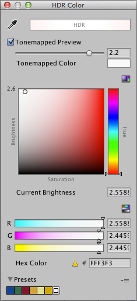
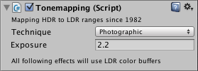
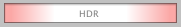
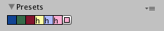

# HDR 拾色器

 

HDR 拾色器外观类似于普通[拾色器](PresetLibraries.html)，但具有一些额外的属性。

###Current brightness

您可以将颜色的 __Current Brightness__ 属性设置为大于 1。这将创建一个位于取色器左上角的白色度区域。

 

###Tonemapped preview

单击 Tonemapped preview 可查看拾色器生成的颜色的预览。将 __Tonemapping Exposure__ 值设置为您在附加到摄像机的 __Tonemapping__ 脚本中设置的值（在此示例中为 2.2）。

 

HDR 颜色也显示在 HDR 拾色器顶部的框中，而且衰减颜色显示在框的边缘。

 

就像普通颜色一样，可以将 HDR 颜色保存为预设值。这些预设值在预设值列表中以**“h”**进行标记，表示它们是 HDR。

 
