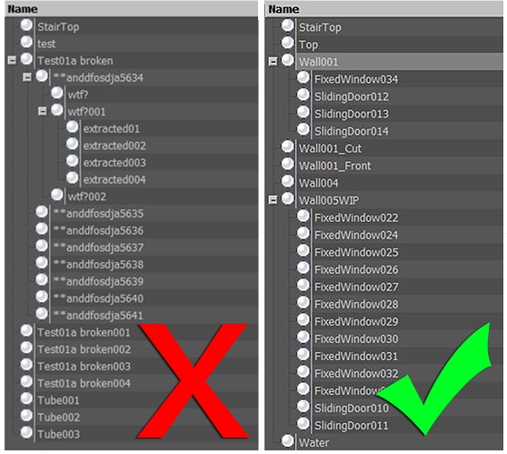
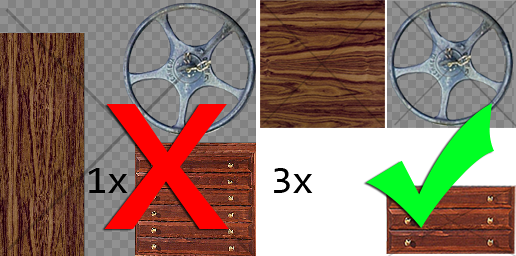
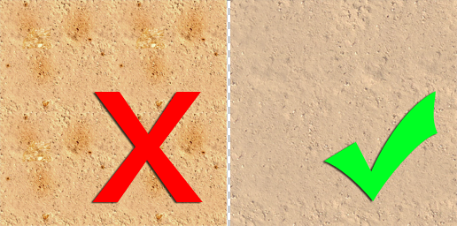
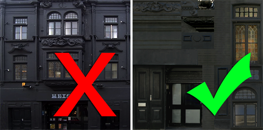

# 艺术资源最佳实践指南

Unity 支持来自各种程序或来源的纹理化 3D 模型。本简短指南由 Unity 游戏美术师和开发人员汇总而成，旨在帮助您在 Unity 项目中创建更好用、更高效的资源。

## 比例和单位

按比例工作对于光照和物理模拟都很重要。

* 将您的系统单位和项目单位设置为公制 (Metric)，从而使您的软件与 Unity 保持一致。
    * 请注意，不同的系统使用不同的单位；例如，Max 的系统单位默认值为英寸，而 Maya 中的系统单位默认值为厘米。
    * Unity 在导入 FBX 与导入本机 3D 建模软件文件时采用不同的缩放比例。请务必检查 [FBX 导入比例设置](FBXImporter-Model.html)。例如，如果要实现 Scale Factor = 1、File Scale = 1 和 Object Transform Scale = 1，请使用其中一种[专有文件格式](3D-formats.html)。
    * 如果有疑问，请用场景导出“米立方体”以便在 Unity 中匹配。
* 动画帧率默认值可能在不同的包中不同。因此，最好在整个工作流程中设置一致的值（例如，设置为 30fps）。

## 文件和对象

* 为场景中的对象提供合理唯一的名称。这种做法有助于您找到项目中的特定网格并对其进行故障排除。
* 避免使用特殊字符，如 `*()?"#$`。
* 为对象和文件使用简单但具有描述性的名称，以方便以后进行复制。
* 保持层级视图尽可能简单。
* 对于 3D 应用程序中的大项目，请考虑在 Unity 项目的目录外部存放工作文件。这样通常可以节省运行更新和导入不必要数据的时间。

### 网格

* 使用高效的拓扑进行构建。仅必要时才使用多边形。
* 如果几何体的多边形太多，请对几何体进行优化。许多角色模型需要由美术师进行智能优化甚至重建，特别是如果模型来自或基于：
    * 3D 捕获数据
    * Poser
    * Zbrush
    * 专为渲染而设计的其他高密度 NURBS 样条曲线模型
* 成本允许的情况下，在建筑物、景观和大型结构中使用均匀分布的多边形将有助于分散光照并避免尴尬的扭结。
* 避免十分狭长的三角形。

用于构造对象的方法会对多边形的数量产生巨大影响，尤其是在未进行优化的情况下。在上图中，相同形状的网格在右侧有 156 个三角形，在左侧有 726 个三角形。726 个可能听起来不像是很多的多边形，但如果在一个关卡中使用 40 次，您将真正看到性能节省有多大。根据经验法则，通常应一切从简，仅在需要时添加细节。添加多边形总是比移除多边形更容易。

### 纹理

如果将纹理固定为 2 的幂（例如，512x512 或 256x1024），纹理将更有效，并且在构建时不需要重新缩放。您可以使用高达 4096x4096 像素，但 2048x2048 是许多显卡和平台上支持的最高像素。

您可以在线搜索有关创建合理纹理的专家建议，但本指南中的一些准则可帮助您从项目中获得最有效的结果：

* 在 Unity 项目外部处理高分辨率源文件（例如 .psd 或 Gimp 文件）。始终可以从源文件缩小尺寸，但反过来却不行。
* 使用场景中所需的纹理分辨率输出（保存副本，例如 256x256 优化的 .png 或 .tga 文件）。您可以根据纹理的显示位置和贴图位置做出判断。
* 将输出纹理文件存储在 Unity 项目中（例如，在 \Assets\textures 中）。
* 确保 3D 工作文件引用相同的纹理，从而在保存或导出时保持一致性。
* 充分利用纹理中的可用空间，但请注意不同材质需要使用相同纹理的不同部分。因此最终可多次使用或加载该纹理。
* 对于可能需要不同着色器的 Alpha 和元素，请使用不同的纹理。例如，下面左侧的单个纹理已替换为下面右侧的三个较小纹理。

* 利用无缝重复的平铺纹理。这样就能使用空间中重复的更高分辨率。
* 从位图中删除容易引人注意的重复元素，并注意对比度。若要添加细节，请使用贴花和对象来分解重复元素。

* Unity 负责处理用于输出平台的压缩，因此除非您的源文件已经是正确分辨率的 .jpg，否则最好为纹理使用无损格式。
* 基于照片创建纹理页面时，将页面缩小为可重复的单个模块化部分。例如，不需要 12 个相同的窗户完全占据纹理空间。这意味着可为这一个窗户提供更多像素细节。

### 材质

* 组织并命名场景中的材质。这样就能在导入材质后在 Unity 中更轻松地查找和编辑材质。
* 可选择在 Unity 中通过以下任一方式创建材质：
    * &lt;模块名称&gt; - &lt;材质名称&gt; 
    或
    * &lt;纹理名称&gt; 
     确保您知道自己想要哪一种方式。
* 本机资源包中的材质的设置不会全部导入 Unity：
    * 通常支持 __Diffuse Colour__、__Diffuse Texture__ 和 __Names__。
    * 无法识别或导入着色器模型、镜面反射、法线、其他次要纹理和物质材质设置。

### 导入和导出

Unity 可使用两种类型的文件：保存的 3D 应用程序文件和导出的 3D 格式。决定使用哪种文件非常重要。有关更多信息，请参阅[模型文件格式](3D-formats.html)。

---

*  2018-04-25  Page amended with limited [editorial review](DocumentationEditorialReview.html)

